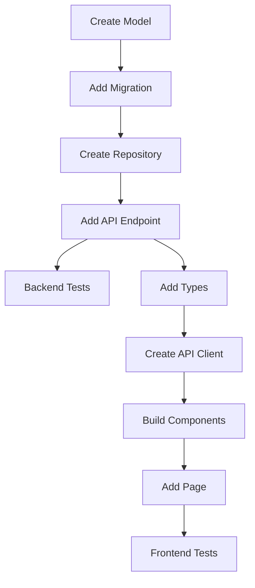

# Implementation Planning Skill

## Description
Generates detailed implementation plans from user stories, including task breakdown, file modifications, dependencies, and testing requirements.

## When to Use
- Breaking down user stories into tasks
- Planning file modifications
- Identifying dependencies
- Estimating effort
- Defining testing requirements

## Plan Structure

### Naming Convention
`PLAN-{US-number}-{date}.md`

Example: `PLAN-US-001-2026-05-26.md`

## Implementation Plan Template

```markdown
# Implementation Plan: US-{number}

**User Story:** {Title}
**Date:** {date}
**Estimated Effort:** {S|M|L|XL}

## 1. Summary

Brief description of what will be implemented.

## 2. Prerequisites

- [ ] Prerequisite 1
- [ ] Prerequisite 2

## 3. Task Breakdown

### Phase 1: Backend Implementation

| Task | File(s) | Effort | Dependencies |
|------|---------|--------|--------------|
| 1.1 Create model | `backend/app/models/` | S | None |
| 1.2 Add migration | `backend/alembic/versions/` | S | 1.1 |
| 1.3 Create repository | `backend/app/repositories/` | M | 1.1 |
| 1.4 Add API endpoint | `backend/app/api/routes/` | M | 1.3 |
| 1.5 Write unit tests | `backend/tests/` | M | 1.4 |

### Phase 2: Frontend Implementation

| Task | File(s) | Effort | Dependencies |
|------|---------|--------|--------------|
| 2.1 Add types | `frontend/src/types/` | S | 1.4 |
| 2.2 Create API client | `frontend/src/lib/api/` | S | 2.1 |
| 2.3 Build components | `frontend/src/components/` | M | 2.2 |
| 2.4 Add page/route | `frontend/src/pages/` | M | 2.3 |
| 2.5 Write tests | `frontend/src/components/**/*.test.tsx` | M | 2.4 |

## 4. File Modifications

### New Files
```
backend/app/models/feature.py
backend/app/repositories/feature_repository.py
backend/app/api/routes/feature.py
backend/tests/test_feature.py
frontend/src/types/feature.ts
frontend/src/lib/api/feature.ts
frontend/src/components/organisms/FeatureCard.tsx
frontend/src/components/organisms/FeatureCard.test.tsx
frontend/src/pages/FeaturePage.tsx
```

### Modified Files
```
backend/app/api/routes/__init__.py  # Add route import
frontend/src/App.tsx                # Add route
```

## 5. Database Changes

### Migrations Required
- [ ] Add `feature` table
- [ ] Add foreign key to `runs`

### Schema Changes
```sql
CREATE TABLE feature (
    id UUID PRIMARY KEY,
    -- columns
);
```

## 6. API Contract

### Endpoints
```yaml
POST /api/features:
  request:
    body: FeatureCreate
  response:
    201: Feature
    400: ValidationError

GET /api/features/{id}:
  response:
    200: Feature
    404: NotFound
```

### Types
```typescript
interface Feature {
  id: string;
  // fields
}

interface FeatureCreate {
  // fields
}
```

## 7. Testing Requirements

### Backend Tests
- [ ] Unit test: model validation
- [ ] Unit test: repository CRUD
- [ ] Integration test: API endpoints
- [ ] Coverage target: ≥80%

### Frontend Tests
- [ ] Component test: FeatureCard
- [ ] Accessibility test: jest-axe
- [ ] Integration test: API mocking with MSW
- [ ] Coverage target: ≥80%

## 8. Acceptance Criteria Mapping

| AC | Task(s) | Verification |
|----|---------|--------------|
| AC-1: ... | 1.4, 2.3 | Unit test + manual |
| AC-2: ... | 2.4 | Integration test |

## 9. Risks and Mitigations

| Risk | Mitigation |
|------|------------|
| Risk 1 | Mitigation 1 |

## 10. Definition of Done

- [ ] All tasks completed
- [ ] Unit tests passing
- [ ] Test coverage ≥80%
- [ ] Code reviewed (score ≥9/10)
- [ ] Documentation updated
- [ ] Memory bank updated
```

## Effort Estimation Guide

| Size | Hours | Complexity |
|------|-------|------------|
| S | 1-2 | Single file, straightforward |
| M | 2-4 | Multiple files, some complexity |
| L | 4-8 | Many files, significant complexity |
| XL | 8+ | Major feature, high complexity |

## Dependency Analysis

### Identifying Dependencies
1. **Data dependencies**: What data/models must exist first?
2. **API dependencies**: What endpoints must be available?
3. **Component dependencies**: What UI components are needed?
4. **External dependencies**: What third-party services/libs?

### Dependency Graph Example


## Task Prioritization

### Priority Matrix
| | High Impact | Low Impact |
|---|---|---|
| **Low Effort** | Do First | Quick Wins |
| **High Effort** | Schedule | Defer |

### Execution Order
1. Core backend (models, repositories)
2. API endpoints
3. Backend tests
4. Frontend types and API client
5. UI components (atoms → molecules → organisms)
6. Pages and routing
7. Frontend tests

## Output Location

Plans are saved to: `docs/implementation-phase/implementation-plans/`
