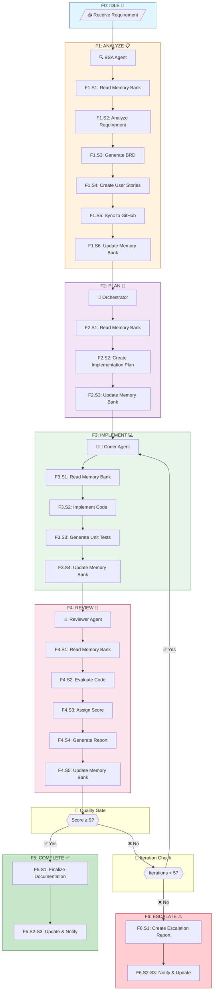
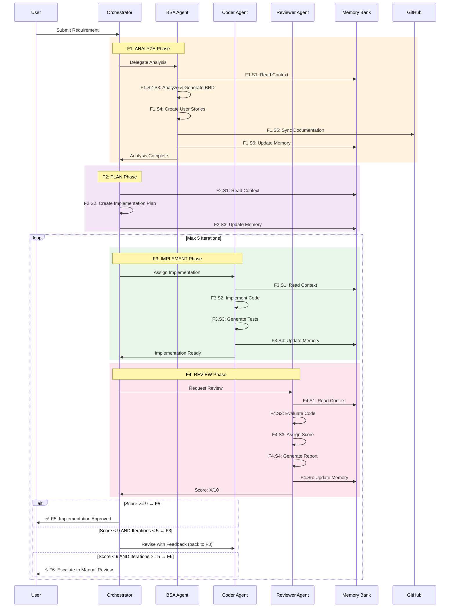
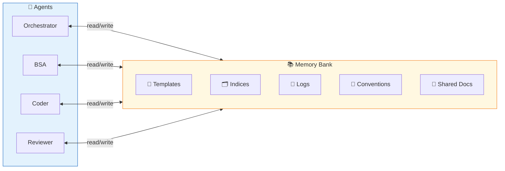
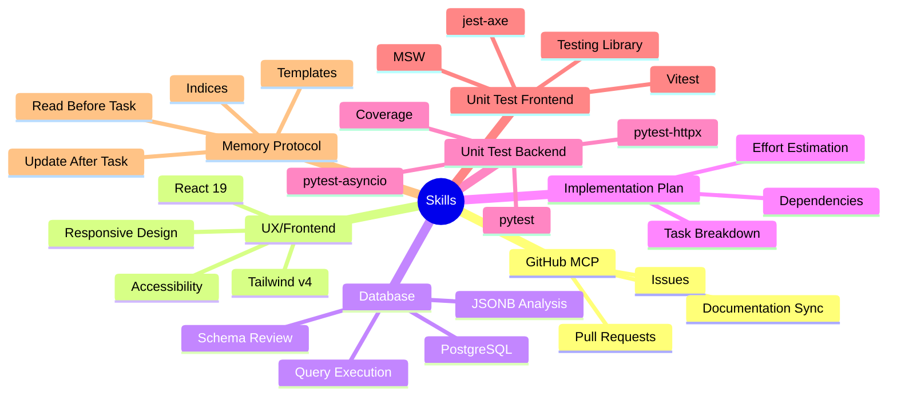
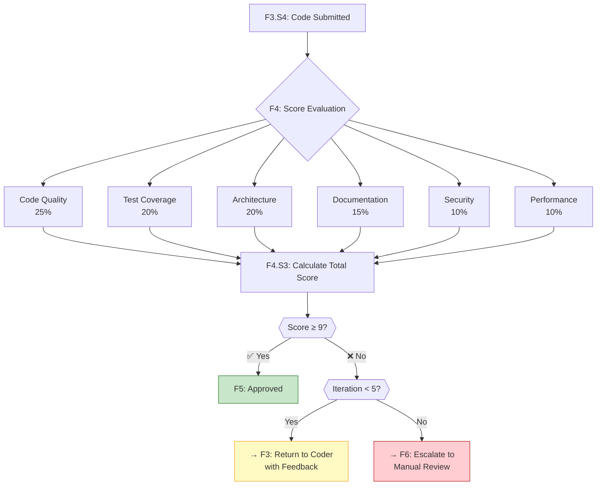
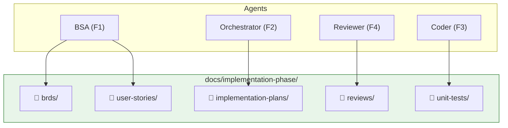
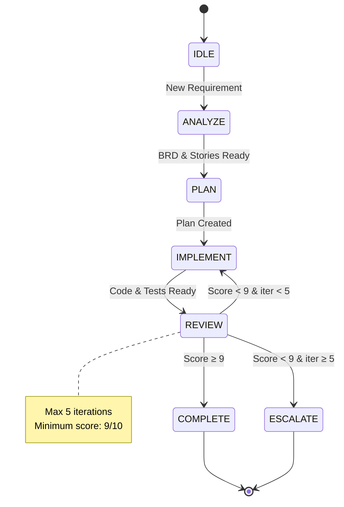

# Agentic Workflow — Novum Development

> Visual representation of the orchestrated development workflow. See [workflow.yaml](workflow.yaml) for the formal definition.

---

## 1. Phase & Step Quick Reference

### 1.1 Phases Overview

| ID | Phase | Agent | Description |
|----|-------|-------|-------------|
| **F0** | IDLE | — | Waiting for new requirement |
| **F1** | ANALYZE | BSA | Requirements analysis and documentation |
| **F2** | PLAN | Orchestrator | Implementation planning |
| **F3** | IMPLEMENT | Coder | Code implementation and testing |
| **F4** | REVIEW | Reviewer | Quality evaluation and scoring |
| **F5** | COMPLETE | — | Approved, finalize documentation |
| **F6** | ESCALATE | — | Max iterations reached, manual review |

### 1.2 All Steps by Phase

| Step ID | Phase | Action | Description |
|---------|-------|--------|-------------|
| **F1.S1** | ANALYZE | `read_memory_bank` | Read project context, knowledge index, lessons learned |
| **F1.S2** | ANALYZE | `analyze_requirement` | Parse and classify incoming requirement |
| **F1.S3** | ANALYZE | `generate_brd` | Create Business Requirements Document |
| **F1.S4** | ANALYZE | `generate_user_stories` | Create user stories with acceptance criteria |
| **F1.S5** | ANALYZE | `sync_to_github` | Sync documentation to GitHub (if MCP available) |
| **F1.S6** | ANALYZE | `update_memory_bank` | Update decisions history and knowledge index |
| **F2.S1** | PLAN | `read_memory_bank` | Read project context and generated BRD/stories |
| **F2.S2** | PLAN | `create_implementation_plan` | Break down user stories into tasks |
| **F2.S3** | PLAN | `update_memory_bank` | Record planning decisions |
| **F3.S1** | IMPLEMENT | `read_memory_bank` | Read implementation plan, architecture, conventions |
| **F3.S2** | IMPLEMENT | `implement_code` | Write production code following standards |
| **F3.S3** | IMPLEMENT | `generate_unit_tests` | Create unit tests (backend/frontend) |
| **F3.S4** | IMPLEMENT | `update_memory_bank` | Record implementation decisions |
| **F4.S1** | REVIEW | `read_memory_bank` | Read implementation plan and criteria |
| **F4.S2** | REVIEW | `evaluate_code` | Review code against quality standards |
| **F4.S3** | REVIEW | `assign_score` | Calculate weighted score (1-10) |
| **F4.S4** | REVIEW | `generate_review_report` | Create detailed review report |
| **F4.S5** | REVIEW | `update_memory_bank` | Record review decisions |
| **F5.S1** | COMPLETE | `finalize_documentation` | Update all relevant documentation |
| **F5.S2** | COMPLETE | `update_memory_bank` | Final decisions history update |
| **F5.S3** | COMPLETE | `notify_completion` | Notify user of success |
| **F6.S1** | ESCALATE | `create_escalation_report` | Document iteration attempts and blockers |
| **F6.S2** | ESCALATE | `notify_manual_review` | Alert user for manual intervention |
| **F6.S3** | ESCALATE | `update_memory_bank` | Record escalation in lessons learned |

---

## 2. Agents Overview

| Agent | Role | Primary Outputs |
|-------|------|-----------------|
| **Orchestrator** | Workflow controller | Implementation plans, task coordination |
| **BSA** | Requirements analyst | BRDs, User Stories |
| **Coder** | Implementation | Code, Unit Tests |
| **Reviewer** | Quality assurance | Review reports, Scores |

---

## 3. Main Workflow Diagram

---

## 4. Agent Interaction Sequence

---

## 5. Memory Protocol Flow

---

## 6. Skills Distribution

---

## 7. Quality Gate Decision Tree (F4)

---

## 8. File Output Structure

---

## 8. State Machine

---

## 9. Usage

### Starting a New Requirement

1. Open VS Code with GitHub Copilot or Claude Code
2. Invoke the **Orchestrator** agent
3. Provide the requirement or ticket reference
4. The workflow executes automatically

### Monitoring Progress

- Check `docs/implementation-phase/` for generated artifacts
- Review `.github/memory-bank/logs/` for decision history
- Monitor iteration count in review reports

### Quality Standards

- **Minimum Score**: 9/10
- **Max Iterations**: 5
- **Test Coverage**: ≥80% (backend and frontend)
