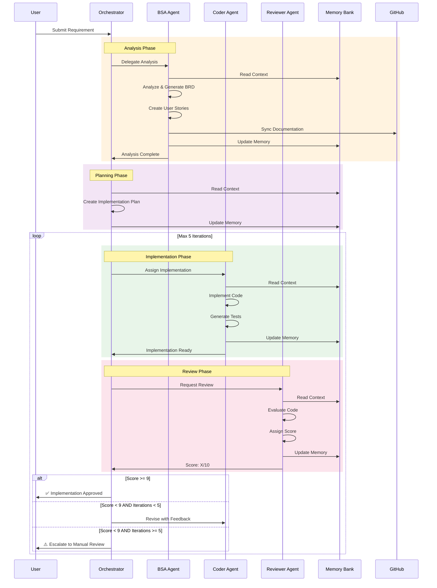
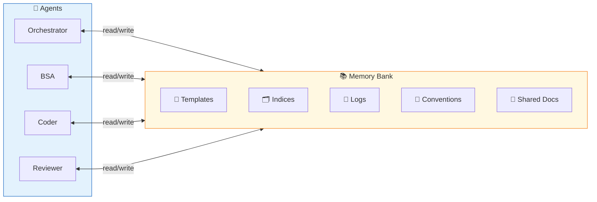
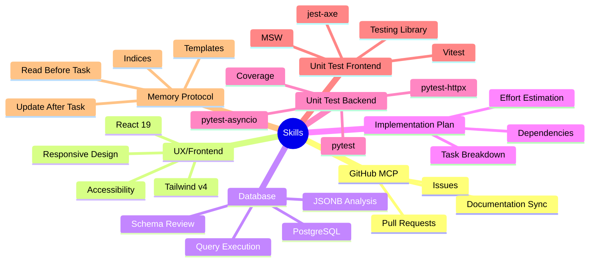
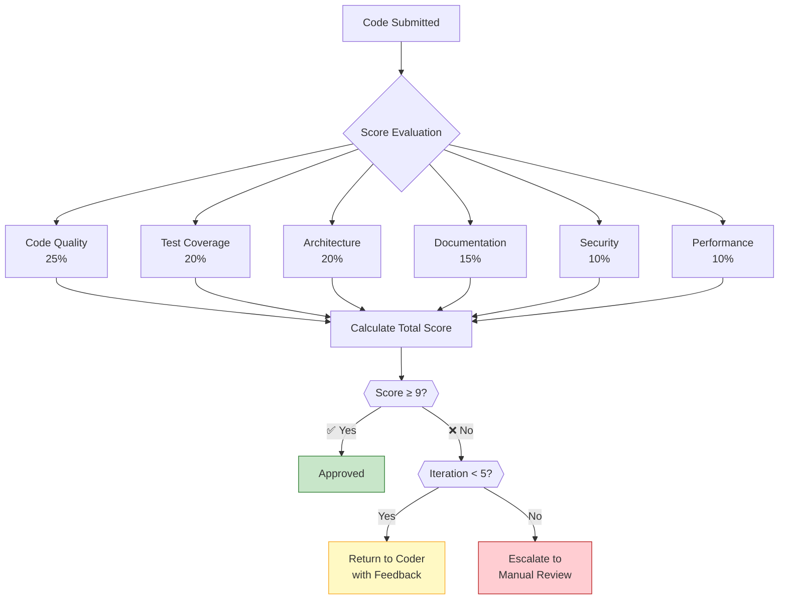
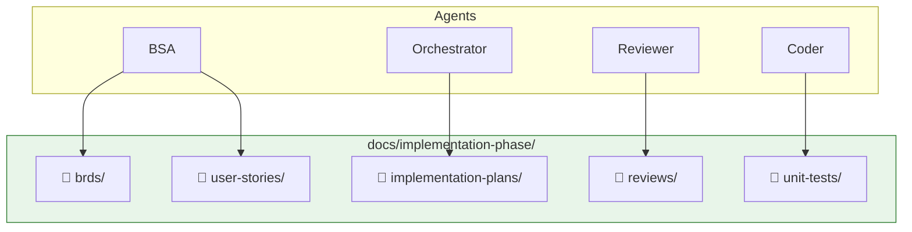
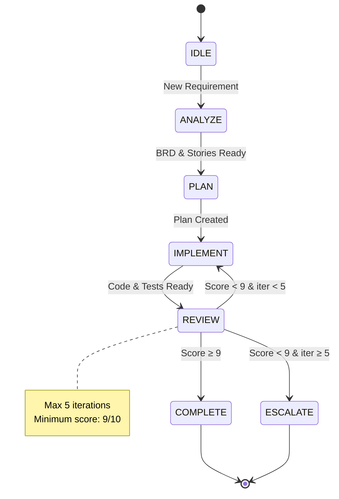

# Agentic Workflow — Novum Development

> Visual representation of the orchestrated development workflow. See [workflow.yaml](workflow.yaml) for the formal definition.

---

## 1. Workflow Overview

The Novum development workflow is an orchestrated agentic system with four specialized agents:

| Agent | Role | Primary Outputs |
|-------|------|-----------------|
| **Orchestrator** | Workflow controller | Implementation plans, task coordination |
| **BSA** | Requirements analyst | BRDs, User Stories |
| **Coder** | Implementation | Code, Unit Tests |
| **Reviewer** | Quality assurance | Review reports, Scores |

---

## 2. Main Workflow Diagram

```mermaid
flowchart TD
    subgraph INIT["🚀 Initialization"]
        A[/"📥 Receive Requirement"/]
    end

    subgraph ANALYSIS["📋 Analysis Phase"]
        B["🔍 BSA Agent"]
        B1["Read Memory Bank"]
        B2["Analyze Requirement"]
        B3["Generate BRD"]
        B4["Create User Stories"]
        B5["Sync to GitHub"]
        B6["Update Memory Bank"]
        
        B --> B1 --> B2 --> B3 --> B4 --> B5 --> B6
    end

    subgraph PLANNING["📝 Planning Phase"]
        C["🎯 Orchestrator"]
        C1["Read Memory Bank"]
        C2["Create Implementation Plan"]
        C3["Update Memory Bank"]
        
        C --> C1 --> C2 --> C3
    end

    subgraph IMPLEMENTATION["💻 Implementation Phase"]
        D["👨‍💻 Coder Agent"]
        D1["Read Memory Bank"]
        D2["Implement Code"]
        D3["Generate Unit Tests"]
        D4["Update Memory Bank"]
        
        D --> D1 --> D2 --> D3 --> D4
    end

    subgraph REVIEW["🔎 Review Phase"]
        E["📊 Reviewer Agent"]
        E1["Read Memory Bank"]
        E2["Evaluate Code"]
        E3["Assign Score"]
        E4["Generate Report"]
        E5["Update Memory Bank"]
        
        E --> E1 --> E2 --> E3 --> E4 --> E5
    end

    subgraph DECISION{"🔀 Quality Gate"}
        F{{"Score ≥ 9?"}}
    end

    subgraph ITERATION{"🔄 Iteration Check"}
        G{{"Iterations < 5?"}}
    end

    subgraph COMPLETION["✅ Completion"]
        H["✨ Implementation Approved"]
        I["📝 Finalize Documentation"]
    end

    subgraph ESCALATION["⚠️ Escalation"]
        J["🚨 Max Iterations Reached"]
        K["👤 Manual Review Required"]
    end

    A --> B
    B6 --> C
    C3 --> D
    D4 --> E
    E5 --> F
    
    F -->|"✅ Yes"| H
    F -->|"❌ No"| G
    
    G -->|"✅ Yes"| D
    G -->|"❌ No"| J
    
    H --> I
    J --> K

    style INIT fill:#e1f5fe,stroke:#01579b
    style ANALYSIS fill:#fff3e0,stroke:#e65100
    style PLANNING fill:#f3e5f5,stroke:#4a148c
    style IMPLEMENTATION fill:#e8f5e9,stroke:#1b5e20
    style REVIEW fill:#fce4ec,stroke:#880e4f
    style COMPLETION fill:#c8e6c9,stroke:#2e7d32
    style ESCALATION fill:#ffcdd2,stroke:#b71c1c
```

---

## 3. Agent Interaction Sequence



---

## 4. Memory Protocol Flow



---

## 5. Skills Distribution



---

## 6. Quality Gate Decision Tree



---

## 7. File Output Structure



---

## 8. State Machine



---

## 9. Usage

### Starting a New Requirement

1. Open VS Code with GitHub Copilot or Claude Code
2. Invoke the **Orchestrator** agent
3. Provide the requirement or ticket reference
4. The workflow executes automatically

### Monitoring Progress

- Check `docs/implementation-phase/` for generated artifacts
- Review `.github/memory-bank/logs/` for decision history
- Monitor iteration count in review reports

### Quality Standards

- **Minimum Score**: 9/10
- **Max Iterations**: 5
- **Test Coverage**: ≥80% (backend and frontend)
