# Software Architecture — Novum

> Software design principles, module boundaries, contracts, and seams. Companion to [tech-stack.md](tech-stack.md) and [infrastructure.md](infrastructure.md). All decisions traced to RFs from [requirement-understanding.md](../understanding-phase/requirement-understanding.md).
>
> Visual companion: [data-flows-and-diagrams.md](../understanding-phase/data-flows-and-diagrams.md) (8 Graphviz diagrams covering run sequence, agent FSM, UI FSM, data flow, plugin seams, ER model, deployment, and agentic architecture). The FSM now includes `PlanCritiquing` (RF-14) and `Replanning` (RF-14) active states.
>
> **Status legend:** ✅ locked · 🤔 pending confirmation · ⏳ V2.

---

## 1. Architectural principles

1. **Event log is the source of truth.** Every state derives from the `events` table in Postgres (append-only by app discipline). No hidden state, no implicit cache that contradicts the log.
2. **Stop reasons are an enum, not free text.** RF-02 guarantee — all 8 terminal states map to `stop_reason` enum values.
3. **Three plugin seams, three not-seams.** The system is extensible at Source / StoppingSignal / OutputRenderer. The planner, the storage, and the LLM provider are deliberately **not** seams in V1 (RF §6-ter).
4. **Read determinism.** Opening any terminal run twice must show identical output. No live LLM regeneration on read.
5. **Append-only contract.** Events are never edited, never deleted. Resume and fork append; they do not mutate.
6. **Single-server scope.** No distributed locks, no Redis, no eventual consistency. RF-05 explicit.
7. **Honest stops as first-class outcomes.** "Cannot answer" is a successful state, not an error.
8. **UI is the trust contract made visible.** Every guarantee in §6-quater has a UI surface (RF-13). Hide nothing.

---

## 1.5 System architecture (visual)

Azure-style layered view of the entire V1 deployment: client tier, edge CDN, the Hetzner VM (with its security ingress, application, and data planes), and external services. Trust boundaries are dashed; data planes are color-coded by tier.

```graphviz
digraph NovumArchitecture {
    graph [
        rankdir=TB,
        bgcolor="#FAFBFC",
        fontname="Segoe UI",
        fontsize=12,
        labelloc=t,
        label=<<B>Novum — System Architecture (V1)</B><BR/><FONT POINT-SIZE="9" COLOR="#5A6273">Single-server FastAPI · event-sourced · plugin seams</FONT>>,
        pad=0.6,
        nodesep=0.35,
        ranksep=0.7,
        splines=ortho,
        compound=true,
        newrank=true
    ];
    node [
        shape=box,
        style="rounded,filled",
        fontname="Segoe UI",
        fontsize=10,
        margin="0.22,0.14",
        penwidth=1.3,
        color="#5A6273"
    ];
    edge [
        fontname="Segoe UI",
        fontsize=9,
        color="#7A8499",
        fontcolor="#5A6273",
        penwidth=1.1,
        arrowsize=0.8
    ];

    // ============================================================
    // LEGEND  (top, horizontal row)
    // ============================================================
    subgraph cluster_legend {
        label=<<B>Legend</B>>;
        style="rounded,filled";
        fillcolor="#FFFFFF";
        color="#8FA0B5";
        fontcolor="#5A6273";
        fontsize=9;
        margin=8;
        rank=same;

        l_client   [label="Client",        fillcolor="#EAF3FB", color="#3B82C4", fontsize=9, height=0.3];
        l_frontend [label="Frontend",      fillcolor="#F0EDFA", color="#7B61D8", fontsize=9, height=0.3];
        l_security [label="Security",      fillcolor="#FFF8E1", color="#C49B0A", fontsize=9, height=0.3];
        l_app      [label="App / FastAPI", fillcolor="#F5FBF7", color="#2E8B57", fontsize=9, height=0.3];
        l_data     [label="Data",          fillcolor="#FFF4E8", color="#C97A2B", fontsize=9, height=0.3];
        l_ext      [label="External",      fillcolor="#FBECEC", color="#B0413E", fontsize=9, height=0.3];

        l_client -> l_frontend -> l_security -> l_app -> l_data -> l_ext [style=invis];
    }

    // ============================================================
    // CLIENT TIER + FRONTEND CDN  (same row, below legend)
    // ============================================================
    subgraph cluster_client {
        label=<<B>  Client Tier  </B>>;
        style="rounded,filled";
        fillcolor="#EAF3FB";
        color="#1F4E79";
        fontcolor="#1F4E79";
        fontsize=11;
        margin=12;

        browser [
            label=<<B>User Browser</B><BR/><FONT POINT-SIZE="9">Chrome · Firefox · Safari</FONT>>,
            fillcolor="#FFFFFF",
            color="#3B82C4"
        ];
    }

    subgraph cluster_cdn {
        label=<<B>  Frontend · Vercel Edge CDN  </B>>;
        style="rounded,filled";
        fillcolor="#F0EDFA";
        color="#3D2E7E";
        fontcolor="#3D2E7E";
        fontsize=11;
        margin=12;

        vercel [
            label=<<B>React 19 SPA</B><BR/><FONT POINT-SIZE="9">Vite build · static assets<BR/>global CDN · auto-deploy</FONT>>,
            fillcolor="#FFFFFF",
            color="#7B61D8"
        ];
    }

    // ============================================================
    // HETZNER VM  (middle row)
    // ============================================================
    subgraph cluster_vm {
        label=<<B>  Hetzner Cloud · CAX11 ARM  </B><BR/><FONT POINT-SIZE="9">novum-prod · 88.198.91.119 · Ubuntu 26.04 ARM64 · 2 vCPU · 4 GB RAM</FONT>>;
        style="rounded,filled";
        fillcolor="#E8F4EC";
        color="#1F5C3A";
        fontcolor="#1F5C3A";
        fontsize=11;
        margin=16;

        // ---------- Ingress / Security (horizontal row inside VM) ----------
        subgraph cluster_ingress {
            label=<<B>Network Ingress · Security</B>>;
            style="rounded,dashed,filled";
            fillcolor="#FFFDF5";
            color="#8A6D1A";
            fontcolor="#8A6D1A";
            fontsize=10;
            margin=10;

            hcfw [
                label=<<B>Hetzner Cloud FW</B><BR/><FONT POINT-SIZE="9">22 · 80 · 443 · 5432 · ICMP</FONT>>,
                fillcolor="#FFF8E1",
                color="#C49B0A"
            ];
            ufw [
                label=<<B>ufw</B><BR/><FONT POINT-SIZE="9">deny in default<BR/>allow-listed ports</FONT>>,
                fillcolor="#FFF8E1",
                color="#C49B0A"
            ];
            fail2ban [
                label=<<B>fail2ban</B><BR/><FONT POINT-SIZE="9">jails: sshd · postgresql</FONT>>,
                fillcolor="#FFF8E1",
                color="#C49B0A"
            ];

            { rank=same; hcfw; ufw; fail2ban; }
        }

        // ---------- Reverse proxy ----------
        caddy [
            label=<<B>Caddy v2</B><BR/><FONT POINT-SIZE="9">auto-TLS · reverse proxy<BR/>SSE-safe (flush_interval -1)</FONT>>,
            fillcolor="#FFFFFF",
            color="#1F5C3A"
        ];

        // ---------- Application plane ----------
        subgraph cluster_app {
            label=<<B>Application Plane · novum.service (systemd)</B>>;
            style="rounded,filled";
            fillcolor="#F5FBF7";
            color="#1F5C3A";
            fontcolor="#1F5C3A";
            fontsize=10;
            margin=12;

            uvicorn [
                label=<<B>uvicorn</B><BR/><FONT POINT-SIZE="9">workers=1 · 127.0.0.1:8000<BR/>user=novum · uv-managed Python 3.12</FONT>>,
                fillcolor="#FFFFFF",
                color="#2E8B57"
            ];

            subgraph cluster_fastapi {
                label=<<B>FastAPI app</B>>;
                style="rounded,dashed,filled";
                fillcolor="#FFFFFF";
                color="#2E8B57";
                fontcolor="#2E8B57";
                fontsize=9;
                margin=8;

                api        [label=<<B>REST API</B><BR/><FONT POINT-SIZE="9">/runs · /users · /health</FONT>>, fillcolor="#F5FBF7", color="#2E8B57"];
                sse        [label=<<B>SSE channel</B><BR/><FONT POINT-SIZE="9">/runs/{id}/events<BR/>Last-Event-ID · 15s heartbeat</FONT>>, fillcolor="#F5FBF7", color="#2E8B57"];
                agent      [label=<<B>Agent FSM</B><BR/><FONT POINT-SIZE="9">classify → plan → critic<BR/>search (± disconfirm) → judge<BR/>(replan up to 2×) → stop</FONT>>, fillcolor="#F5FBF7", color="#2E8B57"];
                seams      [label=<<B>Plugin seams</B><BR/><FONT POINT-SIZE="9">Source · StoppingSignal<BR/>OutputRenderer</FONT>>, fillcolor="#F5FBF7", color="#2E8B57"];
                llm_client [label=<<B>llm.client</B><BR/><FONT POINT-SIZE="9">litellm + instructor<BR/>tenacity retries</FONT>>, fillcolor="#F5FBF7", color="#2E8B57"];

                { rank=same; api; sse; }
                { rank=same; agent; seams; llm_client; }
            }
        }

        // ---------- Data plane ----------
        subgraph cluster_data {
            label=<<B>Data Plane · postgresql@16-main (systemd)</B>>;
            style="rounded,filled";
            fillcolor="#FFF4E8";
            color="#7E4A14";
            fontcolor="#7E4A14";
            fontsize=10;
            margin=12;

            pg [
                label=<<B>PostgreSQL 16</B><BR/><FONT POINT-SIZE="9">Unix socket (app)<BR/>hostssl :5432 + scram-sha-256 (admin)</FONT>>,
                fillcolor="#FFFFFF",
                color="#C97A2B"
            ];

            subgraph cluster_tables {
                label=<<B>Schema (Alembic)</B>>;
                style="rounded,dashed,filled";
                fillcolor="#FFFFFF";
                color="#C97A2B";
                fontcolor="#7E4A14";
                fontsize=9;
                margin=8;

                tbl_users  [label=<<B>users</B>>, shape=cylinder, style="filled", fillcolor="#FFEFD9", color="#C97A2B"];
                tbl_runs   [label=<<B>runs</B><BR/><FONT POINT-SIZE="9">stop_reason ENUM</FONT>>, shape=cylinder, style="filled", fillcolor="#FFEFD9", color="#C97A2B"];
                tbl_events [label=<<B>events</B><BR/><FONT POINT-SIZE="9">JSONB · append-only<BR/>source of truth</FONT>>, shape=cylinder, style="filled", fillcolor="#FFEFD9", color="#C97A2B"];

                { rank=same; tbl_users; tbl_runs; tbl_events; }
            }

            backups [
                label=<<B>pg_dump (cron)</B><BR/><FONT POINT-SIZE="9">/backup/yyyymmdd/<BR/>7-day retention</FONT>>,
                fillcolor="#FFFFFF",
                color="#C97A2B"
            ];
        }
    }

    // ============================================================
    // EXTERNAL SERVICES  (bottom row, horizontal)
    // ============================================================
    subgraph cluster_ext {
        label=<<B>  External Services  </B>>;
        style="rounded,filled";
        fillcolor="#FBECEC";
        color="#7E2A28";
        fontcolor="#7E2A28";
        fontsize=11;
        margin=12;

        github_models [label=<<B>GitHub Models</B><BR/><FONT POINT-SIZE="9">LLM gateway · Bearer PAT<BR/>Llama Scout · GPT-5 · DeepSeek-V3</FONT>>, fillcolor="#FFFFFF", color="#B0413E"];
        tavily        [label=<<B>Tavily</B><BR/><FONT POINT-SIZE="9">web search API</FONT>>, fillcolor="#FFFFFF", color="#B0413E"];
        wikipedia     [label=<<B>Wikipedia</B><BR/><FONT POINT-SIZE="9">REST + Action API</FONT>>, fillcolor="#FFFFFF", color="#B0413E"];
        duckdns       [label=<<B>DuckDNS</B><BR/><FONT POINT-SIZE="9">novum-prod.duckdns.org</FONT>>, fillcolor="#FFFFFF", color="#B0413E"];
        letsencrypt   [label=<<B>Let's Encrypt</B><BR/><FONT POINT-SIZE="9">ACME · auto-renewal</FONT>>, fillcolor="#FFFFFF", color="#B0413E"];

        { rank=same; github_models; tavily; wikipedia; duckdns; letsencrypt; }
    }

    // ============================================================
    // RANK CONSTRAINTS  (vertical order: legend → client/cdn → vm → ext)
    // ============================================================
    { rank=min;  l_client; l_frontend; l_security; l_app; l_data; l_ext; }
    { rank=same; browser; vercel; }
    { rank=max;  github_models; tavily; wikipedia; duckdns; letsencrypt; }

    // Invisible "spine" edges that force a clean vertical stack:
    //   Row 1: Legend   →   Row 2: Client + Frontend
    //   Row 2          →   Row 3: Hetzner VM (caddy = top of VM)
    //   Row 3          →   Row 4: External Services (below VM)
    l_client   -> browser        [style=invis, weight=20];
    l_frontend -> vercel         [style=invis, weight=20];
    l_security -> browser        [style=invis, weight=20];
    l_app      -> vercel         [style=invis, weight=20];
    l_data     -> browser        [style=invis, weight=20];
    l_ext      -> vercel         [style=invis, weight=20];

    browser    -> hcfw           [style=invis, weight=20];
    vercel     -> fail2ban       [style=invis, weight=20];

    backups    -> github_models  [style=invis, weight=30];
    backups    -> tavily         [style=invis, weight=30];
    backups    -> wikipedia      [style=invis, weight=30];
    backups    -> duckdns        [style=invis, weight=30];
    backups    -> letsencrypt    [style=invis, weight=30];

    // ============================================================
    // EDGES — request flow (ortho-friendly)
    // ============================================================
    browser -> vercel       [label=<GET <B>/</B><BR/>static>, color="#3B82C4"];
    browser -> caddy        [label=<HTTPS<BR/><B>/api/*</B> · <B>/events/*</B>>, lhead=cluster_vm, color="#3B82C4", penwidth=1.5];

    caddy -> uvicorn        [label="127.0.0.1:8000", lhead=cluster_app];
    uvicorn -> api          [style=dotted, arrowhead=none];
    uvicorn -> sse          [style=dotted, arrowhead=none];

    api -> agent            [label="start / resume"];
    agent -> sse            [label="emit event\n(queue fanout)", style=dashed];
    agent -> seams;
    agent -> llm_client;
    seams -> llm_client     [style=dashed, arrowhead=none, constraint=false];

    // App → Data
    agent -> pg             [label=<SQLAlchemy async<BR/>asyncpg · Unix socket>, ltail=cluster_app, lhead=cluster_data, color="#2E8B57", penwidth=1.5];
    pg -> tbl_users         [style=dashed, arrowhead=none];
    pg -> tbl_runs          [style=dashed, arrowhead=none];
    pg -> tbl_events        [style=dashed, arrowhead=none];
    pg -> backups           [label="nightly", style=dashed, color="#C97A2B"];

    // App → External  (downward to bottom row)
    llm_client -> github_models [label=<HTTPS<BR/>Bearer PAT>, color="#B0413E"];
    seams -> tavily             [label="HTTPS", color="#B0413E"];
    seams -> wikipedia          [label="HTTPS", color="#B0413E"];

    // Edge ↔ External
    caddy -> letsencrypt    [label=<ACME<BR/>:80 · :443>, style=dashed, color="#B0413E"];
    duckdns -> caddy        [label=<A record<BR/>88.198.91.119>, style=dashed, dir=back, color="#B0413E"];

    // Security layering (visual only)
    hcfw -> ufw             [style=dotted, arrowhead=none, color="#C49B0A"];
    ufw -> fail2ban         [style=dotted, arrowhead=none, color="#C49B0A"];
}
```



**How to read it.**

- **Legend (top, horizontal):** six color tokens used across the diagram, in reading order.
- **Client / Frontend** (blue / purple): the browser pulls a fully static React bundle from Vercel; from there all data calls go to the Hetzner VM over HTTPS.
- **Hetzner VM** (green box): one machine, one process. Three layers of network filtering (yellow) wrap a single FastAPI app fronted by Caddy. The application plane (uvicorn + FastAPI modules) talks to the data plane (Postgres + Alembic-managed tables) over the Unix socket.
- **Data plane** (orange): the `events` table with its JSONB payload is the source of truth; everything else is derived. Nightly `pg_dump` to a local directory.
- **External services (bottom, horizontal)** (red): GitHub Models, Tavily, Wikipedia, DuckDNS, Let's Encrypt — all third-party. Anything outside the green box is untrusted.
- **Solid arrows** = synchronous request paths in steady state. **Dashed arrows** = control / async / out-of-band flows (event fan-out, backups, ACME, DNS).
- **Orthogonal routing**: every edge is drawn in right angles for readability.

> Render this with any Graphviz tool (`dot -Tsvg architecture.dot -o architecture.svg`) or the VS Code Graphviz preview extension.

---

## 2. Top-level module structure

### 2.1 Backend (`backend/`)

```
backend/
├── app/
│   ├── main.py                  # FastAPI app, lifespan, route registration
│   ├── settings.py              # pydantic-settings (loads .env)
│   ├── api/
│   │   ├── runs.py              # POST /runs, GET /runs, GET /runs/{id}, ...
│   │   ├── events.py            # GET /runs/{id}/events (SSE)
│   │   ├── users.py             # POST /users (claim username)
│   │   └── deps.py              # FastAPI dependencies (auth, locks)
│   ├── domain/
│   │   ├── events.py            # Pydantic event types (~17 discriminated union)
│   │   ├── run.py               # RunState, RunMetadata, stop_reason enum
│   │   ├── user.py              # User, token
│   │   ├── question_type.py     # 8-class enum (RF-06)
│   │   └── evidence.py          # Evidence chunk, source citation
│   ├── agent/
│   │   ├── loop.py              # The FSM: classify → plan → critique → search → judge → (replan)
│   │   ├── classifier.py        # RF-06 question typing
│   │   ├── planner.py           # Sub-claim decomposition
│   │   ├── plan_critic.py       # RF-14 · emits PlanCritiqued; one re-plan attempt
│   │   ├── replan.py            # RF-14 · emits PlanRevised; capped by max_replans (default 2)
│   │   ├── searcher.py          # Iterates sources, accumulates evidence; runs RF-15 disconfirmation pass on newly-covered claims
│   │   ├── judge.py             # RF-01·B + RF-12 threshold check + RF-15 ConfidenceMismatch emit when |S−J|>0.3
│   │   ├── synthesizer.py       # Final answer rendering (delegates to OutputRenderer)
│   │   └── budget.py            # RF-01·F token + time accounting
│   ├── seams/
│   │   ├── sources/             # Seam 1
│   │   │   ├── base.py          # Source protocol
│   │   │   ├── registry.py
│   │   │   ├── web_tavily.py
│   │   │   └── wikipedia.py
│   │   ├── signals/             # Seam 2
│   │   │   ├── base.py          # StoppingSignal protocol
│   │   │   ├── registry.py
│   │   │   ├── coverage.py      # A · claim coverage
│   │   │   ├── agreement.py     # D · source agreement
│   │   │   ├── judge_signal.py  # B · adversarial judge
│   │   │   ├── honest.py        # E · honest stops
│   │   │   └── budget.py        # F · budget cap
│   │   └── renderers/           # Seam 3
│   │       ├── base.py          # OutputRenderer protocol
│   │       ├── registry.py
│   │       ├── prose.py
│   │       └── structured.py
│   ├── llm/
│   │   ├── client.py            # litellm wrapper, the thin `llm.call`
│   │   ├── models.py            # ROLE → model mapping
│   │   └── retry.py             # tenacity policies
│   ├── db/
│   │   ├── base.py              # SQLAlchemy declarative base + naming convention
│   │   ├── session.py           # async engine, AsyncSession factory, get_session dep
│   │   └── models.py            # User, Run, Event ORM models (Mapped[...] typed)
│   ├── storage/
│   │   ├── events_repo.py       # append_event, list_events, get_event_by_id
│   │   ├── runs_repo.py         # create_run, list_runs, get_run, fork_run
│   │   ├── users_repo.py        # claim_username, lookup_by_token
│   │   └── snapshots.py         # ⏳ V2 (deferred per tech-stack §2.5)
│   ├── streaming/
│   │   ├── sse.py               # sse-starlette EventSourceResponse helpers
│   │   ├── subscribers.py       # per-run asyncio.Queue registry
│   │   └── protocol.py          # Last-Event-ID handling, heartbeat
│   └── observability/
│       ├── logging.py           # structlog config
│       └── metrics.py           # KPI helpers (lifted from script for prod use)
├── alembic/
│   ├── env.py                   # async env, reads DATABASE_URL
│   ├── script.py.mako
│   └── versions/                # one file per migration, in git
├── alembic.ini
├── scripts/
│   ├── metrics.py               # KPI computation via SQL
│   ├── export_types.py          # Pydantic → JSON Schema → frontend/src/types
│   └── deploy.sh                # if we choose manual deploy
├── tests/
│   ├── unit/
│   ├── integration/
│   ├── fixtures/runs/           # golden traces
│   └── conftest.py
├── pyproject.toml               # uv-managed
├── uv.lock
└── README.md
```

### 2.2 Frontend (`frontend/`)

Already specified in detail in [ui-prototype.md §8.3](../understanding-phase/ui-prototype.md). Recapping the boundary contract:

```
src/
├── components/   # atoms → molecules → organisms → templates (strict layering)
├── pages/        # only layer that fetches data
├── hooks/        # useRun, useEventStream, useUser, ...
├── store/        # Zustand stores
├── lib/          # api.ts, sse.ts, format.ts, clipboard.ts
├── types/        # generated from backend Pydantic schemas
├── styles/
├── router.tsx    # React Router v7
└── main.tsx
```

Enforcement: ESLint `import/no-restricted-paths` (ui-prototype §8.4).

---

## 3. Domain model

### 3.1 Run lifecycle

```
QuestionAsked
  → PlanCreated (with question_type)
    → [ToolCalled → (EvidenceAdded | SourceFailed)]*
      → [ClaimCovered | ClaimUncoverable]*
      → [ContradictionDetected → (ContradictionResolved | …)]?
      → [JudgeRuled]*
        → Stopped(reason)
```

### 3.2 Event types (~17)

Discriminated union on `type`. All inherit base fields: `id`, `run_id`, `parent_event_id?`, `step_index`, `type`, `payload`, `timestamp`. (Per RF-02 contract.)

| Event | Fork point? | Notes |
|---|---|---|
| `QuestionAsked` | No (root) | Carries question, user_context, format, threshold. |
| `PlanCreated` | **Yes** | Includes `question_type` (RF-06). |
| `PlanCritiqued` | No | `{ approved: bool, issues: [{kind, claim_id?, message}], reasoning }`. RF-14. Emitted right after `PlanCreated`. `approved=false` triggers one re-plan attempt (`Planning` re-entered, emits a new `PlanCreated`); a second `approved=false` forces `Stopped(honest_ambiguous, sub_reason=plan_unstable)`. |
| `PlanRevised` | **Yes** | `{ added: [sub_claim], removed: [claim_id], modified: [{claim_id, before, after}], trigger: "judge_gaps" \| "persistent_mismatch" }`. RF-14. Re-enters `Searching` with the new plan; A's denominator is recomputed. Capped by `max_replans` (default 2); exhaustion routes to `Stopped(honest_unanswerable, sub_reason=replan_exhausted)`. |
| `ToolCalled` | No | Mechanical. Payload now includes `query_intent: "supporting" \| "refuting"` (RF-15); refuting queries are issued once per claim that newly reaches coverage (disconfirmation pass). |
| `EvidenceAdded` | No | Chunks + source URL + captured_at + `polarity: "supporting" \| "refuting" \| "limiting"` (RF-15). Polarity feeds `C_agreement` polarity-aware clustering and `C_independence` (distinct eTLD+1 domains). |
| `ClaimCovered` | No | Sub-claim ID. |
| `ClaimUncoverable` | No | `{ claim_id, reason: "sources_exhausted" \| "out_of_scope", attempts }`. Emitted when all source strategies for a sub-claim are exhausted (RF-04). The claim is then excluded from coverage signal A's denominator (see [confidence-calculation.md §3.1](../understanding-phase/confidence-calculation.md)) so A can close on the remaining claims and the judge can still rule on a partial-but-honest answer. |
| `ContradictionDetected` | **Yes** | Positions + supporting sources. |
| `ContradictionResolved` | No | Optional event after dispute-resolution attempt. |
| `AmbiguityDetected` | **Yes** | List of interpretations. |
| `SourceFailed` | No | reason, query, tool, attempt_number (RF-04). |
| `UserContextChallenged` | No | When sources contradict user_context (RF-07). |
| `JudgeRuled` | **Yes** | `{ sufficient, confidence, S, J, rationale, gaps[] }` (RF-12). The `JudgeRuled.payload.gaps[]` feed the next search iteration when `sufficient=false`; `RunState.judge_rejections` is incremented and capped by `max_judge_rejections` (default 3) to prevent infinite rejection loops (anti-cycle guard, RF-12). When `gaps[]` look structural (missing sub-claims, not missing evidence), the loop routes to `replan.py` instead and emits `PlanRevised` (RF-14). |
| `ConfidenceMismatch` | No | `{ delta: float, regime: "S_high_J_low" \| "S_low_J_high", S, J }`. RF-15. Emitted as a side event after every `JudgeRuled` when `|S−J| > 0.3`. **Non-blocking**: never changes the FSM transition or the final confidence; surfaced in the UI as a yellow trust-flag. `S_low_J_high` accumulating across iterations is one of the triggers for `replan.py` (RF-14). |
| `AgentErrored` | No | `{ reason, last_attempt_id, retriable }` (RF-11). |
| `ResumedAfterError` | No | `{ resumed_from_event_id }` (RF-11). |
| `ResumedAfterCancel` | No | `{ reason, resumed_from_event_id }` (RF-08). |
| `Stopped` | **Yes** (any terminal) | `stop_reason` enum value + final summary. |

**Fork rule:** the UI shows `ForkButton` only on events marked `fork point = Yes` (RF-03).

### 3.3 `stop_reason` enum

```python
class StopReason(str, Enum):
    JUDGE_CONFIRMED = "judge_confirmed"
    HONEST_UNANSWERABLE = "honest_unanswerable"
    HONEST_CONTRADICTION = "honest_contradiction"
    HONEST_AMBIGUOUS = "honest_ambiguous"
    STOPPED_BY_BUDGET = "stopped_by_budget"
    USER_CANCELLED = "user_cancelled"
    ERRORED = "errored"
```

Seven values. The judge (B) is the **only** path to a positive terminal: there is no `coverage_met` bypass, because the stopping-signal policy in [stopping-signal-analysis.md](../understanding-phase/stopping-signal-analysis.md) defines B as the final qualitative confirmer that runs whenever A and D are green. Coverage at 100% with no judge ruling is not a terminal — it is the precondition that *invokes* the judge.

Never changed without a documented migration. Never free text.

### 3.4 `RunMetadata`

Stored as columns on the `runs` table. Includes:
- `run_id`, `owner` (username), `started_at`, `parent_run_id?`, `forked_at_event_id?`
- `question`, `user_context?` (≤1000 chars, RF-07)
- `output_format: "prose" | "structured"` (RF-10)
- `confidence_threshold: float` in `[0, 1]` (RF-12)
- `question_type` (filled by classifier, immutable post-classify)

### 3.5 Schema evolution policy ✅

Two layers, two tools:

**Structural (tables, columns, indices, FKs) → Alembic.**
- Every schema change ships as a reviewed migration file in `backend/alembic/versions/`.
- `alembic upgrade head` runs on every deploy (idempotent).
- `alembic check` runs in pre-commit to flag drift between models and migrations.
- Auto-generation (`alembic revision --autogenerate`) accelerates the build; the diff is hand-reviewed before commit.

**Event payload (inside `events.payload JSONB`) → Pydantic + JSONB.**
- Payload Pydantic models use `model_config = ConfigDict(extra="allow")`.
- New payload keys are always introduced as `Optional[...]` with sensible defaults — **no migration needed** (JSONB is schemaless at the DB level).
- Renaming or removing a payload key requires an explicit data migration (an Alembic migration with a `UPDATE events SET payload = ...` step).
- The `events.type` column is locked — adding a new event type is allowed (it's a new branch of the discriminated union), but never rename existing ones.

---

## 4. Agent loop (custom FSM)

> Visual companion: see [data-flows-and-diagrams.md §8](../understanding-phase/data-flows-and-diagrams.md#8-agentic-architecture) for the agentic architecture diagram (roles, registries, signal aggregation, judge-rejection loopback).

### 4.1 States

Per [data-flows-and-diagrams.md §2](../understanding-phase/data-flows-and-diagrams.md):

```
Idle → Classifying → Planning → PlanCritiquing → Searching ⇄ DisputeResolution
                          ↑                ↓              ↓
                          └─ re-plan (≤1) ─┘          Judging → Replanning (≤2) → Searching
                                                          ↓
                                                       Stopped (7 terminals, some with sub_reason)
```

Implemented as a `while` loop over a `RunState` dataclass:

```python
async def run_loop(run_id: str, initial: RunState) -> None:
    state = initial
    while not state.is_terminal:
        match state.phase:
            case Phase.CLASSIFYING:    state = await classify(state)
            case Phase.PLANNING:       state = await plan(state)
            case Phase.PLAN_CRITIQUING:state = await critique_plan(state)   # RF-14
            case Phase.SEARCHING:      state = await search_iter(state)
            case Phase.DISPUTE:        state = await dispute_resolve(state)
            case Phase.JUDGING:        state = await judge(state)
            case Phase.REPLANNING:     state = await revise_plan(state)     # RF-14
        # signal aggregator runs every iteration
        decision = signal_registry.aggregate(state)
        if decision.vote == "stop":
            state = await terminate(state, decision.reason)
        if state.cancelled or state.errored:
            state = await terminate(state, ...)
```

**Defensible properties:**
- Pure state-driven; no implicit globals.
- Cancellation is checked at each iteration boundary.
- LLM errors bubble up via tenacity; on retry exhaustion, the state transitions to `Stopped(errored)`.
- Resume = replay events to reconstruct `RunState`, then jump back into the loop.

### 4.2 Stopping signals aggregation (RF-01)

Layered policy per [stopping-signal-analysis.md](../understanding-phase/stopping-signal-analysis.md):

```python
# Priority order: E (honest) > A (coverage) > D (agreement) > B (judge) > F (budget)
signals = [HonestStopSignal(), CoverageSignal(), AgreementSignal(),
           JudgeSignal(), BudgetSignal()]
```

The registry returns the **first** `stop` vote in priority order. If all return `continue`, the loop iterates.

### 4.3 LLM call contract

Single entry point: `llm.client.call(role, messages, response_model=None)`.

- `role` ∈ `{"classifier", "planner", "synthesizer", "judge"}` → maps to model (tech-stack §2.3).
- `response_model` = a Pydantic class → uses `instructor` to enforce structured output.
- Wrapped in tenacity retries: 1 retry on transient errors (rate limit, 5xx, timeout); on second failure → raises `AgentLLMError`, caught by loop → `AgentErrored`.

---

## 5. Storage layer

### 5.1 Database engine ✅

**PostgreSQL 16**, self-hosted on the Oracle VM, bound to `localhost:5432`. Access via SQLAlchemy 2.0 async + asyncpg. Migrations via Alembic. See [tech-stack.md §2.5](tech-stack.md) and [infrastructure.md §3.4](infrastructure.md).

**Why Postgres in V1:**
- Indexed run listings (RF-09) without ad-hoc index files.
- JSONB preserves the flexibility of "`extra="allow"` payloads" without giving up SQL querying.
- Alembic gives a clean upgrade path for the structural schema.
- Real ACID transactions simplify the fork operation and concurrent reads during SSE.

### 5.2 Schema overview ✅

```
users
  id              UUID PK
  username        VARCHAR(64) UNIQUE NOT NULL
  token_hash      TEXT NOT NULL                 -- sha256(token) hex
  created_at      TIMESTAMPTZ NOT NULL DEFAULT now()

runs
  id                    UUID PK
  owner_username        VARCHAR(64) NOT NULL REFERENCES users(username)
  started_at            TIMESTAMPTZ NOT NULL DEFAULT now()
  stopped_at            TIMESTAMPTZ NULL
  stop_reason           VARCHAR(32) NULL                  -- enum StopReason or NULL while running
  question              TEXT NOT NULL
  user_context          TEXT NULL                          -- ≤1000 chars (RF-07)
  output_format         VARCHAR(16) NOT NULL               -- 'prose' | 'structured'
  confidence_threshold  REAL NOT NULL
  question_type         VARCHAR(32) NULL                   -- filled by classifier
  parent_run_id         UUID NULL REFERENCES runs(id)
  forked_at_event_id    UUID NULL REFERENCES events(id)
  INDEX  (owner_username, started_at DESC)
  INDEX  (started_at DESC)
  INDEX  (parent_run_id)

events
  id               UUID PK
  run_id           UUID NOT NULL REFERENCES runs(id) ON DELETE CASCADE
  parent_event_id  UUID NULL REFERENCES events(id)
  step_index       INTEGER NOT NULL
  type             VARCHAR(48) NOT NULL                   -- discriminator
  payload          JSONB NOT NULL                         -- Pydantic-validated, extra="allow"
  created_at       TIMESTAMPTZ NOT NULL DEFAULT now()
  INDEX  (run_id, step_index)                              -- replay
  INDEX  (run_id, id)                                      -- Last-Event-ID resume lookup
```

All three tables are created and evolved exclusively via Alembic migrations under `backend/alembic/versions/`.

### 5.3 Event repository contract ✅

```python
class EventsRepo:
    async def append(self, session: AsyncSession, event: Event) -> None: ...
    async def list_for_run(self, session, run_id: UUID, *, after_event_id: UUID | None = None) -> list[Event]: ...
    async def get_by_id(self, session, event_id: UUID) -> Event | None: ...
    async def copy_prefix(self, session, *, src_run_id: UUID, dst_run_id: UUID, up_to_step: int) -> dict[UUID, UUID]: ...
```

- `append` is the **only** write path; it inserts a single row and commits.
- The agent task is the sole writer for its `run_id` (one task per run, enforced by the application). MVCC handles concurrent readers.
- `copy_prefix` performs the fork in one transaction: regenerates UUIDs for the copied events, rewrites `parent_event_id` via the returned old-id → new-id map.
- **Append-only discipline:** there is no `update` or `delete` method on this repo. Anyone needing to remove an event must add an Alembic data migration — visible in git history.

### 5.4 Users repository contract ✅

```python
class UsersRepo:
    async def claim(self, session, username: str) -> tuple[User, str]:  # raises if exists
        # generates token = secrets.token_urlsafe(32); stores sha256(token); returns (user, raw_token)
    async def lookup_by_token(self, session, raw_token: str) -> User | None:
        # hashes raw_token, looks up by token_hash
```

Tokens themselves are never stored — only `sha256(token)` hex.

### 5.5 Snapshots ⏳ V2

Deferred per tech-stack §2.5. With Postgres, replay of ~30 events is sub-millisecond; snapshots add complexity without measurable benefit at this scale. Requires amendment to RF-03 in `requirement-understanding.md`.

---

## 6. SSE protocol

Per [ui-prototype.md §9.3](../understanding-phase/ui-prototype.md):

| Property | Value |
|---|---|
| Endpoint | `GET /runs/{run_id}/events` |
| Resume mechanism | `Last-Event-ID` header (W3C standard) |
| Heartbeat | `: keepalive\n\n` every **15 s** |
| Client backoff | 1 → 2 → 4 → 8 → 16 s, max 5 attempts |
| Terminal signal | Server closes the stream cleanly after `Stopped` event |
| Idempotency | Every event has `id`; client deduplicates |

**Backend implementation:** `sse-starlette.EventSourceResponse` wrapping an async generator that:
1. On connect, calls `events_repo.list_for_run(run_id, after_event_id=Last-Event-ID)` for catch-up.
2. Subscribes to the per-run `asyncio.Queue` (`subscribers.py`).
3. Yields events as the agent loop emits them (the loop pushes to the queue immediately after `events_repo.append` commits).
4. On `Stopped` event, yields it and closes the generator.

**Concurrency:** multiple SSE clients per run = multiple subscribers, each with its own queue. The agent loop pushes to all queues. No fan-out service needed at our scale.

---

## 7. Plugin seams (RF §6-ter)

Three explicit contracts. V1 ships two-plus implementations per seam.

### 7.1 Seam 1 · Source

```python
class Source(Protocol):
    name: str
    async def search(self, query: str, k: int) -> list[Evidence]: ...
    async def health_check(self) -> SourceHealth: ...
    metadata: SourceMetadata
```

**V1 implementations:** `WebSearchSource` (Tavily), `WikipediaSource`.

**V2 candidates:** Confluence, arXiv, PDFCorpus, SQLConnector.

### 7.2 Seam 2 · StoppingSignal

```python
class StoppingSignal(Protocol):
    name: str
    priority: int   # for aggregator ordering
    async def evaluate(self, state: RunState) -> StoppingVote: ...

class StoppingVote(BaseModel):
    vote: Literal["stop", "continue", "block"]
    reason: str
    payload: dict
```

**V1 implementations:** A (coverage), D (agreement), B (judge), E (honest), F (budget).

**V2 candidates:** DomainSafetySignal (medical disclaimer enforcement, R1 mitigation).

### 7.3 Seam 3 · OutputRenderer

```python
class OutputRenderer(Protocol):
    name: str          # also the value of run.output_format
    async def render(self, state: RunState) -> RenderedOutput: ...
```

**V1 implementations:** `ProseRenderer`, `StructuredRenderer`.

**V2 candidates:** `PDFRenderer`, `JSONRenderer`, `SlackRenderer`.

### 7.4 Explicit not-seams in V1

- **Planner** — the brain; making it swappable is V2.
- **Storage** — Postgres via SQLAlchemy; swap = repo module + new migrations, not a plugin contract.
- **LLM provider** — abstracted behind `llm.client.call`, but contract too thin to promote to seam status.

---

## 8. Concurrency model

| Concern | Approach |
|---|---|
| HTTP requests | uvicorn workers=1 + asyncio event loop |
| Per-run state | held in-memory in the agent task; persisted via `events_repo.append` |
| Single-writer-per-run discipline | one agent `asyncio.Task` per `run_id`; the API refuses to start a second one (409) — enforced by an in-process `dict[run_id, Task]` registry |
| DB concurrency | Postgres MVCC; default isolation `READ COMMITTED` is sufficient (sole writer per run, readers tolerate eventual visibility) |
| SSE subscribers per run | `dict[run_id, list[asyncio.Queue]]` in `subscribers.py` |
| Cancellation | run owner POSTs `/runs/{id}/cancel` → sets a flag the loop reads at each iteration |
| Resume | new agent task started; old SSE subscribers re-attached via `Last-Event-ID` |
| Multiple tabs of the same owner | both read-ok; only one can have the active agent task (single-writer registry) |

**Race condition consciously addressed:** if two tabs both press Resume on the same `errored` run within milliseconds, the second `POST /runs/{id}/resume` finds an active task in the registry and returns 409. The first `Stopped(errored)` → `ResumedAfterError` sequence is atomic in the DB. Documented as a defensive check; primary safety comes from the in-process task registry.

---

## 9. Authentication and authorization

Per RF-05 lightweight identity:

| Operation | Auth required? | Notes |
|---|---|---|
| `POST /users` (claim username) | No | Creates token if username doesn't exist; returns existing token (huh — no — see below). |
| Reading any run / event log | No | All runs public. |
| Listing runs (any scope) | No (header optional for "Mine") | Token disambiguates `scope=mine`. |
| `POST /runs` | Yes | Token → owner. |
| `POST /runs/{id}/cancel` | Yes + ownership | Only owner can cancel. |
| `POST /runs/{id}/resume` | Yes + ownership | Only owner can resume. |
| Forking | Yes | Creates a new run owned by the forker. |

**Username claim rule:** if the username does not exist, create + return a new token. If it does exist, return **401** — the actor must already have the token (we don't reissue). Practically, since this is a demo with no real auth, a user who lost their token starts a new username.

**Trust contract reminder:** anyone who knows a token can act as that user. Documented non-guarantee.

---

## 10. Frontend ↔ backend contracts

### 10.1 Type generation pipeline

```
backend/app/domain/events.py  (Pydantic)
        ↓
backend/scripts/export_types.py  (runs: model_json_schema())
        ↓
frontend/src/types/events.ts     (generated by datamodel-code-generator)
```

Run as a pre-commit hook + on CI. Drift = build failure.

### 10.2 REST endpoints

| Method | Path | Body / Query | Returns |
|---|---|---|---|
| `POST` | `/users` | `{ username }` | `{ token }` or 401 |
| `GET` | `/users/me` | (token header) | `{ username, created_at }` |
| `POST` | `/runs` | `{ question, user_context?, output_format, confidence_threshold, parent_run_id?, forked_at_event_id? }` | `{ run_id }` (201) |
| `GET` | `/runs` | `?scope={mine|all_public}&cursor=...` | `{ runs[], next_cursor }` |
| `GET` | `/runs/{id}` | — | `RunMetadata + final_answer? + events[]` |
| `POST` | `/runs/{id}/cancel` | (token) | 204 |
| `POST` | `/runs/{id}/resume` | (token) | 204 |
| `GET` | `/runs/{id}/events` | (SSE, optional `Last-Event-ID` header) | text/event-stream |
| `GET` | `/health` | — | `{ ok, uptime, last_run_at }` |

### 10.3 Error contract

Standard FastAPI `HTTPException` shape:

```json
{ "detail": "<message>", "code": "<machine_code>" }
```

UI maps `code` to inline messages (ui-prototype §9.4). 401 / 403 / 404 / 409 / 422 / 5xx all defined.

---

## 11. Testing strategy (cross-stack)

Per tech-stack §1.5 (frontend) and §2.7 (backend):

| Layer | What | Tooling |
|---|---|---|
| Backend unit | event-log append/read, registry contracts, FSM transitions | pytest + pytest-asyncio |
| Backend integration | full run with mocked LLM + mocked Tavily | pytest + pytest-httpx |
| Golden traces | recorded runs in `tests/fixtures/runs/` snapshotted against current code | pytest + custom comparator |
| Frontend atoms/molecules | render + accessibility | Vitest + jest-axe |
| Frontend organisms | branching state | Vitest + MSW |
| End-to-end | ⏳ **V2** — Playwright happy-path deferred post-MVP | (manual smoke in V1) |

**Budget:** ~1 h frontend + ~2 h backend tests in the V1 build. Prioritize golden traces — they're the regression net for stopping logic.

---

## 12. Observability

| Concern | Implementation | Surface |
|---|---|---|
| Per-run timeline | `events` table in Postgres | UI trace panel + `journalctl -u novum` |
| LLM call traces | structlog INFO with `run_id`, `role`, `model`, `tokens`, `latency_ms` | Logs |
| Failures | structlog ERROR with stacktrace; `AgentErrored` event in run | Logs + UI C10 |
| Cost tracking | structlog DEBUG per LLM call with `tokens_in`, `tokens_out`, `provider`, `model` | `scripts/metrics.py` aggregates |
| KPIs | aggregate SQL over `runs` + `events` tables | `scripts/metrics.py` outputs JSON |

No external observability service in V1 (tech-stack §2.6).

---

## 13. Security posture

| Threat | V1 mitigation |
|---|---|
| LLM prompt injection via question / user_context | `user_context` capped at 1000 chars; never injected into judge or synthesizer (RF-07); sources sanitized before injection |
| Token theft | Documented non-guarantee (RF-05 demo scope); tokens stored as `sha256(token)` so a DB leak does not expose raw tokens |
| Public data exposure | Documented in trust contract (§6-quater); no private runs by design |
| Path traversal in `run_id` | UUID validation on all routes; never pass user input as path |
| SQL injection | SQLAlchemy parameterized queries everywhere; no raw `text()` with f-strings |
| DB exposure | Postgres bound to `127.0.0.1` only; no public port; credentials in `DATABASE_URL` via `.env` (chmod 600) |
| TLS | Caddy auto-TLS via Let's Encrypt |
| SSH | Key-only, root disabled, 22 firewalled to my IP |
| Secrets at rest | `.env` chmod 600; PAT never committed (.gitignore: `*api_key*`, `*secret*`, `.env*`) |
| Rate limiting | ⏳ V2 — none in V1 (demo scope, single user) |
| CORS | **During development:** `CORSMiddleware` with `allow_origins=["*"]`, `allow_methods=["*"]`, `allow_headers=["*"]`, `allow_credentials=False`. **Before demo / V1 freeze:** tighten to exact allowlist (`https://novum.vercel.app` + `http://localhost:5173` + `http://localhost:4173`) plus regex `^https://novum-[a-z0-9-]+\.vercel\.app$` for Vercel previews. Tracked as a pre-freeze chore. |

---

## 14. Pending architectural decisions

_All V1 architectural decisions are locked._

- **Username claim on collision:** `POST /users` returns **401** when the username exists (no token reissue). The client must use the token it already has or pick a different name. More honest than silently re-binding.
- **Test DB:** `pytest-postgresql` (lighter than a Docker testcontainer; Alembic `upgrade head` per session; golden traces loaded as fixtures).
- **CORS lockdown:** open during development; tightened to exact allowlist + Vercel-preview regex before the demo (see §13 row above).

---

## 15. What V1 deliberately does **not** address

For the pair-session record:

- Multi-tenant isolation (no real auth).
- Horizontal scaling (single-server only).
- High availability (single VM, no failover).
- Hot config reloads (restart required for env changes).
- Distributed tracing.
- A separate read-replica for queries.
- Schema migrations beyond add-only.
- Anti-abuse (rate limits, captchas, ban lists).

All documented as V2 scope or out-of-scope in the trust contract.
