# Data flows and diagrams — Novum

> Visual companion to [requirement-understanding.md](requirement-understanding.md) and [ui-prototype.md](ui-prototype.md). Every diagram is Graphviz (DOT). Each one is built with **path completeness as a hard invariant**: every non-terminal node has a defined outgoing edge for every reachable outcome, and every terminal node is reachable from at least one path.
>
> Out of scope here (added in the technical-design phase): activity diagrams, deployment diagram, ERD, threat model, sequence of pair-session extension scenarios.

---

## 1. Sequence diagram · complete run (happy path + branches)

End-to-end temporal flow of a single research run, **post IP-25 (lanes) + BRD-26 (meta-judge)**. Actors are implicit in node labels (`UI`, `API`, `Loop`, `External`, `Store`). The diagram makes the three-lane router explicit: after `QuestionClassified` the orchestrator dispatches to FAST, STANDARD or DEEP and the run lives inside that lane until it terminates. Terminal states are the **4** real `stop_reason` values (`judge_confirmed`, `stopped_by_budget`, `user_cancelled`, `errored`); honest-failure cases surface as `stopped_by_budget` with `answer_kind = best_effort` and a `stop_rationale` (see [advanced-ai-research.md §7.6](advanced-ai-research.md#7-6-the-four-stop-reason-enum-values)).

```dot
digraph RunSequence {
  rankdir=TB;
  compound=true;
  node [shape=box, style="rounded,filled", fillcolor="#eef2ff", fontname="Inter", fontsize=10];
  edge [fontname="Inter", fontsize=9];

  start [shape=circle, label="", width=0.2, style=filled, fillcolor=black];

  // ----- Setup -----
  s01 [label="1 · UI: POST /runs\n{question, threshold, …}"];
  s02 [label="2 · API: INSERT users (if new) + runs\nemit QuestionAsked\nreturn 201 {run_id, token}"];
  s03 [label="3 · UI: open SSE\nGET /runs/{id}/events\nLast-Event-ID + 15s heartbeat"];

  // ----- CLASSIFYING (§1.1-1.5) -----
  s_cls [label="4 · Loop → LLM (classifier)\nemit QuestionClassified\n{question_type, complexity_hint,\ntemporal_sensitivity,\nexpected_experts[]}"];

  // ----- Lane routing (§1.6) -----
  s_route [label="5 · Loop: lane_router.select_lane(...)\nemit RouteSelected\n{lane, reason, dimensions}", fillcolor="#dbeafe"];
  d_lane [shape=diamond, label="lane?", fillcolor="#fff3cd"];

  // ============ FAST lane (§2 advanced-ai-research) ============
  subgraph cluster_fast {
    label="FAST lane (trivial direct/definitional)"; style="rounded,filled"; fillcolor="#F5F5F7";
    f01 [label="F1 · Loop: one combined ToolCalled\nWikipedia + Tavily in parallel (top-3 each)"];
    f02 [label="F2 · Loop → LLM (synthesizer)\nFAST_SYNTH_PROMPT → 1-2 sentence answer"];
    f03 [label="F3 · Loop → LLM (mini-judge)\nFAST_MINI_JUDGE_PROMPT\n→ MiniJudgeVerdict{ok, j_score, reason}"];
    d_fast [shape=diamond, label="S_effective ≥ 0.85\n∧ mini_judge.ok?", fillcolor="#fff3cd"];
    f_esc [label="emit LaneEscalated\n{from=FAST, to=STANDARD}", fillcolor="#dbeafe"];
  }

  // ============ STANDARD lane (§3-7 advanced-ai-research) ============
  subgraph cluster_std {
    label="STANDARD lane (default)"; style="rounded,filled"; fillcolor="#F5F5F7";
    st01 [label="S1 · Loop → LLM (planner)\nemit PlanCreated\n{sub_claims[], queries[],\npreferred_sources[]}"];
    st02 [label="S2 · Loop: plan self-critique\n(CRITIQUING)\nregenerate if invalid"];
    st03 [label="S3 · Loop: execute_search_round\nasyncio.gather(per-claim cascade)\nTavily/Wikipedia/SemanticScholar/OpenAlex\nemit ToolCalled + QueryReformulated?\n+ EchoChamberDetected? per round"];
    st04 [label="S4 · Loop: analyze evidence\ncompute S_raw (coverage, diversity,\nagreement, no_conflict)\napply AuthorityTier × kind_ceiling"];
    d_redec [shape=diamond, label="S_raw < threshold+0.10\n∧ redecomp_count < max?", fillcolor="#fff3cd"];
    st_redec [label="emit PlanGapsDetected\nappend new SubClaims\nback to S3 (1 extra round)", fillcolor="#dbeafe"];
    d_noprog [shape=diamond, label="NoProgressSignal\n(Δ over 3 rounds < 0.05)?", fillcolor="#fff3cd"];
    st_noprog [label="emit NoProgressDetected\nforce SYNTHESIZING", fillcolor="#dbeafe"];
    st05 [label="S5 · Loop → LLM (synthesizer · claude-sonnet-4-6)\nemit DraftSynthesized\n(shape by AnswerKind)"];
    st06 [label="S6 · Loop → LLM (judge · claude-sonnet-4-6)\nemit JudgeRuled\n{sufficient, supported,\nshallow_claim_ids[], j_score}"];

    // BRD-26 meta-judge after_judge hook
    d_mj_skip [shape=diamond, label="judge.passed\n∨ meta_judge_enabled=false\n∨ judge_attempts ≥ max?", fillcolor="#fff3cd"];
    st_voc [label="S7 · Loop → meta-judge VoC\n(app/agent/meta_judge_hook.py)\nemit MetaStopVerdict\n{decision, expected_delta_s,\nnext_action_hypothesis}", fillcolor="#dbeafe"];
    d_voc [shape=diamond, label="VoC decision?", fillcolor="#fff3cd"];
    st_ac [label="S8 · Loop → meta-judge AC\nemit AdversarialObjectionsGenerated\n{objections[3], all_answered}", fillcolor="#dbeafe"];
    d_ac [shape=diamond, label="all_answered?", fillcolor="#fff3cd"];
    st_dir [label="mint SubClaims from\nunanswered_needs_search\nobjections\nemit DirectedSubclaimsFromObjections\n→ back to S3 (directed round)", fillcolor="#dbeafe"];
    st_fallback [label="Loop: draft_best_effort_fallback\nAnswerKind = best_effort\nstop_rationale = VoC.reason", fillcolor="#dbeafe"];

    // Deep-fetch (§10)
    d_shallow [shape=diamond, label="judge: shallow claims\n∧ deep_fetch_budget?", fillcolor="#fff3cd"];
    st_df [label="emit DeepFetchPerformed\nfull-page fetch via Source.fetch_full\n→ back to S4 (re-analyze)", fillcolor="#dbeafe"];
  }

  // ============ DEEP lane (§3.5, §5.5, §9.3 advanced-ai-research) ============
  subgraph cluster_deep {
    label="DEEP lane (causal / scenario / predictive)"; style="rounded,filled"; fillcolor="#F5F5F7";
    dp01 [label="D1 · Loop → LLM (planner)\nemit PlanCreated + HypothesesGenerated\n{hypotheses[2..4]}"];
    dp02 [label="D2 · Loop: initial parallel\nsearch round\n(seed evidence for ReAct)"];
    dp03 [label="D3 · ReAct sub-FSM (≤ 8 steps)\nper step emit:\nAgentThought → AgentAction\n(search|deep_fetch|evaluate_hypothesis|finish)\n→ AgentObservation\n+ HypothesisEvaluated\n+ HistorySummarized? (tokens > 15k)"];
    d_react [shape=diamond, label="hypothesis decisively\nsupported / all refuted /\nfinish / max_react_steps?", fillcolor="#fff3cd"];
    dp04 [label="D4 · Loop → LLM (synthesizer · claude-sonnet-4-6)\nemit DraftSynthesized\n(skeleton = confirmed hypotheses)"];
    dp05 [label="D5 · CoVe pass\nemit VerificationQuestionsGenerated[3]\njudge runs directed mini-search\nemit CoveContradictionDetected? → re-draft\n(loop bounded by max_cove_rounds=1)"];

    // BRD-26 after_cove hook (BEFORE mini-judge)
    d_dmj_skip [shape=diamond, label="meta_judge_enabled\n∧ judge_attempts < max?", fillcolor="#fff3cd"];
    dp_voc [label="D6 · Loop → meta-judge VoC\n(after_cove)\nemit MetaStopVerdict", fillcolor="#dbeafe"];
    d_dvoc [shape=diamond, label="VoC decision?", fillcolor="#fff3cd"];
    dp_ac [label="D7 · Loop → meta-judge AC\nemit AdversarialObjectionsGenerated", fillcolor="#dbeafe"];
    d_dac [shape=diamond, label="all_answered?", fillcolor="#fff3cd"];

    dp08 [label="D8 · Loop → LLM (mini-judge)\nFAST_MINI_JUDGE_PROMPT on draft"];
  }

  // ============ Cross-lane safety & terminal ============
  d_cancel [shape=diamond, label="cancel signal\nreceived?", fillcolor="#fff3cd"];
  s_cancel [label="emit Stopped(user_cancelled)", fillcolor="#fee2e2"];
  d_err [shape=diamond, label="LLM/source error\nafter tenacity retry?", fillcolor="#fff3cd"];
  s_err [label="emit AgentErrored →\nStopped(errored)", fillcolor="#fee2e2"];
  d_budget [shape=diamond, label="any budget cap reached?\n(max_rounds · max_searches ·\nmax_tokens · max_seconds)", fillcolor="#fff3cd"];

  s_stop_good [label="emit Stopped(judge_confirmed)\n+ final_confidence = min(S, J)", fillcolor="#d1fae5"];
  s_stop_budget [label="emit Stopped(stopped_by_budget)\nanswer_kind = best_effort?\nstop_rationale = VoC.reason | cap", fillcolor="#fff3cd"];

  s_persist [label="X · Store: persist terminal event\nclose SSE (server side)"];
  s_render [label="Y · UI: receive terminal event\nrender from event log\n(NO LLM on read · RF-08)"];
  end [shape=doublecircle, label="run\ndone", fillcolor="#eef2ff"];

  resume_cancel [label="Owner Resume after cancel\nappend ResumedAfterCancel\nre-attach SSE", fillcolor="#dbeafe"];
  resume_err    [label="Owner Resume after error\nappend ResumedAfterError\nre-attach SSE", fillcolor="#dbeafe"];

  // ============ EDGES ============
  start -> s01 -> s02 -> s03 -> s_cls -> s_route -> d_lane;

  // FAST lane
  d_lane -> f01 [label="FAST"];
  f01 -> f02 -> f03 -> d_fast;
  d_fast -> s_stop_good [label="yes"];
  d_fast -> f_esc [label="no"];
  f_esc -> st01 [label="seamless escalation\n(continue inside STANDARD)"];

  // STANDARD lane
  d_lane -> st01 [label="STANDARD"];
  st01 -> st02 -> st03 -> st04;
  st04 -> d_noprog;
  d_noprog -> st_noprog [label="yes"];
  st_noprog -> st05;
  d_noprog -> d_redec [label="no"];
  d_redec -> st_redec [label="yes"];
  st_redec -> st03 [label="extra round"];
  d_redec -> st05 [label="no"];
  st05 -> st06;
  st06 -> d_shallow;
  d_shallow -> st_df [label="yes"];
  st_df -> st04 [label="re-analyze"];
  d_shallow -> d_mj_skip [label="no"];
  d_mj_skip -> s_stop_good [label="judge.passed → confirm"];
  d_mj_skip -> s_stop_budget [label="cap reached → fallback"];
  d_mj_skip -> st_voc [label="run meta-judge"];
  st_voc -> d_voc;
  d_voc -> st_fallback [label="stop_best_effort"];
  st_fallback -> s_stop_budget;
  d_voc -> s_stop_good [label="stop (confirm)"];
  d_voc -> st_ac [label="continue ∧ Δ ≥ min"];
  d_voc -> st03 [label="continue ∧ Δ < min\n(next round)", style=dashed];
  st_ac -> d_ac;
  d_ac -> s_stop_good [label="yes → confirm"];
  d_ac -> st_dir [label="no"];
  st_dir -> st03 [label="directed round"];

  // DEEP lane
  d_lane -> dp01 [label="DEEP"];
  dp01 -> dp02 -> dp03 -> d_react;
  d_react -> dp03 [label="continue (next step)", style=dashed];
  d_react -> dp04 [label="terminate"];
  dp04 -> dp05 -> d_dmj_skip;
  d_dmj_skip -> dp08 [label="skip → mini-judge"];
  d_dmj_skip -> dp_voc [label="run meta-judge"];
  dp_voc -> d_dvoc;
  d_dvoc -> s_stop_budget [label="stop_best_effort"];
  d_dvoc -> s_stop_good [label="stop"];
  d_dvoc -> dp_ac [label="continue ∧ Δ ≥ min"];
  d_dvoc -> dp08 [label="continue ∧ Δ < min", style=dashed];
  dp_ac -> d_dac;
  d_dac -> s_stop_good [label="yes → confirm"];
  d_dac -> dp08 [label="no → fall through to mini-judge"];
  dp08 -> s_stop_good [label="ok ∧ confidence ≥ thr"];
  dp08 -> s_stop_budget [label="¬ ok"];

  // Cross-lane safety (cancel/error/budget evaluated every iteration of S3/D3)
  st03 -> d_cancel [style=dashed, label="every round"];
  dp03 -> d_cancel [style=dashed, label="every step"];
  d_cancel -> s_cancel [label="yes"];
  s_cancel -> s_persist;
  d_cancel -> d_err [label="no"];
  d_err -> s_err [label="yes"];
  s_err -> s_persist;
  d_err -> d_budget [label="no"];
  d_budget -> s_stop_budget [label="yes"];
  d_budget -> st03 [label="no (STANDARD)", style=dashed];
  d_budget -> dp03 [label="no (DEEP)", style=dashed];

  s_stop_good   -> s_persist;
  s_stop_budget -> s_persist;
  s_persist -> s_render -> end;

  // Resume
  s_cancel -> resume_cancel [style=dashed, color=blue, label="owner clicks Resume"];
  s_err    -> resume_err    [style=dashed, color=blue, label="owner clicks Resume"];
  resume_cancel -> d_lane [label="re-dispatch lane"];
  resume_err    -> d_lane;
}
```

**Path coverage check.**
- `d_lane` covers all three lanes (FAST / STANDARD / DEEP); no implicit default. Lane selection is deterministic in [`app/agent/lane_router.py::select_lane`](../../backend/app/agent/lane_router.py).
- **FAST**: `d_fast` covers both outcomes — pass → `judge_confirmed`; fail → `LaneEscalated` re-enters the diagram at `st01` (STANDARD), so the user never sees a fast-lane failure (transparent escalation, §2.4 advanced-ai-research).
- **STANDARD**:
  - `d_noprog` (anti-stall, §7.2): yes → force synth · no → check redecomp.
  - `d_redec` (dynamic re-decomposition, §5.3): yes → extra round (capped at `max_redecomposition`) · no → synthesize.
  - `d_shallow` (deep-fetch escalation, §10): yes → re-analyze with full text · no → meta-judge.
  - `d_mj_skip` (BRD-26 happy-path skip, §7.5.1): three outcomes — judge passed (confirm), cap reached (fallback), neither (run meta-judge).
  - `d_voc` (VoC decision): all four real outcomes covered — `stop` → confirm; `stop_best_effort` → fallback; `continue ∧ Δ ≥ meta_judge_min_delta_s` → AC; `continue ∧ Δ < min` → skip AC and start the next round directly (dashed).
  - `d_ac` (AC verdict, §7.5.3): `all_answered` → confirm; otherwise mint `SubClaim` per `unanswered_needs_search` objection and enter a directed round.
- **DEEP**:
  - `d_react` covers all 4 termination triggers documented in §5.5 + §7.3: hypothesis decisively supported, all refuted, `finish` action, `max_react_steps` cap.
  - `d_dmj_skip` covers BOTH branches (skip → mini-judge; run → VoC). The DEEP `after_cove` hook runs **before** the mini-judge (§9.3), not after.
  - `d_dvoc` / `d_dac` mirror the STANDARD branches; on confirm the lane returns `JUDGE_CONFIRMED` directly and skips the mini-judge entirely; on `stop_best_effort` the lane sets `state.final_answer = draft_text`, `budget_exhausted_kind = "react_steps"` and returns `STOPPED_BY_BUDGET` (§9.2).
  - `dp08` (mini-judge fallthrough): covers both outcomes.
- **Cross-lane safety**: `d_cancel`, `d_err`, `d_budget` are evaluated every iteration of the long loops (`st03` STANDARD, `dp03` DEEP) — dashed edges signal "every round / every step", not a single one-shot check.
- **Terminals**: exactly the **4** `stop_reason` enum values (`judge_confirmed`, `stopped_by_budget`, `user_cancelled`, `errored`) are reachable. Honest-failure cases (ambiguity, unanswerability, contradictions) surface as `stopped_by_budget` with `answer_kind = best_effort` and a descriptive `stop_rationale` — not as separate enum values (§7.6 advanced-ai-research).
- **Resume**: both `s_cancel` and `s_err` route to `d_lane` rather than directly into a lane, because the original lane decision is replayed from the event log before the loop resumes.
- **Read determinism (RF-08)**: `s_render` reads exclusively from the event log; no edge from `s_render` back into any LLM role.

---

## 2. Agent state machine

The same logic as §1 collapsed into states, with transitions labeled by the emitted event. Terminal states (`peripheries=2`) match the **4-value** `stop_reason` enum (`judge_confirmed`, `stopped_by_budget`, `user_cancelled`, `errored`) defined in [`backend/app/domain/enums.py`](../../backend/app/domain/enums.py) — honest-failure cases (ambiguity, unanswerability, contradictions) surface as `stopped_by_budget` with `answer_kind = best_effort` and a descriptive `stop_rationale` rather than as separate enum values (see [advanced-ai-research §7.6](advanced-ai-research.md#76-honest-failure-no-longer-a-stop_reason)).

Three lanes (`FAST`, `STANDARD`, `DEEP`) are selected by `RouteSelecting` and remain disjoint in the state graph: FAST may transparently escalate to STANDARD via `LaneEscalated`, but no lane re-enters another. The judge is the **only** path to a positive terminal in STANDARD and DEEP; FAST has its own mini-judge (`FAST_MINI_JUDGE_PROMPT`). BRD-26 meta-judge is an **orchestrator-side helper**, not a state, and runs at two hook points (`STANDARD.after_judge`, `DEEP.after_cove`) only when `META_JUDGE_ENABLED=true`.

```dot
digraph AgentFSM {
  rankdir=TB; compound=true;
  node [shape=box, style="rounded,filled", fillcolor="#eef2ff", fontname="Inter", fontsize=10];
  edge [fontname="Inter", fontsize=9];

  start [shape=circle, label="", width=0.2, style=filled, fillcolor=black];
  Idle;
  Classifying;
  RouteSelecting;

  // ---- FAST lane ----
  subgraph cluster_fast {
    label="FAST lane"; style="rounded,filled"; fillcolor="#F5F5F7";
    FastSearchSynth [label="Fast.SearchSynth\n(Wikipedia+Tavily parallel,\nsynth, mini-judge)"];
  }

  // ---- STANDARD lane ----
  subgraph cluster_std {
    label="STANDARD lane"; style="rounded,filled"; fillcolor="#F5F5F7";
    Std_Planning;
    Std_Critiquing;
    Std_Searching;
    Std_Analyzing;
    Std_DeepFetching;
    Std_Synthesizing;
    Std_Judging;
    Std_MetaJudge [label="Std.MetaJudgeHook\n(after_judge · BRD-26)"];
  }

  // ---- DEEP lane ----
  subgraph cluster_deep {
    label="DEEP lane"; style="rounded,filled"; fillcolor="#F5F5F7";
    Dp_Planning [label="Dp.Planning\n+ HypothesesGenerated"];
    Dp_InitSearch [label="Dp.InitialSearch"];
    Dp_ReAct [label="Dp.ReActStep\n(Thought→Action→Observation,\n≤ max_react_steps)"];
    Dp_Synthesizing;
    Dp_CoVe [label="Dp.CoVePass\n(VerificationQuestions,\nCoveContradictionDetected?)"];
    Dp_MetaJudge [label="Dp.MetaJudgeHook\n(after_cove · BRD-26)"];
    Dp_MiniJudge;
  }

  // ---- Terminals (4 enum values only) ----
  node [peripheries=2, fillcolor="#d1fae5"];
  StoppedJudgeConfirmed [label="Stopped\n(judge_confirmed)"];
  node [fillcolor="#fff3cd"];
  StoppedByBudget [label="Stopped\n(stopped_by_budget)\n[may carry answer_kind=\nbest_effort + stop_rationale]"];
  node [fillcolor="#fee2e2"];
  StoppedUserCancelled [label="Stopped\n(user_cancelled)"];
  StoppedErrored       [label="Stopped\n(errored)"];

  node [peripheries=1, fillcolor="#dbeafe"];
  ResumingAfterCancel;
  ResumingAfterError;
  node [fillcolor="#eef2ff"];

  // ---- Entry ----
  start -> Idle [label="run row created"];
  Idle  -> Classifying [label="QuestionAsked"];
  Classifying -> RouteSelecting [label="QuestionClassified"];

  RouteSelecting -> FastSearchSynth [label="RouteSelected\n(lane=FAST)"];
  RouteSelecting -> Std_Planning    [label="RouteSelected\n(lane=STANDARD)"];
  RouteSelecting -> Dp_Planning     [label="RouteSelected\n(lane=DEEP)"];

  // ---- FAST flow ----
  FastSearchSynth -> StoppedJudgeConfirmed [label="mini-judge.ok ∧\nS_effective ≥ 0.85"];
  FastSearchSynth -> Std_Planning [label="LaneEscalated\n(from=FAST, to=STANDARD)"];

  // ---- STANDARD flow ----
  Std_Planning    -> Std_Critiquing  [label="PlanCreated"];
  Std_Critiquing  -> Std_Planning    [label="critique invalid\n→ regenerate"];
  Std_Critiquing  -> Std_Searching   [label="PlanCritiqued (ok)"];
  Std_Searching   -> Std_Searching   [label="ToolCalled +\nEvidenceAdded |\nQueryReformulated |\nEchoChamberDetected |\nSourceFailed"];
  Std_Searching   -> Std_Analyzing   [label="round complete"];
  Std_Analyzing   -> Std_Searching   [label="PlanGapsDetected\n(redecomp_count++)\n→ extra round"];
  Std_Analyzing   -> Std_Synthesizing[label="NoProgressDetected ∨\nS_raw ≥ threshold ∨\nno redecomp budget"];
  Std_Synthesizing-> Std_Judging     [label="DraftSynthesized"];
  Std_Judging     -> Std_DeepFetching[label="shallow_claim_ids[] ≠ []\n∧ deep_fetch_budget"];
  Std_DeepFetching-> Std_Analyzing   [label="DeepFetchPerformed"];
  Std_Judging     -> StoppedJudgeConfirmed [label="JudgeRuled.passed ∧\nmeta-judge skipped/confirms"];
  Std_Judging     -> Std_MetaJudge   [label="¬ passed ∧ enabled ∧\nattempts < max"];
  Std_MetaJudge   -> StoppedJudgeConfirmed [label="VoC=stop\n(confirm)"];
  Std_MetaJudge   -> StoppedByBudget [label="VoC=stop_best_effort\nanswer_kind=best_effort"];
  Std_MetaJudge   -> Std_Searching   [label="VoC=continue ∧\nΔ_s ≥ min OR\nAC: ¬all_answered\n(DirectedSubclaims minted)"];
  Std_Judging     -> StoppedByBudget [label="¬ passed ∧\njudge_attempts ≥ max\n(stop_rationale=judge_cap)"];

  // ---- DEEP flow ----
  Dp_Planning     -> Dp_InitSearch   [label="PlanCreated +\nHypothesesGenerated"];
  Dp_InitSearch   -> Dp_ReAct        [label="initial evidence ready"];
  Dp_ReAct        -> Dp_ReAct        [label="AgentThought→Action→\nObservation +\nHypothesisEvaluated +\nHistorySummarized?\n(step++)"];
  Dp_ReAct        -> Dp_Synthesizing [label="hypothesis decisively\nsupported / all refuted /\nfinish / max_react_steps"];
  Dp_Synthesizing -> Dp_CoVe         [label="DraftSynthesized"];
  Dp_CoVe         -> Dp_Synthesizing [label="CoveContradictionDetected\n(re-draft, max_cove_rounds=1)"];
  Dp_CoVe         -> Dp_MetaJudge    [label="CoVe pass ok ∧ enabled"];
  Dp_CoVe         -> Dp_MiniJudge    [label="CoVe pass ok ∧ ¬ enabled"];
  Dp_MetaJudge    -> StoppedJudgeConfirmed [label="VoC=stop"];
  Dp_MetaJudge    -> StoppedByBudget [label="VoC=stop_best_effort\nbudget_exhausted_kind=\nreact_steps"];
  Dp_MetaJudge    -> Dp_MiniJudge    [label="VoC=continue ∧\nΔ_s < min OR AC ok"];
  Dp_MiniJudge    -> StoppedJudgeConfirmed [label="mini-judge.ok"];
  Dp_MiniJudge    -> StoppedByBudget [label="¬ ok"];

  // ---- Cancel from any active state ----
  Classifying     -> StoppedUserCancelled [label="Cancel", style=dashed];
  RouteSelecting  -> StoppedUserCancelled [label="Cancel", style=dashed];
  FastSearchSynth -> StoppedUserCancelled [label="Cancel", style=dashed];
  Std_Searching   -> StoppedUserCancelled [label="Cancel", style=dashed];
  Std_Judging     -> StoppedUserCancelled [label="Cancel", style=dashed];
  Dp_ReAct        -> StoppedUserCancelled [label="Cancel", style=dashed];
  Dp_CoVe         -> StoppedUserCancelled [label="Cancel", style=dashed];

  // ---- Errored (LLM/source after tenacity retry) ----
  Classifying     -> StoppedErrored [label="LLM error", style=dashed, color=red];
  Std_Planning    -> StoppedErrored [label="LLM error", style=dashed, color=red];
  Std_Searching   -> StoppedErrored [label="source/LLM error", style=dashed, color=red];
  Std_Judging     -> StoppedErrored [label="LLM error", style=dashed, color=red];
  Std_MetaJudge   -> StoppedErrored [label="LLM error\n(swallowed →\noutcome=skipped\nmost paths)", style=dashed, color=red];
  Dp_ReAct        -> StoppedErrored [label="LLM error", style=dashed, color=red];
  Dp_Synthesizing -> StoppedErrored [label="LLM error", style=dashed, color=red];
  Dp_CoVe         -> StoppedErrored [label="LLM error", style=dashed, color=red];

  // ---- Resume ----
  StoppedUserCancelled -> ResumingAfterCancel [label="owner Resume", color=blue];
  StoppedErrored       -> ResumingAfterError  [label="owner Resume", color=blue];
  ResumingAfterCancel  -> RouteSelecting      [label="ResumedAfterCancel\n(replay event log →\nre-dispatch lane)"];
  ResumingAfterError   -> RouteSelecting      [label="ResumedAfterError\n(replay event log)"];
}
```

**Path coverage check.**
- **4 terminal states** match the real enum: `judge_confirmed`, `stopped_by_budget`, `user_cancelled`, `errored`. No `honest_*` enum states exist — see [advanced-ai-research §7.6](advanced-ai-research.md#76-honest-failure-no-longer-a-stop_reason) for the design rationale.
- **Lane dispatch** is the single point where the three sublanes diverge. `LaneEscalated` is the only inter-lane transition; FAST→STANDARD is transparent (the user only sees STANDARD events thereafter).
- **STANDARD**:
  - `Std_Critiquing` may regenerate `Std_Planning` (in-loop) when the plan critique fails — there is no separate "Replanning" state; the planner is re-invoked synchronously.
  - `Std_Analyzing → Std_Searching` is the dynamic re-decomposition path (`PlanGapsDetected`, capped by `max_redecomposition`).
  - `Std_Analyzing → Std_Synthesizing` covers both early-exit (`NoProgressDetected`) and threshold-reached paths.
  - `Std_Judging → Std_DeepFetching → Std_Analyzing` is the deep-fetch escalation (§10 advanced-ai-research).
  - `Std_MetaJudge` is **only** reachable when `META_JUDGE_ENABLED=true` ∧ `judge_attempts < max` ∧ judge did not pass. It has 3 outgoing edges: confirm, fallback (`best_effort`), continue (back to `Std_Searching`, either with directed sub-claims minted from AC or with a plain next round).
- **DEEP**:
  - `Dp_ReAct` self-loop carries all per-step events; the 4 termination triggers (decisive support / all refuted / `finish` action / `max_react_steps` cap) collapse onto the single `→ Dp_Synthesizing` edge.
  - CoVe re-draft is bounded by `max_cove_rounds=1` — the `Dp_CoVe → Dp_Synthesizing` self-cycle is therefore at most one round.
  - The meta-judge hook fires **after CoVe and before the mini-judge** (§9.3 advanced-ai-research). On confirm it short-circuits the mini-judge entirely; on `stop_best_effort` it sets `budget_exhausted_kind="react_steps"` and routes to `StoppedByBudget`.
  - The mini-judge (`Dp_MiniJudge`) is the DEEP-lane analogue of FAST's mini-judge; the judge LLM role (`anthropic/claude-sonnet-4-6`) is reused via `FAST_MINI_JUDGE_PROMPT`.
- **Cancel / Errored**: dashed edges are intentionally drawn only from the long-running states to keep the graph readable; in code every state checks `state.cancel_requested` at its loop boundary and every LLM call routes provider errors through tenacity before the lane converts them into `AgentErrored`.
- **Resume**: both `Resuming*` states re-enter at `RouteSelecting` (not at a lane) because the original `RouteSelected` event is replayed from the log before the orchestrator dispatches the lane again. This guarantees the resumed run honors the original lane decision deterministically (RF-08 read-determinism is preserved because the lane decision lives in the event log, not in process memory).

---

## 3. State machine of the run in the UI (center panel)

Mirrors §3.2 of [ui-prototype.md](ui-prototype.md). Includes M1 (login), the live states (C4 / C5 / C11), terminal states (C6 / C7 / C8 / C9 / C10), and the secondary surfaces C12 (diff) and C13 (fork form).

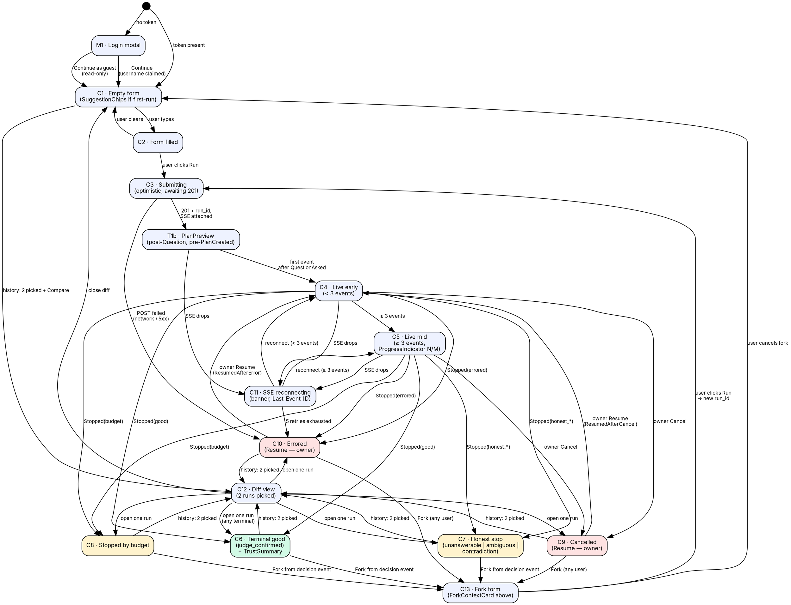

**Path coverage check.**
- Every live state (`C4`, `C5`, `C11`, `T1b`) has a route to every terminal (`C6`/`C7`/`C8`/`C9`/`C10`) — either directly or via `C11`.
- Every terminal state has a forward route: Fork → `C13`, Compare → `C12`, Resume → `C4` (owner-only on `C9`/`C10`).
- `C12` (diff) routes back to any terminal or to `C1`. `C13` (fork form) routes to `C3` (submit) or `C1` (cancel).
- `M1` cannot be re-entered from inside a run — logout is a UserFooter action that returns to `M1` via app reload (modeled implicitly by `start`).

---

## 4. Layers and data flow

Logical layers of the deployed system, from browser to database to external providers. Distinguishes **transport** (REST + SSE), **server** (registries + agent loop + single-writer task registry + lane router + BRD-26 meta-judge helper), **persistence** (PostgreSQL `events` / `runs` / `users` tables — no JSON snapshots in V1), and **external providers** (Anthropic Claude LLM provider — reached via the provider-agnostic `llm.call` interface, V1 active — + 4 search sources).

```dot
digraph DataFlow {
  rankdir=LR;
  compound=true;
  node [shape=box, style="rounded,filled", fontname="Inter", fontsize=10];
  edge [fontname="Inter", fontsize=9];

  subgraph cluster_client {
    label="Browser"; style="rounded,filled"; fillcolor="#f5f5f7";
    page      [label="Pages\n(HomePage, RunPage, DiffPage)", fillcolor="#eef2ff"];
    hooks     [label="Hooks\n(useRun, useEventStream,\nuseRunHistory, useUser,\nuseViewport, useRunMetrics)", fillcolor="#eef2ff"];
    rq        [label="TanStack Query cache", fillcolor="#dbeafe"];
    zustand   [label="Zustand stores\n(userStore, selectionStore)", fillcolor="#dbeafe"];
    components[label="Atoms · Molecules ·\nOrganisms · Templates", fillcolor="#eef2ff"];
    ls        [label="localStorage\n(novum.token, novum.username,\nnovum.history_toggle,\nnovum.advanced_open)", shape=cylinder, fillcolor="#fef3c7"];
  }

  subgraph cluster_transport {
    label="Transport"; style=dashed;
    http [label="REST / HTTPS\n(POST /runs · GET /runs ·\nGET /runs/{id} ·\nPOST /runs/{id}/cancel ·\nPOST /runs/{id}/resume)", fillcolor="#e0e7ff"];
    sse  [label="SSE\n(GET /runs/{id}/events,\nLast-Event-ID, 15s heartbeat)", fillcolor="#e0e7ff"];
  }

  subgraph cluster_server {
    label="Server (single-process · uvicorn --workers 1)"; style="rounded,filled"; fillcolor="#f5f5f7";
    api      [label="API handlers\n(FastAPI routers)", fillcolor="#fde68a"];
    orch     [label="Orchestrator\n(classify → route → lane →\nsynth → render)\napp/agent/orchestrator.py", fillcolor="#fde68a"];
    router   [label="Lane router\napp/agent/lane_router.py\nFAST · STANDARD · DEEP", fillcolor="#fde68a"];
    lane_fast[label="FAST lane\napp/agent/lanes/fast.py", fillcolor="#fde68a"];
    lane_std [label="STANDARD lane\napp/agent/lanes/standard.py", fillcolor="#fde68a"];
    lane_deep[label="DEEP lane\napp/agent/lanes/deep.py\n(ReAct + CoVe)", fillcolor="#fde68a"];
    meta     [label="Meta-judge helper\napp/agent/meta_judge_hook.py\n(VoC + AC · opt-in)", fillcolor="#fde68a"];
    signals  [label="StoppingSignal registry\nBudgetExhausted ·\nUserCancelled · JudgeSignal ·\nNoProgress + early-exit\ncheckpoints", fillcolor="#fde68a"];
    sources  [label="Source registry\nTavily · Wikipedia ·\nSemanticScholar · OpenAlex", fillcolor="#fde68a"];
    renderer [label="OutputRenderer registry\nprose · structured", fillcolor="#fde68a"];
    llm_client[label="llm.call\napp/llm/client.py\n(litellm + instructor +\ntenacity, all roles)", fillcolor="#fde68a"];
    lock     [label="Per-run anyio.Lock\n+ task registry\n(single writer per run)", fillcolor="#fde68a"];
  }

  subgraph cluster_store {
    label="Persistence"; style="rounded,filled"; fillcolor="#f5f5f7";
    pg [label="PostgreSQL 16\nevents (JSONB payload,\nappend-only) ·\nruns · users\n(SQLAlchemy 2.0 async\n+ asyncpg + Alembic)", shape=cylinder, fillcolor="#fef3c7"];
  }

  subgraph cluster_external {
    label="External providers"; style="rounded,filled"; fillcolor="#f5f5f7";
    gh   [label="Anthropic Claude\n(via litellm · x-api-key)\n· anthropic/claude-haiku-4-5\n  (classifier)\n· anthropic/claude-sonnet-4-6\n  (planner · synthesizer ·\n   judge · meta-judge)\nGemini/OpenAI/GitHub Models:\nwired but disabled in V1", fillcolor="#fecaca"];
    tav  [label="Tavily API\n(search_depth=advanced)", fillcolor="#fecaca"];
    wiki [label="Wikipedia REST",          fillcolor="#fecaca"];
    s2   [label="Semantic Scholar API",    fillcolor="#fecaca"];
    oa   [label="OpenAlex API",            fillcolor="#fecaca"];
  }

  // Client internal
  page -> hooks;
  hooks -> rq;
  hooks -> zustand;
  rq -> components       [label="data"];
  zustand -> components  [label="state"];
  components -> page     [label="render", style=dashed];
  zustand -> ls          [label="persist"];
  ls -> zustand          [label="hydrate"];

  // Client ↔ transport
  hooks -> http [label="fetch + token header"];
  http  -> hooks [label="JSON"];
  hooks -> sse  [label="EventSource\n+ Last-Event-ID"];
  sse   -> hooks [label="event stream"];

  // Transport ↔ server
  http -> api;
  api  -> http [label="JSON / 2xx · 4xx · 5xx"];
  sse  -> api;
  api  -> sse  [label="text/event-stream"];

  // Server internal
  api -> orch       [label="start / resume / cancel"];
  api -> lock       [label="acquire on append"];
  orch -> lock      [label="guard every append"];
  orch -> router    [label="select_lane(...)"];
  router -> orch    [label="RouteSelected\n(lane, reason, dimensions)"];
  orch -> lane_fast [label="dispatch (lane=FAST)"];
  orch -> lane_std  [label="dispatch (lane=STANDARD)"];
  orch -> lane_deep [label="dispatch (lane=DEEP)"];
  lane_fast -> orch [label="LaneEscalated →\nre-dispatch STANDARD", style=dashed];
  lane_std  -> meta [label="after_judge hook\n(opt-in)"];
  lane_deep -> meta [label="after_cove hook\n(opt-in · before mini-judge)"];
  meta -> lane_std  [label="continue: mint\nDirectedSubclaims", style=dashed];
  orch -> signals   [label="evaluate(state)"];
  signals -> orch   [label="vote: stop|continue|block"];
  lane_fast -> sources [label="parallel\nwiki+tavily"];
  lane_std  -> sources [label="search(query, k)\nper claim"];
  lane_deep -> sources [label="search +\ndeep_fetch"];
  sources -> lane_fast [label="Evidence[]"];
  sources -> lane_std  [label="Evidence[]"];
  sources -> lane_deep [label="Evidence[] +\nfull-text"];
  lane_fast -> llm_client [label="prompts\n(synth · mini-judge)"];
  lane_std  -> llm_client [label="prompts\n(planner · synth · judge)"];
  lane_deep -> llm_client [label="prompts\n(planner · ReAct ·\nsynth · CoVe · mini-judge)"];
  meta      -> llm_client [label="prompts\n(meta-judge VoC + AC)"];
  llm_client -> gh        [label="HTTPS"];
  gh         -> llm_client[label="completion"];
  orch -> renderer        [label="render(final state)\non Stopped"];
  renderer -> orch        [label="RenderedOutput"];

  // Server ↔ store
  orch -> pg [label="INSERT events\n(sole writer per run_id)"];
  api  -> pg [label="SELECT for SSE catch-up,\nlist, replay,\nuser/token validate"];

  // Sources ↔ external
  sources -> tav  [label="query"]; tav  -> sources [label="results"];
  sources -> wiki [label="query"]; wiki -> sources [label="results"];
  sources -> s2   [label="query"]; s2   -> sources [label="results"];
  sources -> oa   [label="query"]; oa   -> sources [label="results"];
}
```

**Path coverage check.**
- **Single persistent store**: PostgreSQL (`events`, `runs`, `users`). The V1 codebase has no `data/snapshots/<run_id>.json` and no `data/users.json` — those JSON files from the original design were eliminated when Postgres landed.
- Every external provider has a request and a response edge.
- The single-writer task registry (`anyio.Lock` per `run_id`) is the only path through which `orch` issues `INSERT` to the `events` table.
- Both directions of the client ↔ transport ↔ server triplet are present (request and response for REST; subscription and stream for SSE).
- **Lane dispatch** is explicit: the orchestrator delegates per-iteration work to exactly one of `lane_fast`, `lane_std`, `lane_deep`. `LaneEscalated` is the only re-entry from a lane back to the orchestrator (FAST → STANDARD transparent escalation).
- **Meta-judge helper** is wired only into `lane_std` (hook `after_judge`) and `lane_deep` (hook `after_cove`). It is **not** in the `StoppingSignal` registry — see §5 below for rationale. All meta-judge LLM calls flow through `llm.call` like every other role.
- **Anthropic Claude** is the only LLM provider **active** in V1, reached through the provider-agnostic `llm.call` interface (litellm). The interface also supports Gemini, OpenAI direct, and GitHub Models, but those are wired-and-disabled in V1. Two Claude tiers are used: `anthropic/claude-haiku-4-5` (classifier) and `anthropic/claude-sonnet-4-6` (planner, synthesizer, judge, meta-judge).
- The 4 sources (Tavily, Wikipedia, Semantic Scholar, OpenAlex) all conform to the `Source` plugin protocol; new sources plug in here without touching lanes.

---

## 5. Plugin seams

The three first-class extension points from §6-ter of [requirement-understanding.md](requirement-understanding.md). Each seam has: an **interface contract**, a **registry**, V1 implementations, and V2 / pair-session candidates (shown dashed). The explicit *not-seams* are documented so the pair session does not waste minutes proposing them.

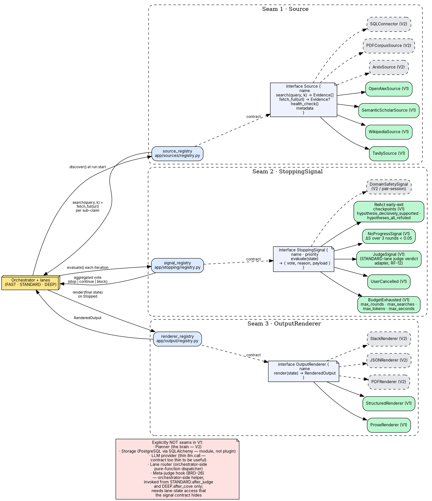

**Path coverage check.**
- Every seam has: a discovery edge (loop → registry), a contract edge (registry → interface), implementation edges (interface → each V1/V2 plugin), and a result edge (registry → loop).
- Each registry has at least 2 V1 plugins (Seam 1 has 4: Tavily, Wikipedia, Semantic Scholar, OpenAlex — guaranteeing source heterogeneity per RF-04).
- The `Source` contract now exposes both `search` (snippets, used by every round) and `fetch_full` (full page body, used by the deep-fetch escalation path in §10 of advanced-ai-research). Sources that cannot fetch full pages return `None` and are skipped by the deep-fetch path.
- **`StoppingSignal` registry V1 contents** are the actual ones in `app/stopping/`: `BudgetExhausted`, `UserCancelled`, `JudgeSignal`, `NoProgressSignal`, and the ReAct early-exit checkpoints. The original A/D/B/E/F naming (coverage / agreement / judge / honest-stop / budget) collapsed into these as the design firmed up — the "B" judge survives as `JudgeSignal`, "F" budget as `BudgetExhausted`, "E" honest-stop became the orchestrator-side `stop_rationale` field on the terminal `Stopped` event (not a signal vote), and "A" coverage / "D" agreement were absorbed into the per-lane analyzer (they are computed inside the STANDARD lane and feed `JudgeSignal` rather than living in the signal registry).
- The `nonseam` note now includes the **meta-judge hook (BRD-26)** with its rationale: the helper needs lane-state access (judge attempt counter, last `s_raw`, `last_voc_decision`, AC objection minting back to `state.claims`) that the `StoppingSignal.evaluate(state) → vote` contract intentionally hides. It is invoked from `lane_std.run` at `after_judge` and from `lane_deep.run` at `after_cove`. The hook is **opt-in** (`META_JUDGE_ENABLED=false` by default).
- The `nonseam` note is reachable from `loop` only via an invisible edge — it is documentation, not a runtime path.

---

## 6. Entity-Relationship diagram (database schema)

Logical ER view of the three tables defined in [architecture.md §5.2](../technical-phase/architecture.md). All three are Alembic-managed in `backend/alembic/versions/`. PKs in **bold**, FKs in *italics*. The `events.payload` column is `JSONB` and intentionally schemaless at the DB level (per RF rule 5 in `.github/copilot-instructions.md`); its allowed shapes per `events.type` are documented separately in [architecture.md §3.2](../technical-phase/architecture.md).

```dot
digraph NovumER {
  rankdir=LR;
  bgcolor="#FAFBFC";
  fontname="Inter";
  splines=ortho;
  nodesep=0.5;
  ranksep=1.0;
  node [shape=plaintext, fontname="Inter"];
  edge [fontname="Inter", fontsize=9, color="#5A6273", arrowsize=0.7];

  users [label=<
    <TABLE BORDER="0" CELLBORDER="1" CELLSPACING="0" CELLPADDING="6" BGCOLOR="#FFFFFF">
      <TR><TD BGCOLOR="#EAF3FB" COLSPAN="2"><B>users</B></TD></TR>
      <TR><TD ALIGN="LEFT"><B>id</B></TD>             <TD ALIGN="LEFT">UUID  PK</TD></TR>
      <TR><TD ALIGN="LEFT">username</TD>              <TD ALIGN="LEFT">VARCHAR(64) UNIQUE NOT NULL</TD></TR>
      <TR><TD ALIGN="LEFT">token_hash</TD>            <TD ALIGN="LEFT">TEXT NOT NULL  · sha256(token)</TD></TR>
      <TR><TD ALIGN="LEFT">created_at</TD>            <TD ALIGN="LEFT">TIMESTAMPTZ DEFAULT now()</TD></TR>
    </TABLE>
  >];

  runs [label=<
    <TABLE BORDER="0" CELLBORDER="1" CELLSPACING="0" CELLPADDING="6" BGCOLOR="#FFFFFF">
      <TR><TD BGCOLOR="#F5FBF7" COLSPAN="2"><B>runs</B></TD></TR>
      <TR><TD ALIGN="LEFT" PORT="pk"><B>id</B></TD>                    <TD ALIGN="LEFT">UUID  PK</TD></TR>
      <TR><TD ALIGN="LEFT" PORT="fk_user"><I>owner_username</I></TD>   <TD ALIGN="LEFT">VARCHAR(64)  FK → users.username</TD></TR>
      <TR><TD ALIGN="LEFT">question</TD>                               <TD ALIGN="LEFT">TEXT NOT NULL</TD></TR>
      <TR><TD ALIGN="LEFT">user_context</TD>                           <TD ALIGN="LEFT">TEXT NULL  · ≤1000 chars</TD></TR>
      <TR><TD ALIGN="LEFT">output_format</TD>                          <TD ALIGN="LEFT">VARCHAR(16)  'prose' | 'structured'</TD></TR>
      <TR><TD ALIGN="LEFT">confidence_threshold</TD>                   <TD ALIGN="LEFT">REAL NOT NULL  [0,1]</TD></TR>
      <TR><TD ALIGN="LEFT">question_type</TD>                          <TD ALIGN="LEFT">VARCHAR(32) NULL  · enum</TD></TR>
      <TR><TD ALIGN="LEFT">started_at</TD>                             <TD ALIGN="LEFT">TIMESTAMPTZ DEFAULT now()</TD></TR>
      <TR><TD ALIGN="LEFT">stopped_at</TD>                             <TD ALIGN="LEFT">TIMESTAMPTZ NULL</TD></TR>
      <TR><TD ALIGN="LEFT">stop_reason</TD>                            <TD ALIGN="LEFT">VARCHAR(32) NULL  · enum (7 values)</TD></TR>
      <TR><TD ALIGN="LEFT" PORT="fk_parent_run"><I>parent_run_id</I></TD>    <TD ALIGN="LEFT">UUID NULL  FK → runs.id (self)</TD></TR>
      <TR><TD ALIGN="LEFT" PORT="fk_fork_event"><I>forked_at_event_id</I></TD><TD ALIGN="LEFT">UUID NULL  FK → events.id</TD></TR>
    </TABLE>
  >];

  events [label=<
    <TABLE BORDER="0" CELLBORDER="1" CELLSPACING="0" CELLPADDING="6" BGCOLOR="#FFFFFF">
      <TR><TD BGCOLOR="#FFF4E8" COLSPAN="2"><B>events</B>  · append-only · source of truth</TD></TR>
      <TR><TD ALIGN="LEFT" PORT="pk"><B>id</B></TD>                          <TD ALIGN="LEFT">UUID  PK</TD></TR>
      <TR><TD ALIGN="LEFT" PORT="fk_run"><I>run_id</I></TD>                  <TD ALIGN="LEFT">UUID  FK → runs.id  · ON DELETE CASCADE</TD></TR>
      <TR><TD ALIGN="LEFT" PORT="fk_parent_event"><I>parent_event_id</I></TD><TD ALIGN="LEFT">UUID NULL  FK → events.id (self)</TD></TR>
      <TR><TD ALIGN="LEFT">step_index</TD>                                  <TD ALIGN="LEFT">INTEGER NOT NULL</TD></TR>
      <TR><TD ALIGN="LEFT">type</TD>                                        <TD ALIGN="LEFT">VARCHAR(48)  · discriminator (≈17 values)</TD></TR>
      <TR><TD ALIGN="LEFT">payload</TD>                                     <TD ALIGN="LEFT">JSONB NOT NULL  · Pydantic, extra="allow"</TD></TR>
      <TR><TD ALIGN="LEFT">created_at</TD>                                  <TD ALIGN="LEFT">TIMESTAMPTZ DEFAULT now()</TD></TR>
    </TABLE>
  >];

  // ---------- Relationships ----------
  // users 1 ── ∞ runs
  users -> runs:fk_user                  [label="1..N\nowns", arrowhead=crow, arrowtail=tee, dir=both];

  // runs 1 ── ∞ events
  runs:pk -> events:fk_run               [label="1..N\nappends", arrowhead=crow, arrowtail=tee, dir=both];

  // runs self-FK (fork lineage)
  runs:fk_parent_run -> runs:pk          [label="0..1\nfork parent", arrowhead=crow, arrowtail=tee, dir=both, style=dashed, constraint=false];

  // events self-FK (causal lineage inside a run)
  events:fk_parent_event -> events:pk    [label="0..1\nderived from", arrowhead=crow, arrowtail=tee, dir=both, style=dashed, constraint=false];

  // runs.forked_at_event_id → events.id (which exact event a fork branched from)
  runs:fk_fork_event -> events:pk        [label="0..1\nforked at", arrowhead=normal, arrowtail=none, style=dotted];
}
```

### Indexes (operational)

| Table | Index | Purpose |
|---|---|---|
| `users` | `UNIQUE (username)` | login lookup |
| `runs`  | `(owner_username, started_at DESC)` | "My runs" listing (RF-09) |
| `runs`  | `(started_at DESC)`                 | "All public" listing |
| `runs`  | `(parent_run_id)`                   | fork tree queries |
| `events`| `(run_id, step_index)`              | replay in order |
| `events`| `(run_id, id)`                      | Last-Event-ID resume lookup |

### Cardinality summary

- **users : runs** — `1 : N` (a user owns many runs).
- **runs : events** — `1 : N` (a run owns many events; cascade delete).
- **runs : runs (parent_run_id)** — `0..1 : N` (any run may have one parent; the root has none).
- **runs : events (forked_at_event_id)** — `0..1 : 1` (a forked run points at the exact event it branched from).
- **events : events (parent_event_id)** — `0..1 : N` (causal chain inside a run; used by Dispute / Judge events that reference an earlier evidence event).

### Payload contracts

The `events.payload JSONB` column is the **schema-less seam**: new event subtypes and new optional keys ship without an Alembic migration. The full discriminated union is enumerated in [architecture.md §3.2](../technical-phase/architecture.md). Rename/remove of a key inside `payload` requires an explicit data migration (Alembic with `UPDATE events SET payload = ...`).

---

## 7. Object diagram (runtime snapshot of one finished run)

A concrete instance of the schema in §6, frozen at the moment the agent emits `Stopped(judge_confirmed)` for a sample run. Useful for grounding the abstract ER in real data: shows one user, one run, six events, and the exact links between them. Identifiers are abbreviated (`u‑1`, `r‑1`, `e‑1`…) to keep the diagram readable.

```dot
digraph NovumObjects {
  rankdir=TB;
  bgcolor="#FAFBFC";
  fontname="Inter";
  splines=ortho;
  nodesep=0.4;
  ranksep=0.7;
  node [shape=plaintext, fontname="Inter"];
  edge [fontname="Inter", fontsize=9, color="#5A6273", arrowsize=0.7];

  // ---------- User instance ----------
  u1 [label=<
    <TABLE BORDER="0" CELLBORDER="1" CELLSPACING="0" CELLPADDING="5" BGCOLOR="#FFFFFF">
      <TR><TD BGCOLOR="#EAF3FB" COLSPAN="2"><B>u-1 : User</B></TD></TR>
      <TR><TD ALIGN="LEFT">id</TD>         <TD ALIGN="LEFT">u-1</TD></TR>
      <TR><TD ALIGN="LEFT">username</TD>   <TD ALIGN="LEFT">"alex"</TD></TR>
      <TR><TD ALIGN="LEFT">token_hash</TD> <TD ALIGN="LEFT">sha256(…)</TD></TR>
      <TR><TD ALIGN="LEFT">created_at</TD> <TD ALIGN="LEFT">2026-05-26T14:00Z</TD></TR>
    </TABLE>
  >];

  // ---------- Run instance ----------
  r1 [label=<
    <TABLE BORDER="0" CELLBORDER="1" CELLSPACING="0" CELLPADDING="5" BGCOLOR="#FFFFFF">
      <TR><TD BGCOLOR="#F5FBF7" COLSPAN="2"><B>r-1 : Run</B></TD></TR>
      <TR><TD ALIGN="LEFT">id</TD>                  <TD ALIGN="LEFT">r-1</TD></TR>
      <TR><TD ALIGN="LEFT">owner_username</TD>      <TD ALIGN="LEFT">"alex"</TD></TR>
      <TR><TD ALIGN="LEFT">question</TD>            <TD ALIGN="LEFT">"Is Python's GIL removed in 3.13?"</TD></TR>
      <TR><TD ALIGN="LEFT">user_context</TD>        <TD ALIGN="LEFT">NULL</TD></TR>
      <TR><TD ALIGN="LEFT">output_format</TD>       <TD ALIGN="LEFT">"prose"</TD></TR>
      <TR><TD ALIGN="LEFT">confidence_threshold</TD><TD ALIGN="LEFT">0.80</TD></TR>
      <TR><TD ALIGN="LEFT">question_type</TD>       <TD ALIGN="LEFT">"factual"</TD></TR>
      <TR><TD ALIGN="LEFT">started_at</TD>          <TD ALIGN="LEFT">2026-05-26T14:05:00Z</TD></TR>
      <TR><TD ALIGN="LEFT">stopped_at</TD>          <TD ALIGN="LEFT">2026-05-26T14:05:42Z</TD></TR>
      <TR><TD ALIGN="LEFT">stop_reason</TD>         <TD ALIGN="LEFT">"judge_confirmed"</TD></TR>
      <TR><TD ALIGN="LEFT">parent_run_id</TD>       <TD ALIGN="LEFT">NULL</TD></TR>
      <TR><TD ALIGN="LEFT">forked_at_event_id</TD>  <TD ALIGN="LEFT">NULL</TD></TR>
    </TABLE>
  >];

  // ---------- Event instances (ordered by step_index) ----------
  e1 [label=<
    <TABLE BORDER="0" CELLBORDER="1" CELLSPACING="0" CELLPADDING="5" BGCOLOR="#FFFFFF">
      <TR><TD BGCOLOR="#FFF4E8" COLSPAN="2"><B>e-1 : Event</B>  · QuestionAsked</TD></TR>
      <TR><TD ALIGN="LEFT">run_id</TD>          <TD ALIGN="LEFT">r-1</TD></TR>
      <TR><TD ALIGN="LEFT">parent_event_id</TD> <TD ALIGN="LEFT">NULL</TD></TR>
      <TR><TD ALIGN="LEFT">step_index</TD>      <TD ALIGN="LEFT">0</TD></TR>
      <TR><TD ALIGN="LEFT">type</TD>            <TD ALIGN="LEFT">"QuestionAsked"</TD></TR>
      <TR><TD ALIGN="LEFT">payload</TD>         <TD ALIGN="LEFT" BALIGN="LEFT">{<BR/>  question: "Is Python's GIL...",<BR/>  format: "prose",<BR/>  threshold: 0.8<BR/>}</TD></TR>
    </TABLE>
  >];

  e2 [label=<
    <TABLE BORDER="0" CELLBORDER="1" CELLSPACING="0" CELLPADDING="5" BGCOLOR="#FFFFFF">
      <TR><TD BGCOLOR="#FFF4E8" COLSPAN="2"><B>e-2 : Event</B>  · PlanCreated</TD></TR>
      <TR><TD ALIGN="LEFT">run_id</TD>          <TD ALIGN="LEFT">r-1</TD></TR>
      <TR><TD ALIGN="LEFT">parent_event_id</TD> <TD ALIGN="LEFT">e-1</TD></TR>
      <TR><TD ALIGN="LEFT">step_index</TD>      <TD ALIGN="LEFT">1</TD></TR>
      <TR><TD ALIGN="LEFT">type</TD>            <TD ALIGN="LEFT">"PlanCreated"</TD></TR>
      <TR><TD ALIGN="LEFT">payload</TD>         <TD ALIGN="LEFT" BALIGN="LEFT">{<BR/>  question_type: "factual",<BR/>  sub_claims: ["GIL removed?",<BR/>               "since version?"]<BR/>}</TD></TR>
    </TABLE>
  >];

  e3 [label=<
    <TABLE BORDER="0" CELLBORDER="1" CELLSPACING="0" CELLPADDING="5" BGCOLOR="#FFFFFF">
      <TR><TD BGCOLOR="#FFF4E8" COLSPAN="2"><B>e-3 : Event</B>  · ToolCalled</TD></TR>
      <TR><TD ALIGN="LEFT">run_id</TD>          <TD ALIGN="LEFT">r-1</TD></TR>
      <TR><TD ALIGN="LEFT">parent_event_id</TD> <TD ALIGN="LEFT">e-2</TD></TR>
      <TR><TD ALIGN="LEFT">step_index</TD>      <TD ALIGN="LEFT">2</TD></TR>
      <TR><TD ALIGN="LEFT">type</TD>            <TD ALIGN="LEFT">"ToolCalled"</TD></TR>
      <TR><TD ALIGN="LEFT">payload</TD>         <TD ALIGN="LEFT" BALIGN="LEFT">{<BR/>  tool: "tavily",<BR/>  query: "PEP 703 free-threaded"<BR/>}</TD></TR>
    </TABLE>
  >];

  e4 [label=<
    <TABLE BORDER="0" CELLBORDER="1" CELLSPACING="0" CELLPADDING="5" BGCOLOR="#FFFFFF">
      <TR><TD BGCOLOR="#FFF4E8" COLSPAN="2"><B>e-4 : Event</B>  · EvidenceAdded</TD></TR>
      <TR><TD ALIGN="LEFT">run_id</TD>          <TD ALIGN="LEFT">r-1</TD></TR>
      <TR><TD ALIGN="LEFT">parent_event_id</TD> <TD ALIGN="LEFT">e-3</TD></TR>
      <TR><TD ALIGN="LEFT">step_index</TD>      <TD ALIGN="LEFT">3</TD></TR>
      <TR><TD ALIGN="LEFT">type</TD>            <TD ALIGN="LEFT">"EvidenceAdded"</TD></TR>
      <TR><TD ALIGN="LEFT">payload</TD>         <TD ALIGN="LEFT" BALIGN="LEFT">{<BR/>  source_url: "peps.python.org/...",<BR/>  chunks: [...],<BR/>  captured_at: "2026-05-26T..."<BR/>}</TD></TR>
    </TABLE>
  >];

  e5 [label=<
    <TABLE BORDER="0" CELLBORDER="1" CELLSPACING="0" CELLPADDING="5" BGCOLOR="#FFFFFF">
      <TR><TD BGCOLOR="#FFF4E8" COLSPAN="2"><B>e-5 : Event</B>  · JudgeRuled</TD></TR>
      <TR><TD ALIGN="LEFT">run_id</TD>          <TD ALIGN="LEFT">r-1</TD></TR>
      <TR><TD ALIGN="LEFT">parent_event_id</TD> <TD ALIGN="LEFT">e-4</TD></TR>
      <TR><TD ALIGN="LEFT">step_index</TD>      <TD ALIGN="LEFT">4</TD></TR>
      <TR><TD ALIGN="LEFT">type</TD>            <TD ALIGN="LEFT">"JudgeRuled"</TD></TR>
      <TR><TD ALIGN="LEFT">payload</TD>         <TD ALIGN="LEFT" BALIGN="LEFT">{<BR/>  sufficient: true,<BR/>  confidence: 0.92,<BR/>  S: 0.95, J: 0.88,<BR/>  rationale: "two primary sources..."<BR/>}</TD></TR>
    </TABLE>
  >];

  e6 [label=<
    <TABLE BORDER="0" CELLBORDER="1" CELLSPACING="0" CELLPADDING="5" BGCOLOR="#D1FAE5">
      <TR><TD BGCOLOR="#A7F3D0" COLSPAN="2"><B>e-6 : Event</B>  · Stopped</TD></TR>
      <TR><TD ALIGN="LEFT">run_id</TD>          <TD ALIGN="LEFT">r-1</TD></TR>
      <TR><TD ALIGN="LEFT">parent_event_id</TD> <TD ALIGN="LEFT">e-5</TD></TR>
      <TR><TD ALIGN="LEFT">step_index</TD>      <TD ALIGN="LEFT">5</TD></TR>
      <TR><TD ALIGN="LEFT">type</TD>            <TD ALIGN="LEFT">"Stopped"</TD></TR>
      <TR><TD ALIGN="LEFT">payload</TD>         <TD ALIGN="LEFT" BALIGN="LEFT">{<BR/>  stop_reason: "judge_confirmed",<BR/>  final_summary: "Yes, optional in 3.13..."<BR/>}</TD></TR>
    </TABLE>
  >];

  // ---------- Ownership ----------
  u1 -> r1 [label="owns"];
  r1 -> e1 [label="contains"];
  r1 -> e2 [style=invis];
  r1 -> e3 [style=invis];
  r1 -> e4 [style=invis];
  r1 -> e5 [style=invis];
  r1 -> e6 [style=invis];

  // ---------- Causal chain (parent_event_id) ----------
  e1 -> e2 [label="parent_event_id", color="#7E4A14", style=dashed];
  e2 -> e3 [label="parent_event_id", color="#7E4A14", style=dashed];
  e3 -> e4 [label="parent_event_id", color="#7E4A14", style=dashed];
  e4 -> e5 [label="parent_event_id", color="#7E4A14", style=dashed];
  e5 -> e6 [label="parent_event_id", color="#7E4A14", style=dashed];

  { rank=same; e1; e2; e3; e4; e5; e6; }
}
```

**What this snapshot illustrates.**

- A single `User` (`alex`) owns a single `Run` (`r-1`); the run has six events ordered by `step_index`.
- The **causal chain** (`parent_event_id`, dashed) walks `QuestionAsked → PlanCreated → ToolCalled → EvidenceAdded → JudgeRuled → Stopped` — exactly the happy-path sequence from §1.
- `Stopped.payload.stop_reason = "judge_confirmed"` (one of the 7 enum values) — never free text.
- `Run.stopped_at` and `Run.stop_reason` are the **denormalized projection** of the terminal `Stopped` event, present on the row to make "list my runs" queries (RF-09) index-friendly.
- `Run.parent_run_id` and `Run.forked_at_event_id` are `NULL` because this is a root run, not a fork. A fork of, say, `e-2` (the `PlanCreated` decision point, RF-03) would create a new `Run` with `parent_run_id=r-1`, `forked_at_event_id=e-2`, and copy events `e-1`…`e-2` into the new run before continuing from there.
- Every `EvidenceAdded` payload carries `captured_at` so re-running the same run later (with stale or evolving sources) is still **read-deterministic** (RF principle 4).

---

## 8. Agentic architecture

A structural view of **what lives inside the agent runtime**, complementary to §1 (temporal), §2 (states), §4 (system layers) and §5 (plugin seams). This one answers *"who does what, and through which contract"*: the **lane router** that dispatches into one of three lanes (FAST · STANDARD · DEEP), the **five LLM-backed roles** (classifier, planner, synthesizer, judge, meta-judge), the **three plugin registries** (sources, signals, renderers), the **opt-in meta-judge helper** that wraps the judge in STANDARD and CoVe in DEEP (BRD-26), and the **single sink** every component writes to (the `events` table).

The diagram makes six V1 design choices visible at a glance:

1. **No LangGraph / LangChain.** The orchestrator is a `match` over `state.phase` inside one Python function (`app/agent/orchestrator.py`). Every LLM role goes through the same `llm.client.call(role, …)` seam (architecture.md §4.3, ai-services.md §1.3).
2. **Three lanes, deterministic dispatch.** `lane_router.select_lane(...)` is a pure function over `(question_type, complexity_hint, temporal_sensitivity, …)` and writes its decision to the event log as `RouteSelected`. Replaying that event re-dispatches the same lane (RF-08 read-determinism).
3. **The judge is the only positive-terminal authority** for STANDARD and DEEP — there is no `coverage_met` bypass. FAST has a dedicated `mini-judge` that uses the same Judge role with `FAST_MINI_JUDGE_PROMPT`.
4. **Meta-judge is an opt-in helper, not a signal.** When `META_JUDGE_ENABLED=true`, the orchestrator calls `meta_judge_hook.maybe_run_meta_judge(...)` from `lane_std.run` (hook `after_judge`) and from `lane_deep.run` (hook `after_cove`). It can confirm, switch the answer to `best_effort` with `Stopped(stopped_by_budget)`, or mint **directed sub-claims** that re-enter the SEARCHING loop (BRD-26, §7.5 advanced-ai-research).
5. **4 terminal stop_reasons only.** `judge_confirmed`, `stopped_by_budget`, `user_cancelled`, `errored`. Honest-failure scenarios surface as `stopped_by_budget` with `answer_kind=best_effort` and a descriptive `stop_rationale` (advanced-ai-research §7.6).
6. **Provider-agnostic LLM interface; Anthropic Claude is the only active provider in V1.** `llm.call` routes through `litellm` and supports Anthropic, Google Gemini, OpenAI direct, and GitHub Models. V1 enables only Anthropic Claude: `anthropic/claude-haiku-4-5` (classifier) and `anthropic/claude-sonnet-4-6` (planner · synthesizer · judge · meta-judge). Switching the active provider is one line in `app/llm/models.py` + the matching API key env var.

```dot
digraph AgenticArchitecture {
  rankdir=TB; compound=true; newrank=true; splines=ortho;
  nodesep=0.4; ranksep=0.6; bgcolor="#FAFBFC"; fontname="Inter";
  node [fontname="Inter", fontsize=10, style="rounded,filled"];
  edge [fontname="Inter", fontsize=9, color="#5A6273", arrowsize=0.7];

  // ---------------- Inputs ----------------
  subgraph cluster_input {
    label="Inputs (POST /runs)"; style="rounded,filled"; fillcolor="#F5F5F7"; fontsize=11;
    inp_q  [label="question",                            shape=box, fillcolor="#eef2ff"];
    inp_c  [label="user_context\n(optional, ≤1000 chars)", shape=box, fillcolor="#eef2ff"];
    inp_th [label="confidence_threshold ∈ [0,1]",        shape=box, fillcolor="#eef2ff"];
    inp_fmt[label="output_format\nprose | structured",   shape=box, fillcolor="#eef2ff"];
  }

  // ---------------- Shared core ----------------
  subgraph cluster_core {
    label="Shared core"; style="rounded,filled"; fillcolor="#F5F5F7"; fontsize=11;
    state [label="RunState (Pydantic)\nphase · lane · sub_claims ·\nhypotheses · evidence ·\ncoverage · budgets ·\njudge_attempts · last_voc_*",
           shape=box3d, fillcolor="#fde68a"];
    llm   [label="llm.client.call(role, …)\nlitellm + instructor +\ntenacity (provider-agnostic;\nV1 → Anthropic only)",
           shape=box, fillcolor="#fde68a"];
    orch  [label="Orchestrator (FSM)\napp/agent/orchestrator.py\nwhile not state.is_terminal:\n  match state.phase: …",
           shape=box, fillcolor="#fde68a"];
    router[label="Lane router\napp/agent/lane_router.py\nselect_lane(...)\n→ FAST · STANDARD · DEEP",
           shape=box, fillcolor="#fde68a"];
    meta  [label="Meta-judge hook (opt-in)\napp/agent/meta_judge_hook.py\nmaybe_run_meta_judge(state, hook)\nhook ∈ {after_judge,\n        after_cove}",
           shape=box, fillcolor="#fde68a"];
  }

  // ---------------- Phase 1: Classifier ----------------
  subgraph cluster_classify {
    label="Phase · CLASSIFYING"; style="rounded,filled"; fillcolor="#FFF8E1"; fontsize=11;
    cls [label="Classifier role\n(anthropic/claude-haiku-4-5)\nprompt: question_type +\ncomplexity_hint +\ntemporal_sensitivity +\nexpected_experts[]",
         shape=box, fillcolor="#fde68a"];
    cls_out [label="QuestionClassified\n{question_type,\ncomplexity_hint,\ntemporal_sensitivity,\nexpected_experts[]}",
             shape=note, fillcolor="#fff3cd"];
  }

  // ---------------- Phase: lane dispatch ----------------
  subgraph cluster_dispatch {
    label="Phase · ROUTE_SELECTING"; style="rounded,filled"; fillcolor="#FFF8E1"; fontsize=11;
    route_out [label="RouteSelected\n{lane, reason, dimensions}",
               shape=note, fillcolor="#fff3cd"];
  }

  // ---------------- FAST lane ----------------
  subgraph cluster_fast {
    label="FAST lane · app/agent/lanes/fast.py"; style="rounded,filled"; fillcolor="#FFF8E1"; fontsize=11;
    fast_search [label="Combined search\nasyncio.gather(\n  wiki.search(q,3),\n  tavily.search(q,3))",
                 shape=box, fillcolor="#fde68a"];
    fast_synth  [label="Synthesizer role (FAST_SYNTH_PROMPT)\n→ 1-2 sentence answer",
                 shape=box, fillcolor="#fde68a"];
    fast_mj     [label="Mini-judge\n(Judge role +\nFAST_MINI_JUDGE_PROMPT)\n→ MiniJudgeVerdict{ok,j_score}",
                 shape=box, fillcolor="#fde68a"];
    fast_gate   [label="gate: S_effective ≥ 0.85\n∧ mini_judge.ok\n→ JUDGE_CONFIRMED\nelse → LaneEscalated",
                 shape=box, fillcolor="#fde68a"];
  }

  // ---------------- STANDARD lane ----------------
  subgraph cluster_std {
    label="STANDARD lane · app/agent/lanes/standard.py"; style="rounded,filled"; fillcolor="#FFF8E1"; fontsize=11;
    std_pln  [label="Planner role\nPlan(sub_claims[], queries[],\npreferred_sources[])",
              shape=box, fillcolor="#fde68a"];
    std_crit [label="Plan self-critique\n(CRITIQUING)\nregenerate if invalid",
              shape=box, fillcolor="#fde68a"];
    std_exec [label="Search executor\nper-claim cascade\nQueryReformulated? per round\nEchoChamberDetected? per round",
              shape=box, fillcolor="#fde68a"];
    std_anal [label="Analyzer\nS_raw = coverage · diversity ·\nagreement · no_conflict\nAuthorityTier × kind_ceiling\nPlanGapsDetected? (capped)",
              shape=box, fillcolor="#fde68a"];
    std_syn  [label="Synthesizer role\n(anthropic/claude-sonnet-4-6)\nshape by AnswerKind",
              shape=box, fillcolor="#fde68a"];
    std_jdg  [label="Judge role\n(anthropic/claude-sonnet-4-6)\nJudgeVerdict{sufficient,\nshallow_claim_ids[], j_score}",
              shape=box, fillcolor="#fde68a"];
    std_df   [label="Deep-fetch escalation\nSource.fetch_full(url)\n→ re-analyze (capped)",
              shape=box, fillcolor="#fde68a"];
  }

  // ---------------- DEEP lane ----------------
  subgraph cluster_deep {
    label="DEEP lane · app/agent/lanes/deep.py"; style="rounded,filled"; fillcolor="#FFF8E1"; fontsize=11;
    dp_pln   [label="Planner role +\nHypothesesGenerated\n(2..4 hypotheses)",
              shape=box, fillcolor="#fde68a"];
    dp_init  [label="Initial parallel search",
              shape=box, fillcolor="#fde68a"];
    dp_react [label="ReAct sub-FSM (≤ 8 steps)\nAgentThought → AgentAction\n(search | deep_fetch |\nevaluate_hypothesis | finish)\n→ AgentObservation +\nHypothesisEvaluated +\nHistorySummarized?",
              shape=box, fillcolor="#fde68a"];
    dp_syn   [label="Synthesizer role\nskeleton = confirmed hypotheses",
              shape=box, fillcolor="#fde68a"];
    dp_cove  [label="CoVe pass\nVerificationQuestionsGenerated[3]\nCoveContradictionDetected? →\nre-draft (≤ max_cove_rounds=1)",
              shape=box, fillcolor="#fde68a"];
    dp_mj    [label="Mini-judge\n(Judge role +\nFAST_MINI_JUDGE_PROMPT)",
              shape=box, fillcolor="#fde68a"];
  }

  // ---------------- Source registry ----------------
  subgraph cluster_sources {
    label="Source registry (Seam 1)"; style="rounded,dashed"; fillcolor="#FFFFFF";
    src_tav  [label="TavilySource\n(search_depth=advanced)", shape=box, fillcolor="#bbf7d0"];
    src_wiki [label="WikipediaSource",                       shape=box, fillcolor="#bbf7d0"];
    src_s2   [label="SemanticScholarSource",                 shape=box, fillcolor="#bbf7d0"];
    src_oa   [label="OpenAlexSource",                        shape=box, fillcolor="#bbf7d0"];
  }

  // ---------------- Stopping-signal registry ----------------
  subgraph cluster_signals {
    label="StoppingSignal registry (Seam 2)"; style="rounded,filled"; fillcolor="#FFF8E1"; fontsize=11;
    sig_budget [label="BudgetExhausted\n(max_rounds · max_searches ·\nmax_tokens · max_seconds)", shape=box, fillcolor="#bbf7d0"];
    sig_cancel [label="UserCancelled",   shape=box, fillcolor="#bbf7d0"];
    sig_judge  [label="JudgeSignal\n(STANDARD verdict adapter)", shape=box, fillcolor="#bbf7d0"];
    sig_nop    [label="NoProgressSignal\n(ΔS over 3 rounds < 0.05)", shape=box, fillcolor="#bbf7d0"];
    sig_react  [label="ReAct early-exit checkpoints\nhypothesis_decisively_supported ·\nhypotheses_all_refuted", shape=box, fillcolor="#bbf7d0"];
    agg        [label="aggregate(state)\n→ {vote, reason}", shape=box, fillcolor="#fde68a"];
  }

  // ---------------- Output renderer ----------------
  subgraph cluster_out {
    label="Terminal · OutputRenderer (Seam 3)"; style="rounded,filled"; fillcolor="#FFF8E1"; fontsize=11;
    rnd_prose  [label="ProseRenderer",      shape=box, fillcolor="#bbf7d0"];
    rnd_struct [label="StructuredRenderer", shape=box, fillcolor="#bbf7d0"];
  }

  // ---------------- Event log + external LLM ----------------
  log [label="events table (PostgreSQL · JSONB · append-only)\nQuestionAsked · QuestionClassified · RouteSelected · LaneEscalated · PlanCreated · HypothesesGenerated · HypothesisEvaluated ·\nToolCalled · EvidenceAdded · QueryReformulated · EchoChamberDetected · SourceFailed · PlanGapsDetected · NoProgressDetected ·\nAgentThought · AgentAction · AgentObservation · HistorySummarized · DeepFetchPerformed · DraftSynthesized · VerificationQuestionsGenerated ·\nCoveContradictionDetected · JudgeRuled · MetaStopVerdict · AdversarialObjectionsGenerated · DirectedSubclaimsFromObjections · Stopped",
       shape=cylinder, fillcolor="#fef3c7", width=8];
  ext_llm [label="Anthropic Claude\n(provider-agnostic via litellm)\nclaude-haiku-4-5  ·  claude-sonnet-4-6",
           shape=box, fillcolor="#fecaca"];

  // ============= EDGES =============

  // Inputs → orchestrator
  inp_q  -> orch;
  inp_c  -> orch;
  inp_th -> std_jdg [label="threshold", style=dashed];
  inp_th -> fast_gate [label="threshold", style=dashed];
  inp_fmt-> rnd_prose  [label="if prose",      style=dashed];
  inp_fmt-> rnd_struct [label="if structured", style=dashed];

  // Orchestrator ↔ state
  orch -> state [dir=both, label="read / write"];

  // Classifier
  orch -> cls [label="phase=CLASSIFYING"];
  cls  -> llm; llm -> cls [label="QuestionClassified", style=dashed];
  cls  -> cls_out;
  cls_out -> log [label="QuestionClassified", style=dashed];

  // Lane router
  orch -> router [label="phase=ROUTE_SELECTING"];
  router -> route_out;
  route_out -> log [label="RouteSelected", style=dashed];

  // Dispatch
  router -> fast_search [label="lane=FAST"];
  router -> std_pln     [label="lane=STANDARD"];
  router -> dp_pln      [label="lane=DEEP"];

  // FAST flow
  fast_search -> src_tav  [label="search"];
  fast_search -> src_wiki [label="search"];
  src_tav  -> fast_search [style=dashed];
  src_wiki -> fast_search [style=dashed];
  fast_search -> fast_synth -> fast_mj -> fast_gate;
  fast_synth -> llm; llm -> fast_synth [style=dashed];
  fast_mj    -> llm; llm -> fast_mj    [style=dashed];
  fast_gate  -> log [label="JUDGE_CONFIRMED |\nLaneEscalated", style=dashed];
  fast_gate  -> std_pln [label="escalate (transparent)", color="#B45309"];

  // STANDARD flow
  std_pln -> llm; llm -> std_pln [style=dashed];
  std_pln -> std_crit -> std_exec -> std_anal -> std_syn -> std_jdg;
  std_crit -> std_pln [label="critique invalid →\nregenerate", style=dashed];
  std_anal -> std_exec [label="PlanGapsDetected\n(extra round)", style=dashed];
  std_exec -> src_tav  [label="search"];
  std_exec -> src_wiki [label="search"];
  std_exec -> src_s2   [label="search"];
  std_exec -> src_oa   [label="search"];
  src_tav  -> std_exec [style=dashed];
  src_wiki -> std_exec [style=dashed];
  src_s2   -> std_exec [style=dashed];
  src_oa   -> std_exec [style=dashed];
  std_syn  -> llm; llm -> std_syn [style=dashed];
  std_jdg  -> llm; llm -> std_jdg [style=dashed];
  std_jdg  -> std_df  [label="shallow_claim_ids[] ≠ []", style=dashed];
  std_df   -> src_tav [label="fetch_full", style=dashed];
  src_tav  -> std_df  [style=dashed];
  std_df   -> std_anal [label="DeepFetchPerformed →\nre-analyze"];
  std_jdg  -> meta    [label="after_judge hook"];
  std_jdg  -> log [label="JudgeRuled", style=dashed];

  // DEEP flow
  dp_pln -> llm; llm -> dp_pln [style=dashed];
  dp_pln -> dp_init -> dp_react -> dp_syn -> dp_cove;
  dp_react -> dp_react [label="step++\n(≤ max_react_steps)"];
  dp_react -> src_tav  [label="action=search"];
  dp_react -> src_wiki [label="action=search"];
  dp_react -> src_s2   [label="action=search"];
  dp_react -> src_oa   [label="action=search"];
  dp_react -> llm; llm -> dp_react [style=dashed];
  dp_syn   -> llm; llm -> dp_syn   [style=dashed];
  dp_cove  -> llm; llm -> dp_cove  [style=dashed];
  dp_cove  -> dp_syn [label="CoveContradictionDetected\n→ re-draft", style=dashed];
  dp_cove  -> meta   [label="after_cove hook\n(BEFORE mini-judge)"];
  dp_cove  -> dp_mj  [label="if ¬ enabled or\nskipped"];
  meta     -> dp_mj  [label="continue ∧\nΔ_s < min"];
  dp_mj    -> llm; llm -> dp_mj [style=dashed];

  // Meta-judge outcomes
  meta -> llm; llm -> meta [label="MetaStopVerdict +\nAdversarialObjectionsGenerated", style=dashed];
  meta -> log [label="MetaStopVerdict /\nAdversarialObjectionsGenerated /\nDirectedSubclaimsFromObjections", style=dashed];
  meta -> std_exec [label="continue ∧\nAC: ¬ all_answered →\nmint DirectedSubclaims", color="#B45309"];
  meta -> std_exec [label="continue ∧\nΔ_s ≥ min", color="#B45309", style=dashed];

  // Signal evaluation every iteration
  state -> sig_budget [label="evaluate", style=dashed];
  state -> sig_cancel [label="evaluate", style=dashed];
  state -> sig_judge  [label="evaluate", style=dashed];
  state -> sig_nop    [label="evaluate", style=dashed];
  state -> sig_react  [label="evaluate", style=dashed];
  sig_budget -> agg;
  sig_cancel -> agg;
  sig_judge  -> agg;
  sig_nop    -> agg;
  sig_react  -> agg;
  agg -> orch [label="decision\n(stop | continue)"];

  // LLM provider edges (consolidated)
  llm -> ext_llm [label="HTTPS"];
  ext_llm -> llm [style=dashed];

  // Search emits events
  std_exec -> log [label="ToolCalled / EvidenceAdded /\nQueryReformulated /\nEchoChamberDetected /\nSourceFailed", style=dashed];
  dp_react -> log [label="AgentThought / Action /\nObservation / Hypothesis* /\nHistorySummarized", style=dashed];

  // Terminal path
  agg       -> rnd_prose  [label="JUDGE_CONFIRMED →\nrender prose",      color="#15803D"];
  agg       -> rnd_struct [label="JUDGE_CONFIRMED →\nrender structured", color="#15803D"];
  rnd_prose  -> log [label="Stopped(judge_confirmed)\n+ final answer", style=dashed];
  rnd_struct -> log [label="Stopped(judge_confirmed)\n+ final answer", style=dashed];

  // Budget / cancel / errored terminals
  sig_budget -> log [label="Stopped(stopped_by_budget)\n[answer_kind=best_effort?]", style=dashed];
  sig_cancel -> log [label="Stopped(user_cancelled)", style=dashed];
  orch       -> log [label="Stopped(errored)\non LLM/source error", style=dashed];

  // Reading-order spine
  inp_q -> orch  [style=invis, weight=30];
  orch  -> cls   [style=invis, weight=20];
  cls   -> router[style=invis, weight=20];
  router-> std_pln [style=invis, weight=10];
}
```

### The five LLM roles and what guarantees their correctness

| Role | Model (V1) | Phase | Prompt style | Structured output (instructor) | Guardrails |
|---|---|---|---|---|---|
| **Classifier** | `anthropic/claude-haiku-4-5` | CLASSIFYING | *"is this factually answerable? estimate complexity / temporal sensitivity / expected experts"* | `QuestionClassified` | Drives `lane_router.select_lane(...)`. Unanswerable types (predictive without data, opinion, personal) still enter the FSM but converge on `stopped_by_budget` with `answer_kind=best_effort` rather than refusing up-front. |
| **Planner** | `anthropic/claude-sonnet-4-6` | STANDARD/DEEP planning | *"decompose into atomic, verifiable sub-claims"* (STANDARD) / *"+ generate 2..4 competing hypotheses"* (DEEP) | `Plan(sub_claims[], queries[], preferred_sources[])` (+ `HypothesesGenerated` for DEEP) | Plan self-critique re-invokes the planner synchronously if the critique fails; dynamic re-decomposition (STANDARD analyzer) can append sub-claims mid-loop bounded by `max_redecomposition`. |
| **Synthesizer** | `anthropic/claude-sonnet-4-6` | STANDARD / DEEP terminal · FAST inline | *"write the answer, cite sources, language = user's"* (shape by `AnswerKind`) | free text + citations + structured shape on demand | Always runs **before** the judge in STANDARD/DEEP (drafts the answer the judge then evaluates); in FAST it runs before the mini-judge. Cannot change the verdict. |
| **Judge** | `anthropic/claude-sonnet-4-6` | STANDARD JUDGING; DEEP & FAST mini-judge | **adversarial** — *"argue why this is NOT enough"* (full JUDGE_PROMPT) / *"is this sufficient at all?"* (FAST_MINI_JUDGE_PROMPT) | `JudgeVerdict{sufficient, shallow_claim_ids[], j_score}` / `MiniJudgeVerdict{ok, j_score, reason}` | `judge_attempts` capped at `max_judge_attempts=3`. `shallow_claim_ids` drive the deep-fetch escalation (§10 advanced-ai-research). Final confidence = `min(S, J)`. **R6 note:** judge runs on the same family as synthesizer in V1 (cross-family verification deferred — see [ai-services.md §1.3](../technical-phase/ai-services.md)). |
| **Meta-judge (BRD-26)** | `anthropic/claude-sonnet-4-6` | STANDARD `after_judge` · DEEP `after_cove` | **VoC**: *"is the marginal benefit of another round ≥ `meta_judge_min_delta_s`?"* · **AC**: *"generate 3 adversarial objections; for each say if it is already answered or needs more search"* | `MetaStopVerdict{decision, expected_delta_s, next_action_hypothesis}` + `AdversarialObjectionsGenerated` | **Opt-in** (`META_JUDGE_ENABLED=false` by default). On `stop_best_effort` the orchestrator drafts the best-effort fallback and emits `Stopped(stopped_by_budget)` with `answer_kind=best_effort` and `stop_rationale = VoC.reason`. On `continue` it may mint `DirectedSubclaimsFromObjections` and re-enter the SEARCHING loop. Errors are swallowed (`outcome=skipped`) — never block the run. |

### Reading guide

- **Yellow boxes** (`#fde68a`) — server-side runtime (orchestrator, lane router, lane bodies, LLM client, meta-judge helper, signal aggregator).
- **Green boxes** (`#bbf7d0`) — V1 plugin implementations behind the three seams (4 Sources, 5 StoppingSignals, 2 OutputRenderers).
- **Red box** (`#fecaca`) — the only external LLM provider active in V1 (Anthropic Claude, via the provider-agnostic `llm.call` interface).
- **Cream cylinder** (`#fef3c7`) — the append-only `events` table (source of truth).
- **Yellow notes** (`#fff3cd`) — orchestrator-phase output contracts (the Pydantic models returned by `instructor`).
- **Dashed edges** — data flow / log write / evaluation; **solid edges** — control flow.
- **Green-tinted edges** — happy-path terminal (judge confirmed → render); **amber** — lane escalation and meta-judge continue (loop-back into a lane); no longer any red "contradiction" edges because contradictions no longer have a dedicated terminal state (they surface as `Stopped(stopped_by_budget)` with `answer_kind=best_effort` and a descriptive `stop_rationale`, e.g. `cove_contradiction_unresolved` in DEEP).

**Path coverage check.**
- Every LLM role has a request edge (`role → llm`) and a response edge (`llm → role`, dashed).
- Every signal has an `evaluate` edge from `state` and an aggregation edge to `agg`. `JudgeSignal` is the STANDARD-lane verdict adapter; the FAST mini-judge and DEEP mini-judge feed their terminals directly through the lane body rather than the registry.
- The **meta-judge helper** is the only component that can write three different event types in a single call (`MetaStopVerdict`, optional `AdversarialObjectionsGenerated`, optional `DirectedSubclaimsFromObjections`). It is not a signal — it is invoked from the lanes themselves, with full access to `state.judge_attempts`, `state.last_voc_*`, and the claim list.
- Every terminal `stop_reason` has at least one writer to `log`:
  - `judge_confirmed` — `rnd_prose` / `rnd_struct` (after STANDARD judge, DEEP mini-judge, or FAST mini-judge confirms; or after meta-judge confirms).
  - `stopped_by_budget` — `sig_budget` (cap reached); or `meta` (VoC `stop_best_effort` + best-effort draft); or DEEP lane (`react_steps` budget exhausted) emitted via `orch`.
  - `user_cancelled` — `sig_cancel`.
  - `errored` — `orch` after tenacity gives up on an LLM/source call.

---

## 9. Agentic-development meta-workflow · audit sub-loops

> Scope: this section diagrams the **development** workflow (how artifacts are produced and validated by Copilot agents), **not** the runtime research workflow of §1–§8. It documents the Auditor agent's internal sub-loops inside `F1: ANALYZE` and `F2: PLAN`, and the blind-path detection rules every diagram must satisfy.
>
> Path-completeness invariant still applies: every non-terminal node must have an outgoing edge for every reachable outcome, and every iteration cap must lead to an explicit terminal (approved / escalated).
>
> Authoritative source: [`.github/workflow.yaml`](../../.github/workflow.yaml) and [`.github/workflow.md`](../../.github/workflow.md).

### 9.1 BRD + User Story audit sub-loop (inside F1 · ANALYZE)

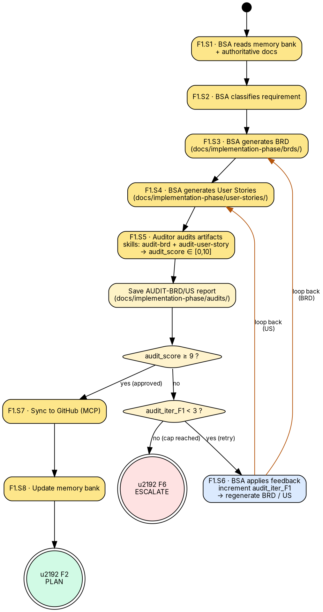

**Path-coverage check (§9.1)**
- `a05` (audit) terminates either with a stored report (`a05r`) or with an audit error (`a05e`), checked at `d_audit_ok`.
- `a05e` (Auditor itself failed after retry) routes directly to `esc` (F6) — no infinite retry on the auditor.
- `d_score` covers both outcomes: `yes → a07` (publish + memory + F2) and `no → d_iter`.
- `d_iter` covers both outcomes: `yes → a06` (apply feedback + loop back to `a03`/`a04`) and `no → esc` (F6).
- `a06` loops back to **both** producers (`a03` BRD, `a04` US) — the Auditor may flag either artifact, so both edges exist.
- Two terminals are reachable: `ok` (success) and `esc` (escalation), with three distinct entry points to `esc` (audit error, score-cap, audit-error cap).
- `audit_iter_F1` is incremented in `a06`; the cap (3) is enforced in `d_iter` before re-entering the loop.

---

### 9.2 Implementation Plan audit sub-loop (inside F2 · PLAN)

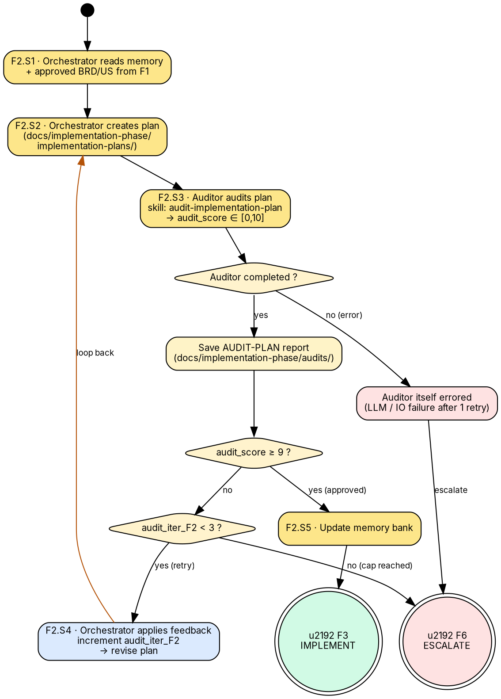

**Path-coverage check (§9.2)**
- `p03` (audit) terminates either with a stored report (`p03r`) or with an audit error (`p03e`), checked at `d_audit_ok`.
- `p03e` (Auditor itself failed after retry) routes directly to `esc` (F6).
- `d_score` covers both outcomes: `yes → p05` (memory + F3) and `no → d_iter`.
- `d_iter` covers both outcomes: `yes → p04 → p02` (revise plan and re-audit) and `no → esc` (F6).
- Two terminals are reachable: `ok` (success) and `esc` (escalation), with two distinct entry points to `esc` (audit error and score-cap).
- `audit_iter_F2` is incremented in `p04`; the cap (3) is enforced in `d_iter`.

---

### 9.3 Auditor's blind-path detection checklist (applied to runtime diagrams §1–§8)

The Auditor uses this checklist to validate that **any** artifact (BRD, User Story, or Plan) preserves the invariants of the runtime diagrams. Each finding maps to a deduction in the **Blind-Path Absence** score (25% weight) of the Auditor.

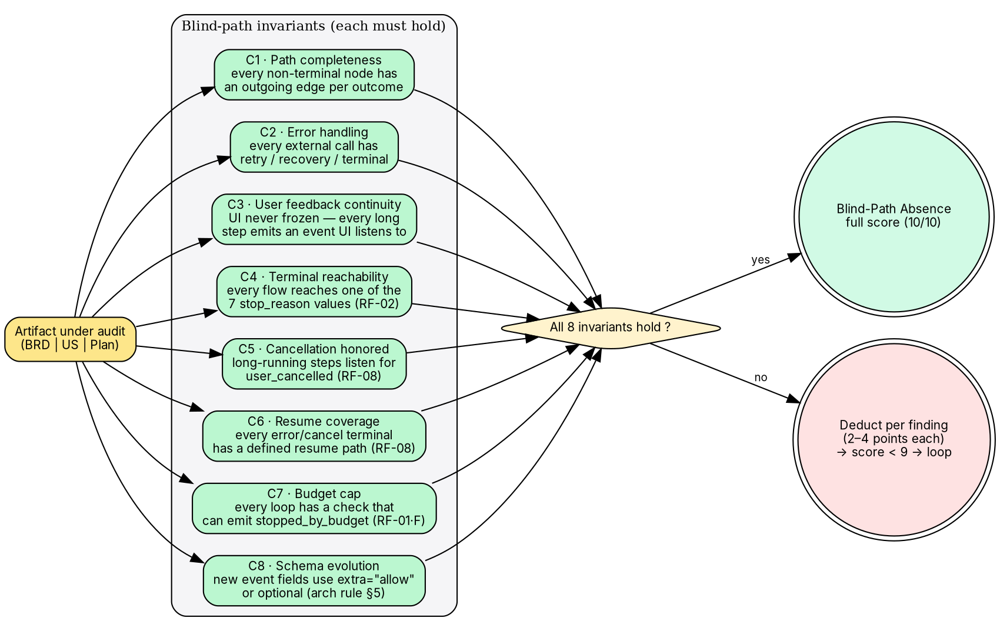

**Path-coverage check (§9.3)**
- Every invariant (C1…C8) has an incoming edge from `art` and an outgoing edge to `d_all` — no orphan checks.
- `d_all` has two outcomes (`yes → pass`, `no → fail`) — both terminal.
- `fail` feeds back into the host phase's iteration counter (F1 or F2) — the loop already handled in §9.1 / §9.2.

---

### 9.4 Cross-section invariants

The Auditor cross-checks artifacts against existing diagrams in this document:

| Artifact claim | Diagram to verify | Invariant |
|---|---|---|
| New event type | §1, §6, §8 (`log` node) | Listed in `events` table writers; `extra="allow"` preserved |
| New `stop_reason` | §1, §2, §3 | Must be one of the 7 enum values (RF-02) — no new ones |
| New phase / FSM state | §2 (Agent state machine) | Every transition into the state has a matching transition out |
| New UI state | §3 (UI state machine) | Belongs to L1-L7 / C1-C13 / T1-T5 sets (`ui-prototype.md` §3) |
| New plugin | §5 (Plugin seams) | Implements one of the 3 protocols (`Source`, `StoppingSignal`, `OutputRenderer`) |
| New schema field | §6 (ERD) | Added as nullable / `JSONB` optional — no destructive migration |

Any failure on this table is a **major** blind-path finding and caps **Consistency w/ docs** at 5/10 in the Auditor scoring.

---

### Color tokens

| Swatch | Hex | Meaning |
|---|---|---|
|  | `#eef2ff` | Neutral state |
|  | `#fff3cd` | Decision diamond |
|  | `#d1fae5` | Good terminal |
|  | `#fee2e2` | Bad / cancelled / errored terminal |
|  | `#dbeafe` | Transient / resuming |
|  | `#fde68a` | Server-side runtime |
|  | `#fecaca` | External provider |
|  | `#fef3c7` | Persistence |
|  | `#bbf7d0` | V1 plugin |
|  | `#e5e7eb` (dashed) | V2 / future plugin |

### Shapes

- Rounded box → state
- Diamond → decision
- Cylinder → persistent store
- Doublecircle (`peripheries=2`) → terminal state
- `box3d` → the agent loop
- Note → interface contract
- Small filled circle → entry point

### Edge styles

- **Solid** → canonical path
- **Dashed** → optional / dynamic / future
- **Blue** → owner-only recovery action
- **Red** → error transition

---

## Coming in the technical-design phase

These diagrams are intentionally **non-technical**: they describe *what flows where*, not *which library calls which function*. The next phase adds:

1. **Activity diagrams** per agent module (classifier, planner, searcher, judge).
2. **Deployment diagram** (process, volumes, env vars, ports, build artifacts).
3. **ERD-equivalent for the event log** (`runs`, `events`, `snapshots`, `users` as logical entities + payload schemas per event type).
4. **Threat model** flow (STRIDE on the seams + on user_context and source content — pairs with R7 in the risk register).
5. **Pair-session extension walkthrough** — one diagram per likely "add X" request, showing exactly which seam absorbs it.
