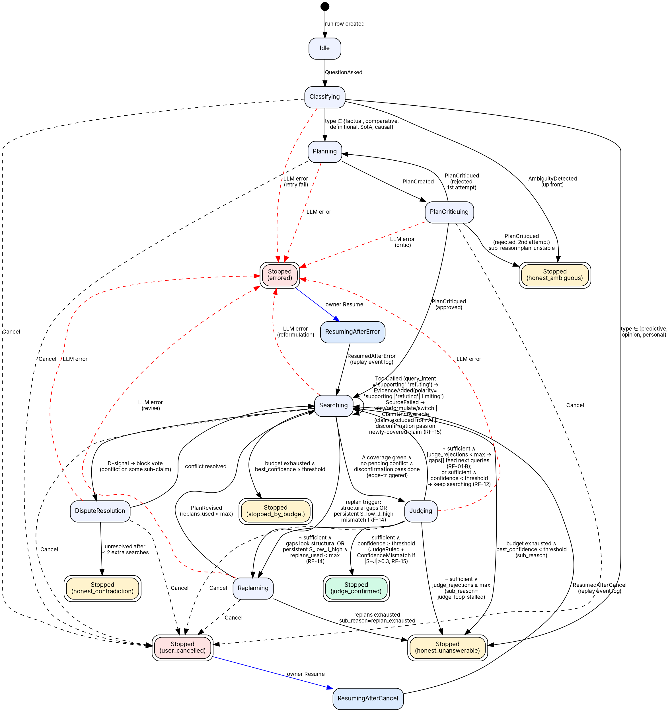
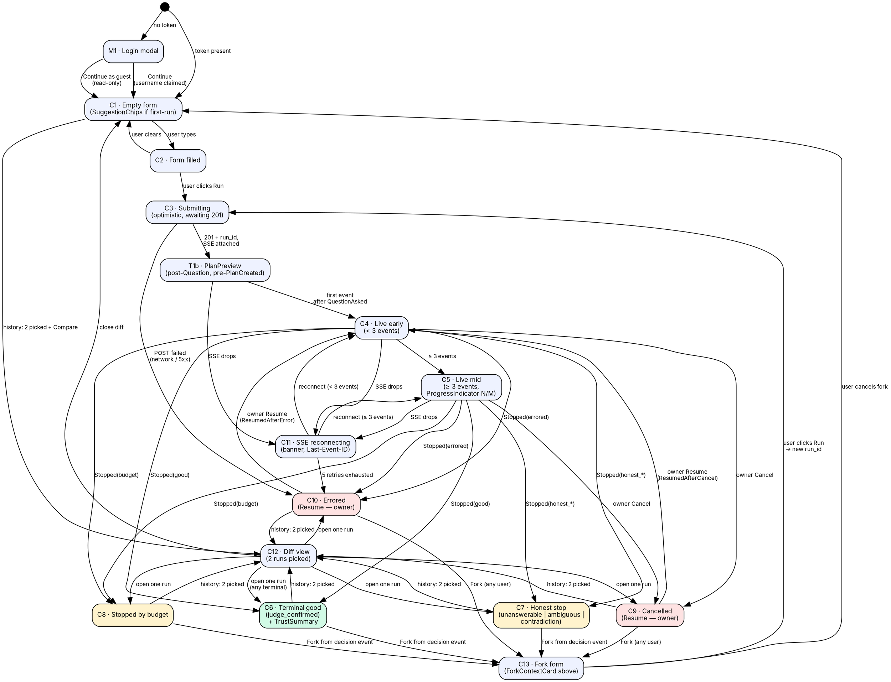
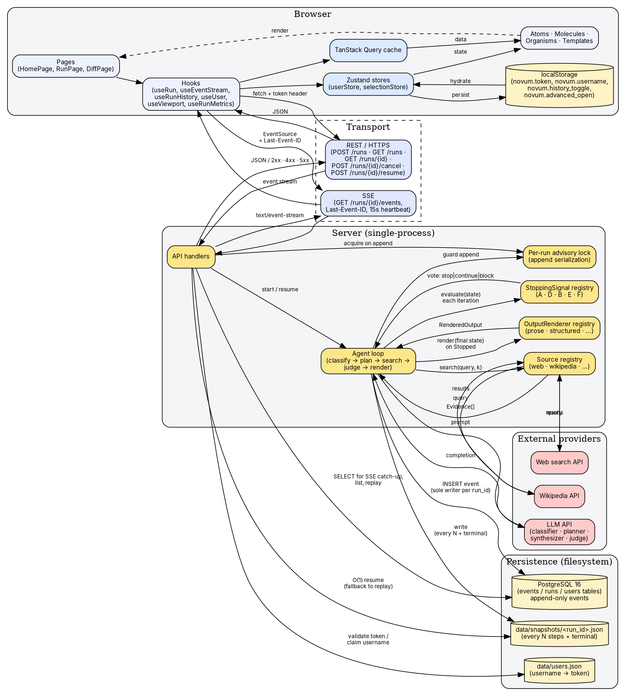
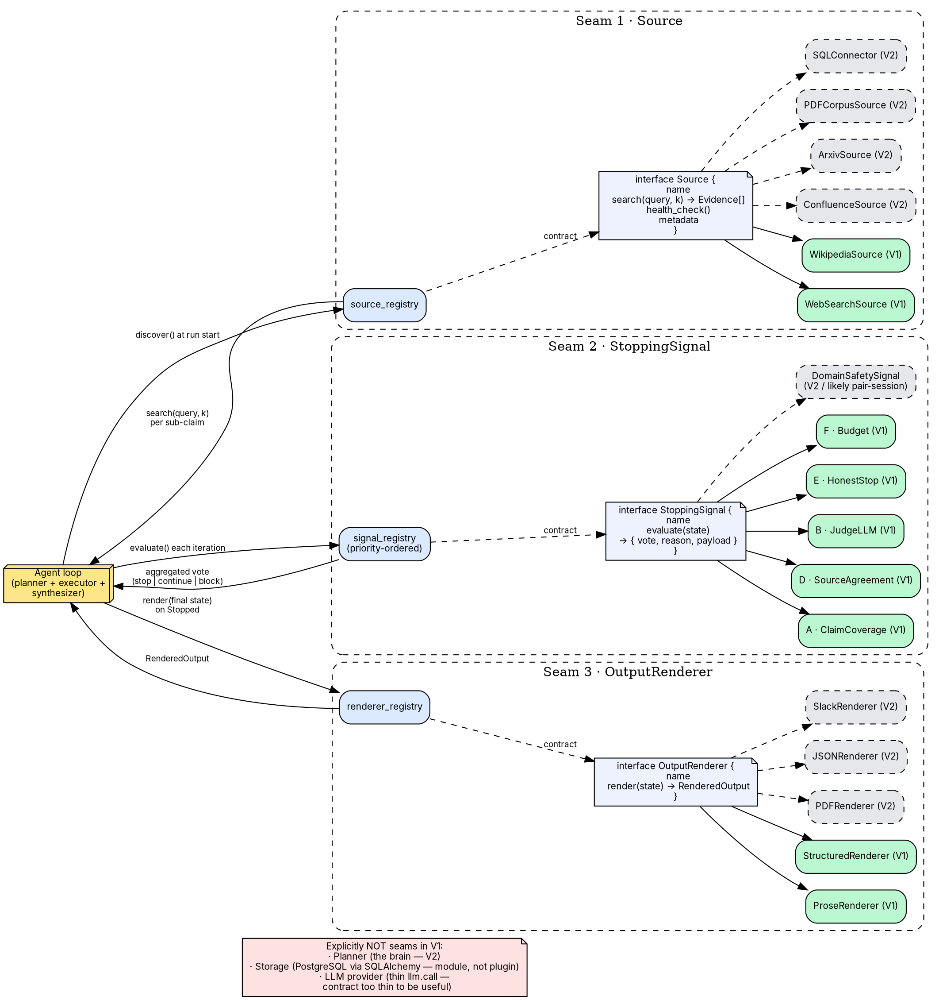

# Data flows and diagrams — Novum

> Visual companion to [requirement-understanding.md](requirement-understanding.md) and [ui-prototype.md](ui-prototype.md). Every diagram is Graphviz (DOT). Each one is built with **path completeness as a hard invariant**: every non-terminal node has a defined outgoing edge for every reachable outcome, and every terminal node is reachable from at least one path.
>
> Out of scope here (added in the technical-design phase): activity diagrams, deployment diagram, ERD, threat model, sequence of pair-session extension scenarios.

---

## 1. Sequence diagram · complete run (happy path + branches)

End-to-end temporal flow of a single research run. Actors are implicit in node labels (`UI`, `API`, `Loop`, `External`, `Store`). Branching covers honest stops, contradictions, source failure cascade (RF-04), user cancel (RF-08), LLM provider errors (RF-11), budget exhaustion (RF-01·F), and the two Resume paths.

```dot
digraph RunSequence {
  rankdir=TB;
  node [shape=box, style="rounded,filled", fillcolor="#eef2ff", fontname="Inter", fontsize=10];
  edge [fontname="Inter", fontsize=9];

  start [shape=circle, label="", width=0.2, style=filled, fillcolor=black];

  s01 [label="1 · UI: POST /runs\n{question, context, format, threshold}"];
  s02 [label="2 · API: create run_id\nINSERT runs + QuestionAsked event\nreturn 201 {run_id}"];
  s03 [label="3 · UI: open SSE\nGET /runs/{id}/events"];
  s04 [label="4 · Loop: replay event log\nemit QuestionAsked to subscribers"];
  s05 [label="5 · Loop → LLM:\nclassifier(question, user_context)\n→ question_type"];

  d_type [shape=diamond, label="type ∈\n{predictive, opinion, personal}?", fillcolor="#fff3cd"];
  s_early [label="Emit Stopped(honest_unanswerable,\nreason=out_of_scope_type)", fillcolor="#fee2e2"];

  s06 [label="6 · Loop: emit PlanCreated\n(question_type, sub_claims[])"];
  s06b [label="6b · Loop → LLM:\nplan_critic(question, sub_claims)\nemit PlanCritiqued\n{approved, issues, reasoning}\n(RF-14)"];

  d_critic [shape=diamond, label="approved?", fillcolor="#fff3cd"];
  d_replan_attempt [shape=diamond, label="first attempt?", fillcolor="#fff3cd"];
  s06c [label="6c · Loop: re-plan once\nwith critic's issues\nemit PlanCreated (v2)\n(RF-14)"];
  s_plan_unstable [label="Emit Stopped(honest_ambiguous,\nsub_reason=plan_unstable,\nissues[])", fillcolor="#fee2e2"];

  d_ambig [shape=diamond, label="AmbiguityDetected\nat plan time?", fillcolor="#fff3cd"];
  s_ambig [label="Emit AmbiguityDetected →\nStopped(honest_ambiguous)", fillcolor="#fee2e2"];

  s07 [label="7 · Loop: pick (source, sub_claim)\npriority: lowest-coverage claim first,\nties by claim weight in confidence\nemit ToolCalled(tool, query,\nquery_intent='supporting')"];
  s08 [label="8 · External: search / wikipedia"];

  d_tool [shape=diamond, label="tool result?", fillcolor="#fff3cd"];
  s09a [label="9a · Loop: emit EvidenceAdded\n(chunks, source_url, captured_at,\npolarity ∈ {supporting,\nrefuting, limiting})"];
  s09b [label="9b · Loop: emit SourceFailed\nretry → reformulate → switch source"];

  d_src_exhausted [shape=diamond, label="all source\nstrategies exhausted?", fillcolor="#fff3cd"];
  s09c [label="9c · Loop: emit ClaimUncoverable\n(claim_id, reason=sources_exhausted)\n→ claim excluded from A denominator"];

  s10 [label="10 · Loop: update coverage\nemit ClaimCovered (if applicable)"];

  d_newly_covered [shape=diamond, label="claim newly reached\nC_coverage(c) ≥ N_min?", fillcolor="#fff3cd"];
  s10b [label="10b · Loop → LLM:\nquery_anti = reformulate(claim,\nintent='refuting')\nemit ToolCalled(query_intent='refuting'),\nEvidenceAdded(polarity='refuting'|'limiting')\n(RF-15 disconfirmation pass)"];

  d_contr [shape=diamond, label="D-score conflict\nfor any sub-claim?", fillcolor="#fff3cd"];
  s_contr_res [label="Loop: dispute-resolution\n≤ 2 extra targeted searches"];
  d_contr_resolved [shape=diamond, label="resolved?", fillcolor="#fff3cd"];
  s_contr_stop [label="Emit ContradictionDetected →\nStopped(honest_contradiction)", fillcolor="#fee2e2"];

  d_gates [shape=diamond, label="A coverage gate green∧\nno pending conflict∧\nall covered claims passed\ndisconfirmation?\n(edge-triggered)", fillcolor="#fff3cd"];
  s_judge [label="11 · Loop → LLM:\njudge(state)\nemit JudgeRuled\n{sufficient, confidence, S, J,\nmismatch:{delta,regime}}"];
  s_mismatch [label="11b · Loop: if |S−J| > 0.3\nemit ConfidenceMismatch\n(non-blocking trust-flag, RF-15)", fillcolor="#dbeafe"];
  d_judge [shape=diamond, label="sufficient ∧\nconfidence ≥ threshold?", fillcolor="#fff3cd"];
  s_stop_good [label="Emit Stopped(judge_confirmed)", fillcolor="#d1fae5"];

  d_replan_trigger [shape=diamond, label="gaps look like\nmissing sub-claims OR\npersistent S_low_J_high\nmismatch?\n(RF-14 trigger)", fillcolor="#fff3cd"];
  d_replans_left [shape=diamond, label="replans_used\n< max_replans?", fillcolor="#fff3cd"];
  s_replan [label="Loop → LLM:\nplanner.revise(gaps, evidence)\nemit PlanRevised(added[],\nremoved[], modified[])\n(RF-14)", fillcolor="#dbeafe"];

  d_judge_stall [shape=diamond, label="judge_rejections\n≥ max_rejections (3)?", fillcolor="#fff3cd"];
  s_stop_stall [label="Emit Stopped(honest_unanswerable,\nsub_reason=judge_loop_stalled,\nlast_gaps[])", fillcolor="#fee2e2"];

  d_cancel [shape=diamond, label="cancel signal\nreceived?", fillcolor="#fff3cd"];
  s_cancel [label="Emit Stopped(user_cancelled)", fillcolor="#fee2e2"];

  d_err [shape=diamond, label="LLM provider error\nafter 1 retry?", fillcolor="#fff3cd"];
  s_err [label="Emit AgentErrored →\nStopped(errored)", fillcolor="#fee2e2"];

  d_budget [shape=diamond, label="budget exhausted?", fillcolor="#fff3cd"];
  d_budget_conf [shape=diamond, label="best_confidence\n≥ threshold?", fillcolor="#fff3cd"];
  s_stop_budget [label="Emit Stopped(stopped_by_budget)", fillcolor="#fee2e2"];
  s_stop_below [label="Emit Stopped(honest_unanswerable,\nsub_reason=confidence_below_threshold)", fillcolor="#fee2e2"];

  s_persist [label="12 · Store: terminal snapshot\nclose SSE (server side)"];
  s_render [label="13 · UI: receive terminal event\nfetch final answer (Seam 3 renderer)\nrender TrustSummary + OutcomeBar"];

  end [shape=doublecircle, label="run\ndone", fillcolor="#eef2ff"];

  // Resume staging
  resume_cancel [label="Owner Resume after cancel\nappend ResumedAfterCancel\nre-attach SSE", fillcolor="#dbeafe"];
  resume_err    [label="Owner Resume after error\nappend ResumedAfterError\nre-attach SSE", fillcolor="#dbeafe"];

  start -> s01 -> s02 -> s03 -> s04 -> s05 -> d_type;
  d_type -> s_early [label="yes"];
  s_early -> s_persist;
  d_type -> s06 [label="no"];
  s06 -> s06b -> d_critic;
  d_critic -> d_ambig [label="approved"];
  d_critic -> d_replan_attempt [label="rejected"];
  d_replan_attempt -> s06c [label="yes"];
  s06c -> s06b [label="critique v2"];
  d_replan_attempt -> s_plan_unstable [label="no\n(2nd failure)"];
  s_plan_unstable -> s_persist;
  d_ambig -> s_ambig [label="yes"];
  s_ambig -> s_persist;
  d_ambig -> s07 [label="no"];

  s07 -> s08 -> d_tool;
  d_tool -> s09a [label="ok"];
  d_tool -> s09b [label="fail"];
  s09b -> d_src_exhausted;
  d_src_exhausted -> s07 [label="no\n(retry / reformulate / switch)", style=dashed];
  d_src_exhausted -> s09c [label="yes", style=dashed];
  s09c -> s10;
  s09a -> s10;

  s10 -> d_newly_covered;
  d_newly_covered -> s10b [label="yes"];
  s10b -> d_contr [label="disconfirmation done"];
  d_newly_covered -> d_contr [label="no"];
  d_contr -> s_contr_res [label="yes"];
  s_contr_res -> d_contr_resolved;
  d_contr_resolved -> s_contr_stop [label="no"];
  s_contr_stop -> s_persist;
  d_contr_resolved -> d_gates [label="yes"];
  d_contr -> d_gates [label="no"];

  d_gates -> s_judge [label="yes"];
  s_judge -> s_mismatch;
  s_mismatch -> d_judge;
  d_judge -> s_stop_good [label="yes"];
  s_stop_good -> s_persist;
  d_judge -> d_replan_trigger [label="no\n(increment\njudge_rejections)"];
  d_replan_trigger -> d_replans_left [label="yes"];
  d_replans_left -> s_replan [label="yes"];
  s_replan -> s07 [label="continue with\nrevised plan"];
  d_replans_left -> d_judge_stall [label="no\n(exhausted)"];
  d_replan_trigger -> d_judge_stall [label="no"];
  d_judge_stall -> s_stop_stall [label="yes"];
  s_stop_stall -> s_persist;
  d_judge_stall -> s07 [label="no\n(gaps[] → next queries,\nRF-01·B)"];
  d_gates -> d_cancel [label="no\n(keep searching)"];

  d_cancel -> s_cancel [label="yes"];
  s_cancel -> s_persist;
  d_cancel -> d_err [label="no"];

  d_err -> s_err [label="yes"];
  s_err -> s_persist;
  d_err -> d_budget [label="no"];

  d_budget -> d_budget_conf [label="yes"];
  d_budget_conf -> s_stop_budget [label="yes"];
  d_budget_conf -> s_stop_below [label="no"];
  s_stop_budget -> s_persist;
  s_stop_below -> s_persist;
  d_budget -> s07 [label="no\n(next iteration)"];

  s_persist -> s_render -> end;

  // Resume edges
  s_cancel -> resume_cancel [style=dashed, color=blue, label="owner clicks Resume"];
  resume_cancel -> s07;
  s_err -> resume_err [style=dashed, color=blue, label="owner clicks Resume"];
  resume_err -> s07;
}
```

**Path coverage check.**
- `d_type`: yes → `s_early` → terminal · no → continues.
- `d_critic` (RF-14): approved → `d_ambig` · rejected → `d_replan_attempt`.
- `d_replan_attempt`: first failure → re-plan once (`s06c → s06b` loop) · second failure → `Stopped(honest_ambiguous, sub_reason=plan_unstable)`.
- `d_ambig`: yes → terminal · no → continues.
- `d_tool`: ok → evidence · fail → `d_src_exhausted` both branches covered.
- `d_src_exhausted`: no → retry/reformulate/switch · **yes → emit `ClaimUncoverable`** (the claim is officially excluded from A's denominator, see [confidence-calculation.md §3.1](confidence-calculation.md); this lets A still close on the remaining claims instead of forcing budget exhaustion).
- `d_newly_covered` (RF-15 disconfirmation): yes → `s10b` issues **one** adversarial query (`query_intent='refuting'`) and any returned chunks land in the same `EvidenceAdded` flow with `polarity ∈ {refuting, limiting}` · no → skip directly to `d_contr`.
- `d_contr`: yes → resolution (this is the **`block` vote** from signal D — stopping is forbidden while a real conflict is open) → both `d_contr_resolved` branches covered · no → continues.
- `d_gates`: "A coverage green ∧ no pending conflict ∧ disconfirmation done on every covered claim" — **edge-triggered**: only fires when A *transitions* from incomplete to complete (after a new `ClaimCovered` or `ClaimUncoverable` closes the open set) **and** every covered claim has received its disconfirmation pass. D is **not** evaluated here as an independent gate because D's contribution is already enforced by the dispute-resolution loop above (any open conflict routes to `s_contr_res` and cannot reach `d_gates`). yes → judge · no → `d_cancel`.
- `s_judge → s_mismatch → d_judge`: every `JudgeRuled` is followed by the mismatch check; `ConfidenceMismatch` is emitted only when `|S − J| > 0.3` (RF-15) and never blocks the decision.
- `d_judge`: yes → terminal · no → `d_replan_trigger`.
- `d_replan_trigger` (RF-14): yes (gaps look structural OR persistent `S_low_J_high`) → `d_replans_left` · no → `d_judge_stall` (the classic gaps[]-feed-search path).
- `d_replans_left`: yes → emit `PlanRevised` and re-enter `s07` with the new plan · no → fall through to `d_judge_stall`.
- `d_judge_stall`: yes → `Stopped(honest_unanswerable, sub_reason=judge_loop_stalled)` (guards against the judge rejecting indefinitely when `gaps[]` cannot be filled — anti-ciclo); no → `s07` with the judge's `gaps[]` as next queries (RF-01·B).
- `d_cancel` / `d_err` / `d_budget` / `d_budget_conf`: all yes/no edges defined.
- `s07` documents the sub-claim picking criterion (lowest coverage first, ties by claim weight in the final confidence) and the default `query_intent='supporting'`; refuting queries flow through `s10b`.
- Resume from `s_cancel` and `s_err` both loop back into `s07`.

---

## 2. Agent state machine

The same logic as §1 collapsed into states, with transitions labeled by the emitted event. Terminal states (`peripheries=2`) match the 7-value `stop_reason` enum from RF-02. The judge (B) is the **only** path to a positive terminal: there is no `coverage_met` bypass, because per [stopping-signal-analysis.md](stopping-signal-analysis.md) signal B is the final qualitative confirmer that fires whenever A and D are green.

**Path coverage check.**
- All 7 `stop_reason` enum values are terminal nodes and each is reachable.
- Every active state (`Classifying`, `Planning`, `PlanCritiquing`, `Replanning`, `Searching`, `DisputeResolution`, `Judging`) has: a happy-path transition forward, a `Cancel` transition to `StoppedUserCancelled`, and an LLM-error transition to `StoppedErrored`.
- **`PlanCritiquing` (RF-14)** is the new mandatory stop between `Planning` and `Searching`. It is the only path out of `Planning`. Three outcomes: `approved` → `Searching`; `rejected, 1st attempt` → back to `Planning` (one re-plan); `rejected, 2nd attempt` → `StoppedHonestAmbiguous(plan_unstable)`.
- **`Replanning` (RF-14)** is reachable from `Searching` (when `Judging` does not happen because A is not green but structural gaps are obvious) and from `Judging` (when the judge rejected and the gaps look structural OR a persistent `S_low_J_high` `ConfidenceMismatch` accumulated). Two outcomes: `PlanRevised` appended → back to `Searching` with recomputed A denominator; `replans_used >= max_replans` → `StoppedHonestUnanswerable(sub_reason=replan_exhausted)`.
- `Searching → DisputeResolution` materializes the signal registry's `block` vote (signal D forbids stopping while a real conflict is open) — the only consumer of the `block` value defined by the `StoppingSignal` contract in [§5 Plugin seams](#5-plugin-seams).
- `Searching` self-loop now includes the **`ClaimUncoverable`** event and the **RF-15 disconfirmation pass**: when a claim newly reaches `C_coverage(c) ≥ N_min`, one adversarial `ToolCalled(query_intent='refuting')` is issued and its results land back with `polarity ∈ {refuting, limiting}`.
- `Searching → Judging` requires three conditions now: A green, no conflict pending, **and** every covered claim has completed its disconfirmation pass. The gate stays **edge-triggered** to avoid invoking the expensive judge on every iteration.
- `Judging` has **four** outgoing transitions: (a) `judge_confirmed` on success (with `ConfidenceMismatch` emitted as a side event if `|S−J|>0.3`); (b) `Replanning` when the judge's `gaps[]` are structural and the replan budget allows; (c) `Searching` with `gaps[]` when the rejection is evidence-shaped and the rejection counter is below `max_judge_rejections`; (d) `StoppedHonestUnanswerable(sub_reason=judge_loop_stalled)` when the counter is exhausted — anti-ciclo guard against a judge that keeps rejecting on unfillable gaps.
- `Judging → Searching` carries two semantically distinct sub-cases on the same edge: (a) `¬ sufficient` — the judge's `gaps[]` array is fed back to the searcher as next queries (RF-01·B); (b) `sufficient ∧ confidence < threshold` — the threshold raises the bar without silencing the judge (RF-12).
- Both `Resuming*` states return to `Searching` (mechanical parity).

---

## 3. State machine of the run in the UI (center panel)

Mirrors §3.2 of [ui-prototype.md](ui-prototype.md). Includes M1 (login), the live states (C4 / C5 / C11), terminal states (C6 / C7 / C8 / C9 / C10), and the secondary surfaces C12 (diff) and C13 (fork form).

**Path coverage check.**
- Every live state (`C4`, `C5`, `C11`, `T1b`) has a route to every terminal (`C6`/`C7`/`C8`/`C9`/`C10`) — either directly or via `C11`.
- Every terminal state has a forward route: Fork → `C13`, Compare → `C12`, Resume → `C4` (owner-only on `C9`/`C10`).
- `C12` (diff) routes back to any terminal or to `C1`. `C13` (fork form) routes to `C3` (submit) or `C1` (cancel).
- `M1` cannot be re-entered from inside a run — logout is a UserFooter action that returns to `M1` via app reload (modeled implicitly by `start`).

---

## 4. Layers and data flow

Logical layers of the deployed system, from browser to database to external providers. Distinguishes **transport** (REST + SSE), **server** (registries + agent loop + single-writer task registry), **persistence** (PostgreSQL `events` / `runs` / `users` tables), and **external providers** (LLM + search APIs).

**Path coverage check.**
- Every persistent store (Postgres tables, snapshot cache when added in V2) has both a writer and a reader.
- Every external provider has a request and a response edge.
- The single-writer task registry is the only path through which `loop` issues `INSERT` to the `events` table for a given `run_id`.
- Both directions of the client ↔ transport ↔ server triplet are present (request and response for REST; subscription and stream for SSE).

---

## 5. Plugin seams

The three first-class extension points from §6-ter of [requirement-understanding.md](requirement-understanding.md). Each seam has: an **interface contract**, a **registry**, V1 implementations, and V2 / pair-session candidates (shown dashed). The explicit *not-seams* are documented so the pair session does not waste minutes proposing them.

**Path coverage check.**
- Every seam has: a discovery edge (loop → registry), a contract edge (registry → interface), implementation edges (interface → each V1/V2 plugin), and a result edge (registry → loop).
- Each registry has at least 2 V1 plugins (so the abstraction is real, not a stub).
- The `nonseam` note is reachable from `loop` only via an invisible edge — it is documentation, not a runtime path.

---

## 6. Entity-Relationship diagram (database schema)

Logical ER view of the three tables defined in [architecture.md §5.2](../technical-phase/architecture.md). All three are Alembic-managed in `backend/alembic/versions/`. PKs in **bold**, FKs in *italics*. The `events.payload` column is `JSONB` and intentionally schemaless at the DB level (per RF rule 5 in `.github/copilot-instructions.md`); its allowed shapes per `events.type` are documented separately in [architecture.md §3.2](../technical-phase/architecture.md).

```dot
digraph NovumER {
  rankdir=LR;
  bgcolor="#FAFBFC";
  fontname="Inter";
  splines=ortho;
  nodesep=0.5;
  ranksep=1.0;
  node [shape=plaintext, fontname="Inter"];
  edge [fontname="Inter", fontsize=9, color="#5A6273", arrowsize=0.7];

  users [label=<
    <TABLE BORDER="0" CELLBORDER="1" CELLSPACING="0" CELLPADDING="6" BGCOLOR="#FFFFFF">
      <TR><TD BGCOLOR="#EAF3FB" COLSPAN="2"><B>users</B></TD></TR>
      <TR><TD ALIGN="LEFT"><B>id</B></TD>             <TD ALIGN="LEFT">UUID  PK</TD></TR>
      <TR><TD ALIGN="LEFT">username</TD>              <TD ALIGN="LEFT">VARCHAR(64) UNIQUE NOT NULL</TD></TR>
      <TR><TD ALIGN="LEFT">token_hash</TD>            <TD ALIGN="LEFT">TEXT NOT NULL  · sha256(token)</TD></TR>
      <TR><TD ALIGN="LEFT">created_at</TD>            <TD ALIGN="LEFT">TIMESTAMPTZ DEFAULT now()</TD></TR>
    </TABLE>
  >];

  runs [label=<
    <TABLE BORDER="0" CELLBORDER="1" CELLSPACING="0" CELLPADDING="6" BGCOLOR="#FFFFFF">
      <TR><TD BGCOLOR="#F5FBF7" COLSPAN="2"><B>runs</B></TD></TR>
      <TR><TD ALIGN="LEFT" PORT="pk"><B>id</B></TD>                    <TD ALIGN="LEFT">UUID  PK</TD></TR>
      <TR><TD ALIGN="LEFT" PORT="fk_user"><I>owner_username</I></TD>   <TD ALIGN="LEFT">VARCHAR(64)  FK → users.username</TD></TR>
      <TR><TD ALIGN="LEFT">question</TD>                               <TD ALIGN="LEFT">TEXT NOT NULL</TD></TR>
      <TR><TD ALIGN="LEFT">user_context</TD>                           <TD ALIGN="LEFT">TEXT NULL  · ≤1000 chars</TD></TR>
      <TR><TD ALIGN="LEFT">output_format</TD>                          <TD ALIGN="LEFT">VARCHAR(16)  'prose' | 'structured'</TD></TR>
      <TR><TD ALIGN="LEFT">confidence_threshold</TD>                   <TD ALIGN="LEFT">REAL NOT NULL  [0,1]</TD></TR>
      <TR><TD ALIGN="LEFT">question_type</TD>                          <TD ALIGN="LEFT">VARCHAR(32) NULL  · enum</TD></TR>
      <TR><TD ALIGN="LEFT">started_at</TD>                             <TD ALIGN="LEFT">TIMESTAMPTZ DEFAULT now()</TD></TR>
      <TR><TD ALIGN="LEFT">stopped_at</TD>                             <TD ALIGN="LEFT">TIMESTAMPTZ NULL</TD></TR>
      <TR><TD ALIGN="LEFT">stop_reason</TD>                            <TD ALIGN="LEFT">VARCHAR(32) NULL  · enum (7 values)</TD></TR>
      <TR><TD ALIGN="LEFT" PORT="fk_parent_run"><I>parent_run_id</I></TD>    <TD ALIGN="LEFT">UUID NULL  FK → runs.id (self)</TD></TR>
      <TR><TD ALIGN="LEFT" PORT="fk_fork_event"><I>forked_at_event_id</I></TD><TD ALIGN="LEFT">UUID NULL  FK → events.id</TD></TR>
    </TABLE>
  >];

  events [label=<
    <TABLE BORDER="0" CELLBORDER="1" CELLSPACING="0" CELLPADDING="6" BGCOLOR="#FFFFFF">
      <TR><TD BGCOLOR="#FFF4E8" COLSPAN="2"><B>events</B>  · append-only · source of truth</TD></TR>
      <TR><TD ALIGN="LEFT" PORT="pk"><B>id</B></TD>                          <TD ALIGN="LEFT">UUID  PK</TD></TR>
      <TR><TD ALIGN="LEFT" PORT="fk_run"><I>run_id</I></TD>                  <TD ALIGN="LEFT">UUID  FK → runs.id  · ON DELETE CASCADE</TD></TR>
      <TR><TD ALIGN="LEFT" PORT="fk_parent_event"><I>parent_event_id</I></TD><TD ALIGN="LEFT">UUID NULL  FK → events.id (self)</TD></TR>
      <TR><TD ALIGN="LEFT">step_index</TD>                                  <TD ALIGN="LEFT">INTEGER NOT NULL</TD></TR>
      <TR><TD ALIGN="LEFT">type</TD>                                        <TD ALIGN="LEFT">VARCHAR(48)  · discriminator (≈17 values)</TD></TR>
      <TR><TD ALIGN="LEFT">payload</TD>                                     <TD ALIGN="LEFT">JSONB NOT NULL  · Pydantic, extra="allow"</TD></TR>
      <TR><TD ALIGN="LEFT">created_at</TD>                                  <TD ALIGN="LEFT">TIMESTAMPTZ DEFAULT now()</TD></TR>
    </TABLE>
  >];

  // ---------- Relationships ----------
  // users 1 ── ∞ runs
  users -> runs:fk_user                  [label="1..N\nowns", arrowhead=crow, arrowtail=tee, dir=both];

  // runs 1 ── ∞ events
  runs:pk -> events:fk_run               [label="1..N\nappends", arrowhead=crow, arrowtail=tee, dir=both];

  // runs self-FK (fork lineage)
  runs:fk_parent_run -> runs:pk          [label="0..1\nfork parent", arrowhead=crow, arrowtail=tee, dir=both, style=dashed, constraint=false];

  // events self-FK (causal lineage inside a run)
  events:fk_parent_event -> events:pk    [label="0..1\nderived from", arrowhead=crow, arrowtail=tee, dir=both, style=dashed, constraint=false];

  // runs.forked_at_event_id → events.id (which exact event a fork branched from)
  runs:fk_fork_event -> events:pk        [label="0..1\nforked at", arrowhead=normal, arrowtail=none, style=dotted];
}
```

### Indexes (operational)

| Table | Index | Purpose |
|---|---|---|
| `users` | `UNIQUE (username)` | login lookup |
| `runs`  | `(owner_username, started_at DESC)` | "My runs" listing (RF-09) |
| `runs`  | `(started_at DESC)`                 | "All public" listing |
| `runs`  | `(parent_run_id)`                   | fork tree queries |
| `events`| `(run_id, step_index)`              | replay in order |
| `events`| `(run_id, id)`                      | Last-Event-ID resume lookup |

### Cardinality summary

- **users : runs** — `1 : N` (a user owns many runs).
- **runs : events** — `1 : N` (a run owns many events; cascade delete).
- **runs : runs (parent_run_id)** — `0..1 : N` (any run may have one parent; the root has none).
- **runs : events (forked_at_event_id)** — `0..1 : 1` (a forked run points at the exact event it branched from).
- **events : events (parent_event_id)** — `0..1 : N` (causal chain inside a run; used by Dispute / Judge events that reference an earlier evidence event).

### Payload contracts

The `events.payload JSONB` column is the **schema-less seam**: new event subtypes and new optional keys ship without an Alembic migration. The full discriminated union is enumerated in [architecture.md §3.2](../technical-phase/architecture.md). Rename/remove of a key inside `payload` requires an explicit data migration (Alembic with `UPDATE events SET payload = ...`).

---

## 7. Object diagram (runtime snapshot of one finished run)

A concrete instance of the schema in §6, frozen at the moment the agent emits `Stopped(judge_confirmed)` for a sample run. Useful for grounding the abstract ER in real data: shows one user, one run, six events, and the exact links between them. Identifiers are abbreviated (`u‑1`, `r‑1`, `e‑1`…) to keep the diagram readable.

```dot
digraph NovumObjects {
  rankdir=TB;
  bgcolor="#FAFBFC";
  fontname="Inter";
  splines=ortho;
  nodesep=0.4;
  ranksep=0.7;
  node [shape=plaintext, fontname="Inter"];
  edge [fontname="Inter", fontsize=9, color="#5A6273", arrowsize=0.7];

  // ---------- User instance ----------
  u1 [label=<
    <TABLE BORDER="0" CELLBORDER="1" CELLSPACING="0" CELLPADDING="5" BGCOLOR="#FFFFFF">
      <TR><TD BGCOLOR="#EAF3FB" COLSPAN="2"><B>u-1 : User</B></TD></TR>
      <TR><TD ALIGN="LEFT">id</TD>         <TD ALIGN="LEFT">u-1</TD></TR>
      <TR><TD ALIGN="LEFT">username</TD>   <TD ALIGN="LEFT">"alex"</TD></TR>
      <TR><TD ALIGN="LEFT">token_hash</TD> <TD ALIGN="LEFT">sha256(…)</TD></TR>
      <TR><TD ALIGN="LEFT">created_at</TD> <TD ALIGN="LEFT">2026-05-26T14:00Z</TD></TR>
    </TABLE>
  >];

  // ---------- Run instance ----------
  r1 [label=<
    <TABLE BORDER="0" CELLBORDER="1" CELLSPACING="0" CELLPADDING="5" BGCOLOR="#FFFFFF">
      <TR><TD BGCOLOR="#F5FBF7" COLSPAN="2"><B>r-1 : Run</B></TD></TR>
      <TR><TD ALIGN="LEFT">id</TD>                  <TD ALIGN="LEFT">r-1</TD></TR>
      <TR><TD ALIGN="LEFT">owner_username</TD>      <TD ALIGN="LEFT">"alex"</TD></TR>
      <TR><TD ALIGN="LEFT">question</TD>            <TD ALIGN="LEFT">"Is Python's GIL removed in 3.13?"</TD></TR>
      <TR><TD ALIGN="LEFT">user_context</TD>        <TD ALIGN="LEFT">NULL</TD></TR>
      <TR><TD ALIGN="LEFT">output_format</TD>       <TD ALIGN="LEFT">"prose"</TD></TR>
      <TR><TD ALIGN="LEFT">confidence_threshold</TD><TD ALIGN="LEFT">0.80</TD></TR>
      <TR><TD ALIGN="LEFT">question_type</TD>       <TD ALIGN="LEFT">"factual"</TD></TR>
      <TR><TD ALIGN="LEFT">started_at</TD>          <TD ALIGN="LEFT">2026-05-26T14:05:00Z</TD></TR>
      <TR><TD ALIGN="LEFT">stopped_at</TD>          <TD ALIGN="LEFT">2026-05-26T14:05:42Z</TD></TR>
      <TR><TD ALIGN="LEFT">stop_reason</TD>         <TD ALIGN="LEFT">"judge_confirmed"</TD></TR>
      <TR><TD ALIGN="LEFT">parent_run_id</TD>       <TD ALIGN="LEFT">NULL</TD></TR>
      <TR><TD ALIGN="LEFT">forked_at_event_id</TD>  <TD ALIGN="LEFT">NULL</TD></TR>
    </TABLE>
  >];

  // ---------- Event instances (ordered by step_index) ----------
  e1 [label=<
    <TABLE BORDER="0" CELLBORDER="1" CELLSPACING="0" CELLPADDING="5" BGCOLOR="#FFFFFF">
      <TR><TD BGCOLOR="#FFF4E8" COLSPAN="2"><B>e-1 : Event</B>  · QuestionAsked</TD></TR>
      <TR><TD ALIGN="LEFT">run_id</TD>          <TD ALIGN="LEFT">r-1</TD></TR>
      <TR><TD ALIGN="LEFT">parent_event_id</TD> <TD ALIGN="LEFT">NULL</TD></TR>
      <TR><TD ALIGN="LEFT">step_index</TD>      <TD ALIGN="LEFT">0</TD></TR>
      <TR><TD ALIGN="LEFT">type</TD>            <TD ALIGN="LEFT">"QuestionAsked"</TD></TR>
      <TR><TD ALIGN="LEFT">payload</TD>         <TD ALIGN="LEFT" BALIGN="LEFT">{<BR/>  question: "Is Python's GIL...",<BR/>  format: "prose",<BR/>  threshold: 0.8<BR/>}</TD></TR>
    </TABLE>
  >];

  e2 [label=<
    <TABLE BORDER="0" CELLBORDER="1" CELLSPACING="0" CELLPADDING="5" BGCOLOR="#FFFFFF">
      <TR><TD BGCOLOR="#FFF4E8" COLSPAN="2"><B>e-2 : Event</B>  · PlanCreated</TD></TR>
      <TR><TD ALIGN="LEFT">run_id</TD>          <TD ALIGN="LEFT">r-1</TD></TR>
      <TR><TD ALIGN="LEFT">parent_event_id</TD> <TD ALIGN="LEFT">e-1</TD></TR>
      <TR><TD ALIGN="LEFT">step_index</TD>      <TD ALIGN="LEFT">1</TD></TR>
      <TR><TD ALIGN="LEFT">type</TD>            <TD ALIGN="LEFT">"PlanCreated"</TD></TR>
      <TR><TD ALIGN="LEFT">payload</TD>         <TD ALIGN="LEFT" BALIGN="LEFT">{<BR/>  question_type: "factual",<BR/>  sub_claims: ["GIL removed?",<BR/>               "since version?"]<BR/>}</TD></TR>
    </TABLE>
  >];

  e3 [label=<
    <TABLE BORDER="0" CELLBORDER="1" CELLSPACING="0" CELLPADDING="5" BGCOLOR="#FFFFFF">
      <TR><TD BGCOLOR="#FFF4E8" COLSPAN="2"><B>e-3 : Event</B>  · ToolCalled</TD></TR>
      <TR><TD ALIGN="LEFT">run_id</TD>          <TD ALIGN="LEFT">r-1</TD></TR>
      <TR><TD ALIGN="LEFT">parent_event_id</TD> <TD ALIGN="LEFT">e-2</TD></TR>
      <TR><TD ALIGN="LEFT">step_index</TD>      <TD ALIGN="LEFT">2</TD></TR>
      <TR><TD ALIGN="LEFT">type</TD>            <TD ALIGN="LEFT">"ToolCalled"</TD></TR>
      <TR><TD ALIGN="LEFT">payload</TD>         <TD ALIGN="LEFT" BALIGN="LEFT">{<BR/>  tool: "tavily",<BR/>  query: "PEP 703 free-threaded"<BR/>}</TD></TR>
    </TABLE>
  >];

  e4 [label=<
    <TABLE BORDER="0" CELLBORDER="1" CELLSPACING="0" CELLPADDING="5" BGCOLOR="#FFFFFF">
      <TR><TD BGCOLOR="#FFF4E8" COLSPAN="2"><B>e-4 : Event</B>  · EvidenceAdded</TD></TR>
      <TR><TD ALIGN="LEFT">run_id</TD>          <TD ALIGN="LEFT">r-1</TD></TR>
      <TR><TD ALIGN="LEFT">parent_event_id</TD> <TD ALIGN="LEFT">e-3</TD></TR>
      <TR><TD ALIGN="LEFT">step_index</TD>      <TD ALIGN="LEFT">3</TD></TR>
      <TR><TD ALIGN="LEFT">type</TD>            <TD ALIGN="LEFT">"EvidenceAdded"</TD></TR>
      <TR><TD ALIGN="LEFT">payload</TD>         <TD ALIGN="LEFT" BALIGN="LEFT">{<BR/>  source_url: "peps.python.org/...",<BR/>  chunks: [...],<BR/>  captured_at: "2026-05-26T..."<BR/>}</TD></TR>
    </TABLE>
  >];

  e5 [label=<
    <TABLE BORDER="0" CELLBORDER="1" CELLSPACING="0" CELLPADDING="5" BGCOLOR="#FFFFFF">
      <TR><TD BGCOLOR="#FFF4E8" COLSPAN="2"><B>e-5 : Event</B>  · JudgeRuled</TD></TR>
      <TR><TD ALIGN="LEFT">run_id</TD>          <TD ALIGN="LEFT">r-1</TD></TR>
      <TR><TD ALIGN="LEFT">parent_event_id</TD> <TD ALIGN="LEFT">e-4</TD></TR>
      <TR><TD ALIGN="LEFT">step_index</TD>      <TD ALIGN="LEFT">4</TD></TR>
      <TR><TD ALIGN="LEFT">type</TD>            <TD ALIGN="LEFT">"JudgeRuled"</TD></TR>
      <TR><TD ALIGN="LEFT">payload</TD>         <TD ALIGN="LEFT" BALIGN="LEFT">{<BR/>  sufficient: true,<BR/>  confidence: 0.92,<BR/>  S: 0.95, J: 0.88,<BR/>  rationale: "two primary sources..."<BR/>}</TD></TR>
    </TABLE>
  >];

  e6 [label=<
    <TABLE BORDER="0" CELLBORDER="1" CELLSPACING="0" CELLPADDING="5" BGCOLOR="#D1FAE5">
      <TR><TD BGCOLOR="#A7F3D0" COLSPAN="2"><B>e-6 : Event</B>  · Stopped</TD></TR>
      <TR><TD ALIGN="LEFT">run_id</TD>          <TD ALIGN="LEFT">r-1</TD></TR>
      <TR><TD ALIGN="LEFT">parent_event_id</TD> <TD ALIGN="LEFT">e-5</TD></TR>
      <TR><TD ALIGN="LEFT">step_index</TD>      <TD ALIGN="LEFT">5</TD></TR>
      <TR><TD ALIGN="LEFT">type</TD>            <TD ALIGN="LEFT">"Stopped"</TD></TR>
      <TR><TD ALIGN="LEFT">payload</TD>         <TD ALIGN="LEFT" BALIGN="LEFT">{<BR/>  stop_reason: "judge_confirmed",<BR/>  final_summary: "Yes, optional in 3.13..."<BR/>}</TD></TR>
    </TABLE>
  >];

  // ---------- Ownership ----------
  u1 -> r1 [label="owns"];
  r1 -> e1 [label="contains"];
  r1 -> e2 [style=invis];
  r1 -> e3 [style=invis];
  r1 -> e4 [style=invis];
  r1 -> e5 [style=invis];
  r1 -> e6 [style=invis];

  // ---------- Causal chain (parent_event_id) ----------
  e1 -> e2 [label="parent_event_id", color="#7E4A14", style=dashed];
  e2 -> e3 [label="parent_event_id", color="#7E4A14", style=dashed];
  e3 -> e4 [label="parent_event_id", color="#7E4A14", style=dashed];
  e4 -> e5 [label="parent_event_id", color="#7E4A14", style=dashed];
  e5 -> e6 [label="parent_event_id", color="#7E4A14", style=dashed];

  { rank=same; e1; e2; e3; e4; e5; e6; }
}
```

**What this snapshot illustrates.**

- A single `User` (`alex`) owns a single `Run` (`r-1`); the run has six events ordered by `step_index`.
- The **causal chain** (`parent_event_id`, dashed) walks `QuestionAsked → PlanCreated → ToolCalled → EvidenceAdded → JudgeRuled → Stopped` — exactly the happy-path sequence from §1.
- `Stopped.payload.stop_reason = "judge_confirmed"` (one of the 7 enum values) — never free text.
- `Run.stopped_at` and `Run.stop_reason` are the **denormalized projection** of the terminal `Stopped` event, present on the row to make "list my runs" queries (RF-09) index-friendly.
- `Run.parent_run_id` and `Run.forked_at_event_id` are `NULL` because this is a root run, not a fork. A fork of, say, `e-2` (the `PlanCreated` decision point, RF-03) would create a new `Run` with `parent_run_id=r-1`, `forked_at_event_id=e-2`, and copy events `e-1`…`e-2` into the new run before continuing from there.
- Every `EvidenceAdded` payload carries `captured_at` so re-running the same run later (with stale or evolving sources) is still **read-deterministic** (RF principle 4).

---

## 8. Agentic architecture

A structural view of **what lives inside the agent loop**, complementary to §1 (temporal), §2 (states), §4 (system layers) and §5 (plugin seams). This one answers *"who does what, and through which contract"*: the four LLM-backed **roles** (classifier, planner, judge, synthesizer), the three plugin **registries** (sources, signals, renderers), the deterministic **signal aggregator** that gates the judge, and the **single sink** every component writes to (the `events` table).

The diagram makes four V1 design choices visible at a glance:

1. **No LangGraph / LangChain.** The orchestrator is a `match` over `state.phase` inside one Python function. Every LLM role goes through the same `llm.client.call(role, …)` seam (architecture.md §4.3).
2. **The judge is gated, not autonomous.** Signal B (`JudgeLLM`) only fires after the deterministic signals A (`ClaimCoverage`) and D (`SourceAgreement`) are both green — see the green-dashed edges `sig_a/sig_d → sig_b`. B is the **only** path to `judge_confirmed`; there is no `coverage_met` bypass.
3. **The signal contract has three votes: `stop`, `continue`, `block`.** `block` is emitted by signal D when a real contradiction is open and routes the FSM into the dispute resolver (red edge `sig_d → disp`). It is **not** a no-op: while any signal votes `block`, the aggregator forbids `stop` even if other signals would vote for it.
4. **The judge-rejection loop is explicit.** When the judge returns `sufficient=false`, its `gaps[]` array becomes the next search queries — the amber edge `jdg_out → exec`. The loop iterates until the judge confirms, **or** signal F (budget) caps the run, **or** signal E (honest stop) fires. The budget is the hard upper bound: there is no path where the loop runs forever.

```dot
digraph AgenticArchitecture {
  rankdir=TB;
  compound=true;
  newrank=true;
  splines=ortho;
  nodesep=0.4;
  ranksep=0.6;
  bgcolor="#FAFBFC";
  fontname="Inter";
  node [fontname="Inter", fontsize=10, style="rounded,filled"];
  edge [fontname="Inter", fontsize=9, color="#5A6273", arrowsize=0.7];

  // ---------------- Inputs ----------------
  subgraph cluster_input {
    label="Inputs (POST /runs)"; style="rounded,filled"; fillcolor="#F5F5F7"; fontsize=11;
    inp_q  [label="question",            shape=box, fillcolor="#eef2ff"];
    inp_c  [label="user_context\n(optional, ≤1000 chars)", shape=box, fillcolor="#eef2ff"];
    inp_th [label="confidence_threshold\n∈ [0,1]",  shape=box, fillcolor="#eef2ff"];
    inp_fmt[label="output_format\nprose | structured",     shape=box, fillcolor="#eef2ff"];
  }

  // ---------------- Shared core ----------------
  subgraph cluster_core {
    label="Shared core"; style="rounded,filled"; fillcolor="#F5F5F7"; fontsize=11;
    state    [label="RunState\n(dataclass · in-memory)\nsub_claims · coverage ·\ncontradictions · budget ·\nphase · evidence[]",
              shape=box3d, fillcolor="#fde68a"];
    llm      [label="llm.client.call(role, …)\nlitellm + instructor +\ntenacity retries (1)",
              shape=box,   fillcolor="#fde68a"];
    fsm      [label="FSM orchestrator\nwhile not state.is_terminal:\n  match state.phase: …",
              shape=box,   fillcolor="#fde68a"];
  }

  // ---------------- Phase 1: Classifier ----------------
  subgraph cluster_classify {
    label="Phase · CLASSIFYING"; style="rounded,filled"; fillcolor="#FFF8E1"; fontsize=11;
    cls [label="Classifier role\nprompt: \"is this answerable\nfactually?\"\n→ question_type",
         shape=box, fillcolor="#fde68a"];
    cls_out [label="QuestionType ∈\n{factual, comparative, definitional,\nSotA, causal} → continue\n{predictive, opinion, personal}\n→ honest_unanswerable",
             shape=note, fillcolor="#fff3cd"];
  }

  // ---------------- Phase 2: Planner ----------------
  subgraph cluster_plan {
    label="Phase · PLANNING"; style="rounded,filled"; fillcolor="#FFF8E1"; fontsize=11;
    pln [label="Planner role\nprompt: \"decompose into\natomic, verifiable sub_claims\"\n→ Plan(sub_claims[])",
         shape=box, fillcolor="#fde68a"];
    pln_out [label="Plan\n· sub_claim[]\n· per-claim source hints\n· AmbiguityDetected?",
             shape=note, fillcolor="#fff3cd"];
  }

  // ---------------- Phase 3: Searcher + tools ----------------
  subgraph cluster_search {
    label="Phase · SEARCHING (loops)"; style="rounded,filled"; fillcolor="#FFF8E1"; fontsize=11;
    exec [label="Search executor\npicks (source, sub_claim)\nreformulates on failure",
          shape=box, fillcolor="#fde68a"];

    subgraph cluster_sources {
      label="Source registry (Seam 1)"; style="rounded,dashed"; fillcolor="#FFFFFF";
      src_web  [label="WebSearchSource\n(Tavily)",   shape=box, fillcolor="#bbf7d0"];
      src_wiki [label="WikipediaSource\n(wikipedia-api)", shape=box, fillcolor="#bbf7d0"];
    }

    evid [label="Evidence ledger\n(in RunState.evidence)\nchunks · source_url ·\ncaptured_at",
          shape=cylinder, fillcolor="#fef3c7"];
  }

  // ---------------- Phase 4: Dispute resolver ----------------
  subgraph cluster_dispute {
    label="Phase · DISPUTE RESOLUTION"; style="rounded,filled"; fillcolor="#FFF8E1"; fontsize=11;
    disp [label="Dispute resolver\n≤ 2 targeted re-searches\n(no LLM role of its own —\nreuses Planner reformulation)",
          shape=box, fillcolor="#fde68a"];
    disp_out [label="resolved → back to Searching\nunresolved →\nStopped(honest_contradiction)",
              shape=note, fillcolor="#fff3cd"];
  }

  // ---------------- Stopping signal registry ----------------
  subgraph cluster_signals {
    label="Stopping signals (Seam 2 · priority-ordered)"; style="rounded,filled"; fillcolor="#FFF8E1"; fontsize=11;
    sig_e [label="E · HonestStop\n(deterministic)",      shape=box, fillcolor="#bbf7d0"];
    sig_a [label="A · ClaimCoverage\n(deterministic)",   shape=box, fillcolor="#bbf7d0"];
    sig_d [label="D · SourceAgreement\n(deterministic)", shape=box, fillcolor="#bbf7d0"];
    sig_b [label="B · JudgeLLM\n(LLM role — see Judge)", shape=box, fillcolor="#bbf7d0"];
    sig_f [label="F · Budget\n(deterministic · hard cap)", shape=box, fillcolor="#bbf7d0"];
    agg   [label="aggregate(state) →\n{vote, reason}\nfirst stop wins",
           shape=box, fillcolor="#fde68a"];
  }

  // ---------------- Phase 5: Judge ----------------
  subgraph cluster_judge {
    label="Phase · JUDGING (gated by A ∧ D green)"; style="rounded,filled"; fillcolor="#FFF8E1"; fontsize=11;
    jdg [label="Judge role\n**adversarial prompt:**\n\"argue why this is NOT enough\"\nstructured output via instructor",
         shape=box, fillcolor="#fde68a"];
    jdg_out [label="JudgeVerdict\n· sufficient: bool\n· J: confidence ∈ [0,1]\n· gaps[] (used as next queries)\n· rationale (must cite A & D)",
             shape=note, fillcolor="#fff3cd"];
    conf [label="final_confidence =\nmin(S, J)\ngate: sufficient ∧\nfinal_confidence ≥ threshold",
          shape=box, fillcolor="#fde68a"];
  }

  // ---------------- Phase 6: Synthesizer + Renderer ----------------
  subgraph cluster_out {
    label="Terminal (Stopped)"; style="rounded,filled"; fillcolor="#FFF8E1"; fontsize=11;
    syn [label="Synthesizer role\nprompt: \"write the answer,\ncite sources, language = user's\"",
         shape=box, fillcolor="#fde68a"];
    subgraph cluster_renderer {
      label="OutputRenderer (Seam 3)"; style="rounded,dashed"; fillcolor="#FFFFFF";
      rnd_prose  [label="ProseRenderer",      shape=box, fillcolor="#bbf7d0"];
      rnd_struct [label="StructuredRenderer", shape=box, fillcolor="#bbf7d0"];
    }
  }

  // ---------------- Event log sink ----------------
  log [label="events table (PostgreSQL · JSONB · append-only)\nQuestionAsked · PlanCreated · PlanCritiqued · PlanRevised · ToolCalled ·\nEvidenceAdded(polarity) · ClaimCovered · ClaimUncoverable ·\nContradictionDetected · JudgeRuled · ConfidenceMismatch · Stopped · …",
       shape=cylinder, fillcolor="#fef3c7", width=6];

  // ---------------- External LLM provider ----------------
  ext_llm [label="GitHub Models\n(provider · single-key V1)", shape=box, fillcolor="#fecaca"];

  // ============= EDGES =============

  // Inputs → FSM
  inp_q  -> fsm;
  inp_c  -> fsm;
  inp_th -> conf [label="threshold", style=dashed];
  inp_fmt-> rnd_prose  [label="if prose",      style=dashed];
  inp_fmt-> rnd_struct [label="if structured", style=dashed];

  // FSM ↔ State
  fsm -> state [dir=both, label="read / write"];

  // FSM dispatch into each phase
  fsm -> cls  [label="phase=CLASSIFYING"];
  fsm -> pln  [label="phase=PLANNING"];
  fsm -> exec [label="phase=SEARCHING"];
  fsm -> disp [label="phase=DISPUTE"];
  fsm -> jdg  [label="phase=JUDGING ∧\nA & D green"];

  // LLM roles go through the single client
  cls -> llm;  llm -> cls  [label="QuestionType",     style=dashed];
  pln -> llm;  llm -> pln  [label="Plan",             style=dashed];
  jdg -> llm;  llm -> jdg  [label="JudgeVerdict",     style=dashed];
  syn -> llm;  llm -> syn  [label="answer text",      style=dashed];
  llm -> ext_llm [label="HTTPS · instructor"];
  ext_llm -> llm [style=dashed];

  // Classifier outputs
  cls -> cls_out;
  cls_out -> log [label="QuestionAsked /\nStopped(honest_unanswerable)", style=dashed];

  // Planner outputs
  pln -> pln_out;
  pln_out -> log [label="PlanCreated /\nAmbiguityDetected", style=dashed];
  pln_out -> exec [label="sub_claims[]"];

  // Search loop
  exec -> src_web  [label="search(q, k)"];
  exec -> src_wiki [label="search(q, k)"];
  src_web  -> evid [label="Evidence[]"];
  src_wiki -> evid [label="Evidence[]"];
  evid -> state  [label="append"];
  exec -> log   [label="ToolCalled /\nEvidenceAdded /\nSourceFailed /\nClaimUncoverable", style=dashed];

  // Every iteration: signals evaluate state
  state -> sig_e [label="evaluate", style=dashed];
  state -> sig_a [label="evaluate", style=dashed];
  state -> sig_d [label="evaluate", style=dashed];
  state -> sig_f [label="evaluate", style=dashed];
  sig_e -> agg;  sig_a -> agg;  sig_d -> agg;  sig_b -> agg;  sig_f -> agg;
  agg -> fsm [label="decision\n(stop | continue | block)"];

  // Judge is invoked from signal B only after A & D green
  sig_a -> sig_b [label="green",  style=dashed, color="#2E7D32"];
  sig_d -> sig_b [label="green",  style=dashed, color="#2E7D32"];
  sig_b -> jdg   [label="invoke"];
  jdg -> jdg_out;
  jdg_out -> conf;
  conf -> agg   [label="judge vote"];
  jdg_out -> log [label="JudgeRuled", style=dashed];

  // Judge says not enough → gaps fuel next search
  jdg_out -> exec [label="if ¬sufficient:\ngaps → next queries", color="#B45309"];

  // Dispute path
  sig_d -> disp   [label="conflict",  color="#B91C1C"];
  disp -> exec    [label="retry queries"];
  disp -> disp_out;
  disp_out -> log [label="ContradictionDetected /\nStopped(honest_contradiction)", style=dashed];

  // Terminal path
  agg -> syn        [label="stop=judge_confirmed →\nsynthesize", color="#15803D"];
  syn -> rnd_prose;
  syn -> rnd_struct;
  rnd_prose  -> log [label="Stopped(judge_confirmed)\n+ final answer", style=dashed];
  rnd_struct -> log [label="Stopped(judge_confirmed)\n+ final answer", style=dashed];

  // Budget / honest stops emit directly
  sig_f -> log [label="Stopped(stopped_by_budget |\nhonest_unanswerable)", style=dashed];
  sig_e -> log [label="Stopped(honest_*)",            style=dashed];

  // Invisible spine to enforce vertical reading order
  inp_q -> fsm        [style=invis, weight=30];
  fsm   -> cls        [style=invis, weight=20];
  cls   -> pln        [style=invis, weight=20];
  pln   -> exec       [style=invis, weight=20];
  exec  -> disp       [style=invis, weight=20];
  disp  -> agg        [style=invis, weight=20];
  agg   -> jdg        [style=invis, weight=20];
  jdg   -> syn        [style=invis, weight=20];
  syn   -> log        [style=invis, weight=30];
}
```

### The four LLM roles and what guarantees their correctness

| Role | Phase | Prompt style | Structured output (instructor) | Guardrails |
|---|---|---|---|---|
| **Classifier** | CLASSIFYING | *"is this factually answerable?"* | `QuestionType` enum | Predictive / opinion / personal → honest stop **before** any search cost. |
| **Planner** | PLANNING / REPLANNING | *"decompose into atomic, verifiable sub-claims"* / *"revise the plan given these gaps"* | `Plan(sub_claims[])` / `PlanRevision(added[], removed[], modified[])` | Coverage signal A is computed against this plan — the planner cannot smuggle a trivial plan and pass A. The **plan critic** (RF-14) rejects bad plans before search, the **replan trigger** (RF-14) revises stale plans during search. |
| **Plan critic** | PLAN_CRITIQUING | *"does this plan cover the question's intent? is the granularity right? are the claims mutually exclusive?"* | `PlanCritique(approved, issues[], reasoning)` | One re-plan allowed on rejection; second failure → `Stopped(honest_ambiguous, sub_reason=plan_unstable)`. Cheaper than letting a bad plan burn the whole budget. **(RF-14)** |
| **Judge** | JUDGING | **adversarial** — *"argue why this is NOT enough"* | `JudgeVerdict(sufficient, J, gaps[], rationale)` | Gated by A ∧ D green **and disconfirmation pass complete** (RF-15); capped via `min(S, J)`; rationale must cite A and D (enforced by snapshot test on golden traces). Each ruling computes `|S − J|` and emits a non-blocking `ConfidenceMismatch` event when the delta exceeds 0.3 — trust-flag, not gate. **(RF-15)** |
| **Synthesizer** | terminal | *"write the answer, cite sources, language = user's"* | free text + citation list | Only runs **after** a `stop=judge_confirmed` decision. Cannot affect the verdict; can only render it. |

### Reading guide

- **Yellow boxes** (`#fde68a`) — server-side runtime (FSM, LLM client, role implementations, signal aggregator, dispute resolver, synthesizer).
- **Green boxes** (`#bbf7d0`) — V1 plugin implementations behind the three seams (Sources, StoppingSignals, OutputRenderers).
- **Red box** (`#fecaca`) — the only external LLM provider in V1 (GitHub Models).
- **Cream cylinders** (`#fef3c7`) — persistence: in-memory `Evidence ledger` (transient, lives in `RunState`) and the append-only `events` table (source of truth).
- **Yellow notes** (`#fff3cd`) — role output contracts (the Pydantic models returned by `instructor`).
- **Dashed edges** — data flow / log write / evaluation; **solid edges** — control flow.
- **Green-tinted edges** — happy-path gates passing (A & D green → judge); **red** — contradiction path into dispute resolver; **amber** — judge-rejection loopback (gaps re-feed the searcher).

**Path coverage check.**
- Every LLM role has a request edge (`role → llm`) and a response edge (`llm → role`, dashed).
- Every signal has an `evaluate` edge from `state` (deterministic ones directly; B via `sig_a/sig_d → sig_b` after gates) and an aggregation edge to `agg`.
- The judge has three outgoing destinations: `conf` (confidence gate), `log` (`JudgeRuled` event), and `exec` (gap-driven re-search) — covering the three outcomes *terminate good*, *keep going*, *log only*.
- Every terminal `stop_reason` has at least one writer to `log`: synthesizer via `rnd_*` for `judge_confirmed`; `sig_f` for `stopped_by_budget` / budget-triggered `honest_unanswerable`; `sig_e` for the remaining `honest_*` variants; `disp_out` for `honest_contradiction`; `cls_out` for the up-front `honest_unanswerable`.

---

### Color tokens

| Swatch | Hex | Meaning |
|---|---|---|
|  | `#eef2ff` | Neutral state |
|  | `#fff3cd` | Decision diamond |
|  | `#d1fae5` | Good terminal |
|  | `#fee2e2` | Bad / cancelled / errored terminal |
|  | `#dbeafe` | Transient / resuming |
|  | `#fde68a` | Server-side runtime |
|  | `#fecaca` | External provider |
|  | `#fef3c7` | Persistence |
|  | `#bbf7d0` | V1 plugin |
|  | `#e5e7eb` (dashed) | V2 / future plugin |

### Shapes

- Rounded box → state
- Diamond → decision
- Cylinder → persistent store
- Doublecircle (`peripheries=2`) → terminal state
- `box3d` → the agent loop
- Note → interface contract
- Small filled circle → entry point

### Edge styles

- **Solid** → canonical path
- **Dashed** → optional / dynamic / future
- **Blue** → owner-only recovery action
- **Red** → error transition

---

## Coming in the technical-design phase

These diagrams are intentionally **non-technical**: they describe *what flows where*, not *which library calls which function*. The next phase adds:

1. **Activity diagrams** per agent module (classifier, planner, searcher, judge).
2. **Deployment diagram** (process, volumes, env vars, ports, build artifacts).
3. **ERD-equivalent for the event log** (`runs`, `events`, `snapshots`, `users` as logical entities + payload schemas per event type).
4. **Threat model** flow (STRIDE on the seams + on user_context and source content — pairs with R7 in the risk register).
5. **Pair-session extension walkthrough** — one diagram per likely "add X" request, showing exactly which seam absorbs it.
