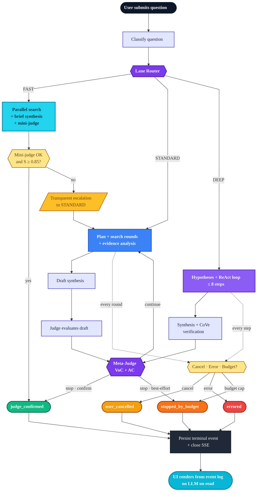

Run Lifecycle (high level)

```mermaid
%%{init: {"flowchart": {"curve": "linear", "nodeSpacing": 55, "rankSpacing": 65}, "themeVariables": {"fontFamily": "Inter, Segoe UI, sans-serif"}}}%%
flowchart TD
    Start([User submits question]):::start --> Classify[Classify question]:::stage
    Classify --> Route{{Lane Router}}:::router

    Route -->|FAST| Fast[Parallel search<br/>+ brief synthesis<br/>+ mini-judge]:::fast
    Route -->|STANDARD| Std[Plan + search rounds<br/>+ evidence analysis]:::std
    Route -->|DEEP| Deep[Hypotheses + ReAct loop<br/>≤ 8 steps]:::deep

    Fast --> FastOk{{Mini-judge OK<br/>and S ≥ 0.85?}}:::decision
    FastOk -->|yes| Confirm
    FastOk -->|no| Escalate[/Transparent escalation<br/>to STANDARD/]:::escalate
    Escalate --> Std

    Std --> Synth[Draft synthesis]:::stage
    Synth --> Judge[Judge evaluates draft]:::stage
    Judge --> Meta{{Meta-Judge<br/>VoC + AC}}:::router

    Deep --> Cove[Synthesis + CoVe<br/>verification]:::stage
    Cove --> Meta

    Meta -->|stop · confirm| Confirm
    Meta -->|continue| Std
    Meta -->|stop · best-effort| Budget

    Std -. every round .-> Safety{{Cancel · Error · Budget?}}:::decision
    Deep -. every step .-> Safety
    Safety -->|cancel| Cancelled
    Safety -->|error| Errored
    Safety -->|budget cap| Budget

    Confirm([judge_confirmed]):::ok --> Persist[Persist terminal event<br/>+ close SSE]:::persist
    Cancelled([user_cancelled]):::warn --> Persist
    Errored([errored]):::fail --> Persist
    Budget([stopped_by_budget]):::budget --> Persist
    Persist --> Render([UI renders from event log<br/>no LLM on read]):::render

    classDef start fill:#0F172A,stroke:#0F172A,color:#FFFFFF,font-weight:bold;
    classDef stage fill:#E0E7FF,stroke:#4338CA,color:#1E1B4B,stroke-width:1.5px;
    classDef router fill:#7C3AED,stroke:#4C1D95,color:#FFFFFF,stroke-width:2px,font-weight:bold;
    classDef decision fill:#FDE68A,stroke:#B45309,color:#78350F,stroke-width:1.5px;
    classDef fast fill:#22D3EE,stroke:#0E7490,color:#083344,stroke-width:2px,font-weight:bold;
    classDef std fill:#3B82F6,stroke:#1D4ED8,color:#FFFFFF,stroke-width:2px,font-weight:bold;
    classDef deep fill:#8B5CF6,stroke:#5B21B6,color:#FFFFFF,stroke-width:2px,font-weight:bold;
    classDef escalate fill:#FBBF24,stroke:#B45309,color:#78350F,stroke-width:1.5px;
    classDef ok fill:#10B981,stroke:#065F46,color:#FFFFFF,stroke-width:2px,font-weight:bold;
    classDef warn fill:#F59E0B,stroke:#92400E,color:#FFFFFF,stroke-width:2px,font-weight:bold;
    classDef fail fill:#EF4444,stroke:#991B1B,color:#FFFFFF,stroke-width:2px,font-weight:bold;
    classDef budget fill:#F97316,stroke:#9A3412,color:#FFFFFF,stroke-width:2px,font-weight:bold;
    classDef persist fill:#1F2937,stroke:#111827,color:#FFFFFF,stroke-width:1.5px;
    classDef render fill:#06B6D4,stroke:#0E7490,color:#FFFFFF,stroke-width:2px,font-weight:bold;
```